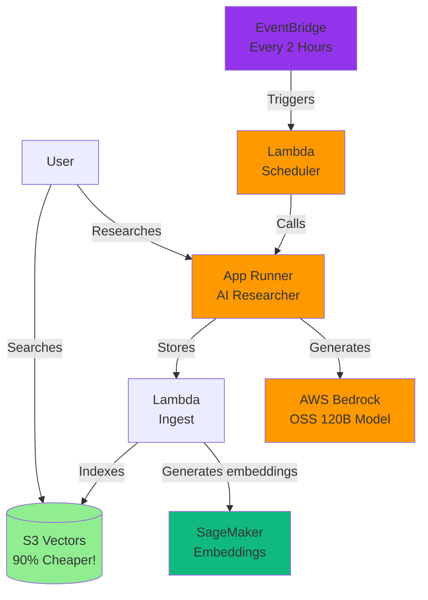

# Building Alex: Part 1 - AWS Permission Setup

Welcome to the Alex Project - the Agentic Learning Equities eXplainer!

Alex is an AI-powered personal financial planner that helps users manage their investment portfolios and plan for retirement. Throughout this course, we will build a complete AI system using AWS services.

## What is Alex?

Alex helps users:
- Understand their investment portfolios
- Plan for retirement
- Get personalized financial guidance
- Track market trends and opportunities

## BEFORE YOU START - IMPORTANT TIP!

There is a `gameplan.md` file at the project root that describes the full Alex project for an AI Agent, so you can ask questions and get help. There are also identical files called `CLAUDE.md` and `AGENTS.md`. If you need help, simply open your favorite AI Agent and give it this prompt:

> I am a student in the AI in Production course. We are in the course repository. Read the `gameplan.md` file for a project overview. Read this file completely and carefully review all linked guides. Do not start any work other than reading and checking the directory structure. When you finish all reading, tell me whether you have questions before we begin.

After answering any questions, clearly state which guide you are on and any issues you are experiencing. Your agent will be fully informed and ready to help. Allow it to run AWS and Terraform commands for investigation. Be careful to validate every suggestion; always ask for the root cause and evidence that it has actually been found. LLMs often jump to conclusions, but they usually self-correct when they must provide evidence.

## Architecture Overview

This is what you will build across all guides:



See [architecture.md](architecture.md) for the complete system architecture.

## About this guide

This first guide focuses on setting up the required AWS permissions. We will create a dedicated IAM group with only the permissions needed for the Alex project.

## Important note about infrastructure management

This project uses Terraform to deploy infrastructure with a specific educational approach:
- **Separate Terraform directories**: Each guide has its own Terraform directory (for example, `terraform/2_sagemaker`, `terraform/3_ingestion`)
- **Local state files**: We use local state files instead of S3 for simplicity (automatically ignored by git)
- **Independent deployments**: Each part can be deployed independently without affecting the others
- **No remote state bucket required**: This removes the complexity of setting up and maintaining a Terraform state bucket

This approach lets you:
- Deploy each part as you move through the guides
- Avoid accidentally deploying later sections too early
- Keep infrastructure changes isolated
- Simplify the learning experience

## Prerequisites

Before you begin, make sure you have:
- An AWS account with root access
- AWS CLI installed and configured with your IAM user `aiengineer`
- Basic familiarity with AWS services
- Terraform installed (version 1.5 or higher)

**Note for VS Code/Cursor users**: To view architecture diagrams in this guide, install the "Markdown Preview Mermaid Support" extension (ID: `bierner.markdown-mermaid`). This enables Mermaid diagrams in Markdown preview.

## Step 1: IAM permission setup

First, we need to create the correct IAM permissions for the Alex project. We will create a dedicated IAM group with only the permissions required for this project.

### 1.1 Sign in as root user

1. Go to [https://aws.amazon.com/console/](https://aws.amazon.com/console/)
2. Click "Sign In to the Console"
3. Select "Root user" and enter your root email
4. Click "Next" and enter your root password

⚠️ **Security note**: We use the root user only for this IAM setup. For everything else, we will use our IAM user.

### 1.2 Create the S3 Vectors policy

Because S3 Vectors is a new service (in 2025), we need to create a custom policy for it:

1. In the AWS console, go to **IAM** (Identity and Access Management)
2. In the left sidebar, click **Policies**
3. Click **Create policy**
4. Click the **JSON** tab
5. Replace the content with:

```json
{
    "Version": "2012-10-17",
    "Statement": [
        {
            "Effect": "Allow",
            "Action": [
                "s3vectors:*"
            ],
            "Resource": "*"
        }
    ]
}
```

6. Click **Next: Tags**, then **Next: Review**
7. In **Policy name**, enter: `AlexS3VectorsAccess`
8. In **Description**, enter: `Full access to S3 Vectors for Alex project`
9. Click **Create policy**

### 1.3 Create the AlexAccess group

1. Still in IAM, click **User groups** in the left sidebar
2. Click **Create group**
3. In **Group name**, enter: `AlexAccess`
4. In **Attach permissions policies**, search for and select these policies:
   - `AmazonSageMakerFullAccess` (AWS managed policy)
   - `AmazonBedrockFullAccess` (AWS managed policy - AI model access)
   - `CloudWatchEventsFullAccess` (AWS managed policy - includes EventBridge)
   - `AlexS3VectorsAccess` (the custom policy you just created)
   
   Note: We already have permissions for Lambda, S3, CloudWatch, and API Gateway from other groups.

5. Click **Create group**

### 1.4 Add the group to your IAM user

1. Still in IAM, click **Users** in the left sidebar
2. Click your `aiengineer` user
3. Click the **Groups** tab
4. Click **Add user to groups**
5. Check the box next to `AlexAccess`
6. Click **Add to groups**

### 1.5 Sign out and sign in again

1. Click your username in the top-right corner
2. Click **Sign out**
3. Sign in again using your IAM user credentials:
   - Account ID or alias
   - IAM username: `aiengineer`
   - Your IAM password

### 1.6 Verify permissions

Let's verify that you have the required permissions by running:

```bash
aws sts get-caller-identity
```

You should see your IAM user ARN. Now check SageMaker access:

```bash
aws sagemaker list-endpoints
```

This should return an empty list (with no error).

## Step 3: Initial project setup

Before moving to the next guide, let's set up your environment files:

### Create your environment file

```bash
# Navigate to the project root
cd alex  # or where you cloned the repo

# Copy the example environment file
cp .env.example .env

# Get your AWS account ID
aws sts get-caller-identity --query Account --output text
```

Edit `.env` and add your AWS account ID and default region:
```
AWS_ACCOUNT_ID=123456789012     # Your real account ID
DEFAULT_AWS_REGION=us-east-1    # Your preferred default region
```

You will add more values to this file as you progress through the guides.

### Important files

This project uses two types of configuration files:
- **`.env`** - Environment variables for Python scripts and backend services
- **`terraform.tfvars`** - Configuration for Terraform infrastructure

Both are included in `.gitignore` for security. You must create them from the provided examples.

## Next steps

Excellent! You now have the required permissions and initial setup complete.

Continue to the next guide: [2_sagemaker.md](2_sagemaker.md), where we will deploy our first AI component - a serverless SageMaker endpoint for generating text embeddings.

This will be the foundation of Alex's ability to understand and process financial information! 🚀
