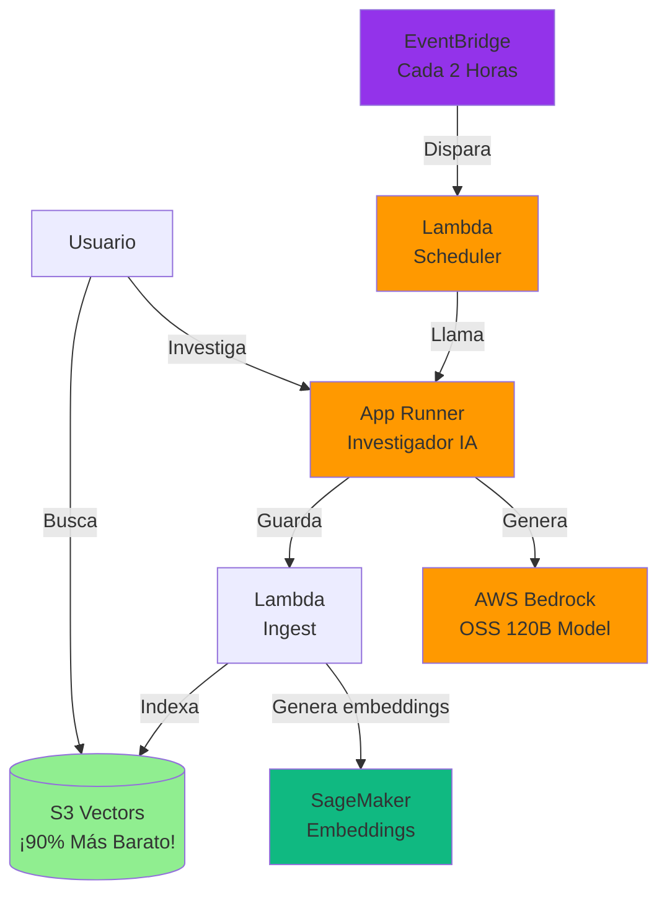

# Construyendo Alex: Parte 1 - Configuración de Permisos en AWS

Bienvenido al Proyecto Alex - ¡el Agentic Learning Equities eXplainer!

Alex es un planificador financiero personal impulsado por IA que ayudará a los usuarios a gestionar sus carteras de inversión y planificar su jubilación. A lo largo de este curso, construiremos un sistema de IA completo utilizando servicios de AWS.

## ¿Qué es Alex?

Alex ayudará a los usuarios a:
- Entender sus carteras de inversión
- Planificar la jubilación
- Obtener asesoramiento financiero personalizado
- Rastrear tendencias y oportunidades del mercado

## ¡¡ANTES DE EMPEZAR - CONSEJO IMPORTANTE!!

Hay un archivo `gameplan.md` en la raíz del proyecto que describe todo el proyecto Alex para un Agente de IA, para que puedas hacer preguntas y recibir ayuda. También existen archivos idénticos llamados `CLAUDE.md` y `AGENTS.md`. Si necesitas ayuda, simplemente inicia tu Agente de IA favorito y dale esta instrucción:

> Soy un estudiante del curso IA en Producción. Estamos en el repositorio del curso. Lee el archivo `gameplan.md` para un resumen del proyecto. Lee este archivo completamente y revisa todas las guías vinculadas cuidadosamente. No comiences ningún trabajo aparte de leer y comprobar la estructura de directorios. Cuando hayas terminado toda la lectura, dime si tienes preguntas antes de empezar.

Luego de responder cualquier pregunta, indica exactamente en qué guía te encuentras y cualquier problema que estés experimentando. Tu agente estará completamente informado y listo para ayudarte. Permítele ejecutar comandos de aws y terraform para investigar. Ten cuidado de validar cada sugerencia; pide siempre la causa raíz de los problemas y evidencia que demuestre que realmente la ha encontrado. Los LLMs tienden a sacar conclusiones precipitadas, pero a menudo se corrigen cuando deben aportar evidencia.

## Resumen de la Arquitectura

Esto es lo que vas a construir a lo largo de todas las guías:



Consulta [architecture.md](architecture.md) para ver la arquitectura completa del sistema.

## Sobre esta guía

Esta primera guía se centra en configurar los permisos necesarios de AWS. Crearemos un grupo IAM dedicado solo con los permisos necesarios para el proyecto Alex.

## Nota importante sobre la gestión de la infraestructura

Este proyecto utiliza Terraform para desplegar la infraestructura con un enfoque específico pensado para fines educativos:
- **Directorios separados de Terraform**: Cada guía tiene su propio directorio Terraform (por ejemplo, `terraform/2_sagemaker`, `terraform/3_ingestion`)
- **Archivos de estado locales**: Usamos archivos de estado locales en vez de S3 para simplificar (se ignoran en git automáticamente)
- **Despliegues independientes**: Cada parte se puede desplegar de forma independiente sin afectar a las demás
- **No se necesita bucket de estado**: Esto elimina la complejidad de configurar y gestionar un bucket de estado de Terraform

Este enfoque te permite:
- Desplegar cada parte a medida que avanzas por las guías
- Evitar el despliegue accidental de partes adelantadas
- Mantener los cambios de infraestructura aislados
- Simplificar la experiencia de aprendizaje

## Prerrequisitos

Antes de empezar, asegúrate de tener:
- Una cuenta de AWS con acceso root
- AWS CLI instalado y configurado con tu usuario IAM `aiengineer`
- Familiaridad básica con los servicios de AWS
- Terraform instalado (versión 1.5 o superior)

**Nota para usuarios de VS Code/Cursor**: Para visualizar los diagramas de arquitectura en esta guía, instala la extensión "Markdown Preview Mermaid Support" (ID: `bierner.markdown-mermaid`). Esto mostrará los diagramas en la vista previa de Markdown.

## Paso 1: Configuración de permisos IAM

Primero, necesitamos crear los permisos IAM adecuados para el proyecto Alex. Crearemos un grupo IAM dedicado solo con los permisos necesarios para este proyecto.

### 1.1 Iniciar sesión como usuario root

1. Ve a [https://aws.amazon.com/console/](https://aws.amazon.com/console/)
2. Haz clic en "Sign In to the Console"
3. Selecciona "Root user" e introduce tu correo de root
4. Haz clic en "Next" e introduce tu contraseña de root

⚠️ **Nota de seguridad**: Solo usamos el usuario root para esta configuración de IAM. Para todo lo demás, usaremos nuestro usuario IAM.

### 1.2 Crear la política de S3 Vectors

Como S3 Vectors es un servicio nuevo (en 2025), necesitamos crear una política personalizada para él:

1. En la consola de AWS, dirígete a **IAM** (Identity and Access Management)
2. En la barra lateral izquierda, haz clic en **Policies**
3. Haz clic en **Create policy**
4. Haz clic en la pestaña **JSON**
5. Sustituye el contenido por:

```json
{
    "Version": "2012-10-17",
    "Statement": [
        {
            "Effect": "Allow",
            "Action": [
                "s3vectors:*"
            ],
            "Resource": "*"
        }
    ]
}
```

6. Haz clic en **Next: Tags**, luego **Next: Review**
7. En **Policy name**, introduce: `AlexS3VectorsAccess`
8. En **Description**, introduce: `Full access to S3 Vectors for Alex project`
9. Haz clic en **Create policy**

### 1.3 Crear el Grupo AlexAccess

1. Aún en IAM, haz clic en **User groups** en la barra lateral izquierda
2. Haz clic en el botón **Create group**
3. En **Group name**, introduce: `AlexAccess`
4. En la sección **Attach permissions policies**, busca y selecciona estas políticas:
   - `AmazonSageMakerFullAccess` (política administrada de AWS)
   - `AmazonBedrockFullAccess` (política administrada de AWS - acceso a modelos IA)
   - `CloudWatchEventsFullAccess` (política administrada de AWS - incluye EventBridge)
   - `AlexS3VectorsAccess` (la política personalizada que acabas de crear)
   
   Nota: Ya disponemos de permisos para Lambda, S3, CloudWatch y API Gateway desde otros grupos.

5. Haz clic en **Create group**

### 1.4 Añadir el grupo a tu usuario IAM

1. Aún en IAM, haz clic en **Users** en la barra lateral izquierda
2. Haz clic en tu usuario `aiengineer`
3. Haz clic en la pestaña **Groups**
4. Haz clic en **Add user to groups**
5. Marca la casilla al lado de `AlexAccess`
6. Haz clic en **Add to groups**

### 1.5 Cierra sesión e inicia sesión de nuevo

1. Haz clic en tu nombre de usuario en la esquina superior derecha
2. Haz clic en **Sign out**
3. Inicia sesión de nuevo usando tus credenciales de usuario IAM:
   - Account ID o alias
   - Nombre de usuario IAM: `aiengineer`
   - Tu contraseña IAM

### 1.6 Verifica los permisos

Verifiquemos que tienes los permisos necesarios ejecutando:

```bash
aws sts get-caller-identity
```

Deberías ver el ARN de tu usuario IAM. Ahora, comprobemos el acceso a SageMaker:

```bash
aws sagemaker list-endpoints
```

Esto debería devolver una lista vacía (sin error).

## Paso 3: Configuración inicial del proyecto

Antes de pasar a la siguiente guía, vamos a configurar tus archivos de entorno:

### Crea tu archivo de entorno

```bash
# Navega a la raíz del proyecto
cd alex  # o a donde hayas clonado el repo

# Copia el archivo de entorno de ejemplo
cp .env.example .env

# Obtén tu AWS account ID
aws sts get-caller-identity --query Account --output text
```

Edita el archivo `.env` y añade tu AWS account ID y la región por defecto:
```
AWS_ACCOUNT_ID=123456789012     # Tu Account ID real
DEFAULT_AWS_REGION=us-east-1    # Tu región por defecto preferida
```

Añadirás más valores a este archivo a medida que avances en las guías.

### Archivos importantes

Este proyecto utiliza dos tipos de archivos de configuración:
- **`.env`** - Variables de entorno para scripts Python y servicios backend
- **`terraform.tfvars`** - Configuración para la infraestructura de Terraform

Ambos están incluidos en el .gitignore por seguridad. Debes crearlos a partir de los ejemplos proporcionados.

## Próximos pasos

¡Excelente! Ya tienes los permisos necesarios y la configuración inicial completada.

Continúa a la siguiente guía: [2_sagemaker.md](2_sagemaker.md) donde desplegaremos nuestro primer componente IA - un endpoint serverless de SageMaker para generar embeddings de texto.

¡Esto será la base de la capacidad de Alex para entender y procesar información financiera! 🚀