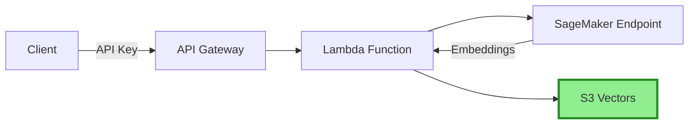

# Construyendo Alex: Parte 3 - Pipeline de Ingesta con S3 Vectors

¡Bienvenido de nuevo! En esta guía, vamos a desplegar una solución de almacenamiento vectorial rentable usando AWS S3 Vectors:
- S3 Vectors para almacenamiento vectorial (¡90% más barato que OpenSearch!)
- Función Lambda para la ingestión de documentos  
- API Gateway con autenticación mediante API key
- Integración con el endpoint de embeddings de SageMaker

## Requisitos Previos
- Haber completado la [Guía 1](1_permissions.md) (Configuración de AWS)
- Haber completado la [Guía 2](2_sagemaker.md) (Despliegue de SageMaker)
- AWS CLI configurado
- Terraform instalado
- Python con el gestor de paquetes `uv` instalado

## RECORDATORIO - ¡GRAN CONSEJO!

Hay un archivo `gameplan.md` en la raíz del proyecto que describe todo el proyecto Alex a un Agente de IA, para que puedas hacer preguntas y recibir ayuda. También hay un archivo idéntico llamado `CLAUDE.md` y otro llamado `AGENTS.md`. Si necesitas ayuda, simplemente inicia tu Agente de IA favorito y dale esta instrucción:

> Soy estudiante del curso AI in Production. Estamos en el repositorio del curso. Lee el archivo `gameplan.md` para obtener una visión general del proyecto. Lee este archivo por completo y lee cuidadosamente todas las guías enlazadas. No inicies ningún trabajo aparte de leer y revisar la estructura de directorios. Cuando hayas terminado toda la lectura, avísame si tienes dudas antes de empezar.

Después de responder preguntas, indica exactamente en qué guía estás y cualquier problema. Ten cuidado de validar cada sugerencia; siempre pide la causa raíz y evidencia de problemas. Los LLMs tienden a sacar conclusiones apresuradas, pero a menudo se corrigen cuando necesitan aportar evidencia.

## Acerca de S3 Vectors

S3 Vectors es la solución nativa de AWS para almacenamiento vectorial, ofreciendo un ahorro del 90% comparado con bases de datos vectoriales tradicionales. Utiliza un espacio de nombres separado (`s3vectors`) del S3 regular.

## Paso 1: Crear un Bucket Vectorial en S3

Ya que S3 Vectors usa un espacio de nombres diferente al S3 regular, lo crearemos desde la Consola de AWS:

1. Accede a la [Consola de S3](https://console.aws.amazon.com/s3/)
2. Busca **"Vector buckets"** en la navegación izquierda (no los buckets normales)
3. Haz clic en **"Create vector bucket"**
4. Configura:
   - Nombre del bucket: `alex-vectors-{your-account-id}` (reemplaza con tu ID real de cuenta)
   - Encriptación: Deja la predeterminada (SSE-S3)
5. Después de crear el bucket, crea un índice:
   - Nombre del índice: `financial-research`
   - Dimensión: `384`
   - Métrica de distancia: `Cosine`
6. Haz clic en **"Create vector index"**

## Paso 2: Preparar el Paquete de Despliegue de Lambda

El código de la función Lambda ya está en el repositorio:

```bash
# Navega al directorio de ingest
cd backend/ingest

# Instala las dependencias y crea el paquete de despliegue
uv run package.py
```

Esto crea `lambda_function.zip` que contiene tu función y todas las dependencias. Deberías ver:
```
✅ Deployment package created: lambda_function.zip
   Size: ~15 MB
```

## Paso 3: Configura y Despliega la Infraestructura

Primero, configura las variables de Terraform:

```bash
# Navega al directorio de terraform de ingesta
cd ../../terraform/3_ingestion

# Copia el archivo de variables de ejemplo
cp terraform.tfvars.example terraform.tfvars
```

Edita `terraform.tfvars` y coloca tus valores:
```hcl
aws_region = "us-east-1"  # Usa tu DEFAULT_AWS_REGION de .env
sagemaker_endpoint_name = "alex-embedding-endpoint"  # De la Parte 2
```

Ahora despliega la infraestructura:

```bash
# Inicializa Terraform (crea el archivo de estado local)
terraform init

# Despliega la infraestructura
terraform apply
```

Escribe `yes` cuando se te solicite. El despliegue toma 2-3 minutos.

Nota: La función Lambda espera que el paquete de despliegue exista en `../../backend/ingest/lambda_function.zip` (el que creaste en el Paso 2).

## Paso 4: Guarda tu Configuración

Después del despliegue, Terraform mostrará salidas importantes. Debes guardar estos valores en tu archivo `.env`.

### Obtener tu API Key

Primero, obtén tu API key usando el comando mostrado en la salida de Terraform:
```bash
# Reemplaza el ID por el de tu salida de Terraform
aws apigateway get-api-key --api-key YOUR_API_KEY_ID --include-value --query 'value' --output text
```

### Actualiza tu Archivo .env

Vuelve a la raíz del proyecto y actualiza tu `.env`:
```bash
cd ../..

nano .env  # o utiliza tu editor preferido
```

Agrega o actualiza estas líneas en tu archivo `.env`:
```
# From Part 3 - get these values from Terraform output
VECTOR_BUCKET=alex-vectors-YOUR_ACCOUNT_ID
ALEX_API_ENDPOINT=https://xxxxxxxxxx.execute-api.us-east-1.amazonaws.com/prod/ingest
ALEX_API_KEY=your-api-key-here
```

💡 **Consejo**: Puedes ver las salidas de Terraform en cualquier momento:
```bash
cd terraform/3_ingestion
terraform output
```

## Paso 5: Prueba la Configuración

Prueba la ingestión de documentos directamente vía S3 Vectors:

```bash
cd backend/ingest
uv run test_ingest_s3vectors.py
```

Deberías ver:
```
✓ Success! Document ID: [uuid]
Testing complete!
```

## Paso 6: Prueba la Búsqueda

Ahora prueba que puedes buscar los documentos:

```bash
uv run test_search_s3vectors.py
```

Deberías ver los tres documentos (Tesla, Amazon, NVIDIA) que acabas de ingresar, y ejemplos de búsquedas semánticas mostrando cómo S3 Vectors encuentra contenido relacionado.

### Opcional: Prueba mediante API Gateway

También puedes probar el endpoint de API Gateway directamente:

```bash
# Obtén tu API key desde .env o la salida de Terraform
curl -X POST $ALEX_API_ENDPOINT \
  -H "x-api-key: $ALEX_API_KEY" \
  -H "Content-Type: application/json" \
  -d '{"text": "Test document via API", "metadata": {"source": "api_test"}}'
```

Deberías ver:
```json
{"message": "Document indexed successfully", "document_id": "..."}
```

## Resumen de la Arquitectura



## Comparativa de Costes

| Servicio | Costo Mensual (Estimado) |
|----------|-------------------------|
| OpenSearch Serverless | ~$200-300 |
| S3 Vectors | ~$20-30 |
| **Ahorro** | **¡90%!** |

## Resolución de Problemas

### "Vector bucket not found"
- Asegúrate de haber creado el bucket con la configuración vectorial habilitada
- Revisa que el nombre del bucket coincida exactamente

### Errores "AccessDenied"
- Asegúrate de que tu usuario IAM tiene permisos para S3 y S3 Vectors
- El rol de Lambda necesita permisos `s3vectors:*`

### Comando de S3 Vectors No Encontrado
- Asegúrate de tener la última versión de AWS CLI
- Los comandos `s3vectors` usan un espacio de nombres separado del S3 regular

### Errores del Handler de Lambda (500 Internal Server Error)
- Revisa los logs de CloudWatch: `aws logs tail /aws/lambda/alex-ingest`
- Verifica que las variables de entorno estén correctamente configuradas (SAGEMAKER_ENDPOINT, VECTOR_BUCKET)
- Asegúrate de que el rol de Lambda tenga permiso `s3vectors:PutVectors`
- El handler de Lambda debe ser `ingest_s3vectors.lambda_handler`

## ¿Qué Sigue?

¡Felicidades! Ahora tienes una solución de almacenamiento vectorial rentable. La infraestructura incluye:
- ✅ Bucket S3 con capacidades vectoriales
- ✅ Función Lambda para ingresar documentos con embeddings
- ✅ API Gateway con autenticación segura vía API key
- ✅ ¡Ahorro del 90% comparado con OpenSearch!

**Importante**: Guarda las salidas de Terraform, las necesitarás para la siguiente guía.

En la [Guía 4](4_researcher.md), desplegaremos el Agente Investigador de Alex que usará esta infraestructura para proporcionar insights inteligentes de inversión.

## Limpieza (Opcional)

Si deseas destruir la infraestructura para evitar costes:

```bash
# Desde el directorio de terraform
terraform destroy
```

**Nota**: Esto destruirá TODOS los recursos incluyendo tu endpoint de SageMaker. Hazlo solamente si has terminado por completo el proyecto.