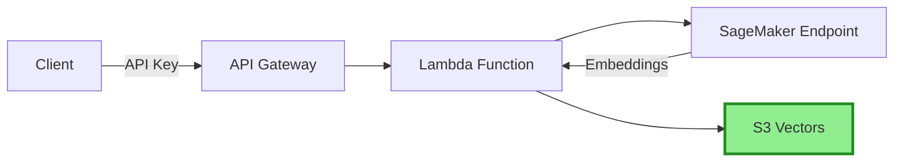

# Building Alex: Part 3 - Ingestion Pipeline with S3 Vectors

Welcome back! In this guide, we will deploy a cost-effective vector storage solution using AWS S3 Vectors:
- S3 Vectors for vector storage (90% cheaper than OpenSearch!)
- Lambda function for document ingestion
- API Gateway with API key authentication
- Integration with the SageMaker embeddings endpoint

## Prerequisites
- Complete [Guide 1](1_permissions.md) (AWS setup)
- Complete [Guide 2](2_sagemaker.md) (SageMaker deployment)
- AWS CLI configured
- Terraform installed
- Python with the `uv` package manager installed

## REMINDER - GREAT TIP!

There is a `gameplan.md` file at the project root that describes the full Alex project for an AI Agent, so you can ask questions and get help. There is also an identical `CLAUDE.md` file and another one called `AGENTS.md`. If you need help, simply open your favorite AI Agent and give it this prompt:

> I am a student in the AI in Production course. We are in the course repository. Read the `gameplan.md` file for a project overview. Read this file fully and carefully read all linked guides. Do not start any work other than reading and reviewing the directory structure. When you finish all reading, let me know if you have questions before we start.

After answering questions, clearly state which guide you are on and any issue. Be careful to validate every suggestion; always ask for root cause and evidence of issues. LLMs tend to jump to conclusions, but they often self-correct when they need to provide evidence.

## About S3 Vectors

S3 Vectors is AWS's native vector storage solution, offering 90% savings compared to traditional vector databases. It uses a separate namespace (`s3vectors`) from standard S3.

## Step 1: Create an S3 vector bucket

Since S3 Vectors uses a different namespace from standard S3, we will create it in the AWS Console:

1. Open the [S3 Console](https://console.aws.amazon.com/s3/)
2. Find **"Vector buckets"** in the left navigation (not regular buckets)
3. Click **"Create vector bucket"**
4. Configure:
   - Bucket name: `alex-vectors-{your-account-id}` (replace with your real account ID)
   - Encryption: Leave default (SSE-S3)
5. After creating the bucket, create an index:
   - Index name: `financial-research`
   - Dimension: `384`
   - Distance metric: `Cosine`
6. Click **"Create vector index"**

## Step 2: Prepare the Lambda deployment package

The Lambda function code is already in the repository:

```bash
# Navigate to the ingest directory
cd backend/ingest

# Install dependencies and create the deployment package
uv run package.py
```

This creates `lambda_function.zip` containing your function and all dependencies. You should see:
```
✅ Deployment package created: lambda_function.zip
   Size: ~15 MB
```

## Step 3: Configure and deploy infrastructure

First, configure Terraform variables:

```bash
# Navigate to the ingestion Terraform directory
cd ../../terraform/3_ingestion

# Copy the example variables file
cp terraform.tfvars.example terraform.tfvars
```

Edit `terraform.tfvars` and set your values:
```hcl
aws_region = "us-east-1"  # Use your DEFAULT_AWS_REGION from .env
sagemaker_endpoint_name = "alex-embedding-endpoint"  # From Part 2
```

Now deploy the infrastructure:

```bash
# Initialize Terraform (creates the local state file)
terraform init

# Deploy the infrastructure
terraform apply
```

Type `yes` when prompted. Deployment takes 2-3 minutes.

Note: The Lambda function expects the deployment package at `../../backend/ingest/lambda_function.zip` (the one you created in Step 2).

## Step 4: Save your configuration

After deployment, Terraform shows important outputs. You must save these values in your `.env` file.

### Get your API key

First, get your API key using the command shown in Terraform output:
```bash
# Replace the ID with the one from your Terraform output
aws apigateway get-api-key --api-key YOUR_API_KEY_ID --include-value --query 'value' --output text
```

### Update your `.env` file

Go back to the project root and update your `.env`:
```bash
cd ../..

nano .env  # or use your preferred editor
```

Add or update these lines in your `.env` file:
```
# From Part 3 - get these values from Terraform output
VECTOR_BUCKET=alex-vectors-YOUR_ACCOUNT_ID
ALEX_API_ENDPOINT=https://xxxxxxxxxx.execute-api.us-east-1.amazonaws.com/prod/ingest
ALEX_API_KEY=your-api-key-here
```

💡 **Tip**: You can check Terraform outputs anytime:
```bash
cd terraform/3_ingestion
terraform output
```

## Step 5: Test the setup

Test document ingestion directly through S3 Vectors:

```bash
cd backend/ingest
uv run test_ingest_s3vectors.py
```

You should see:
```
✓ Success! Document ID: [uuid]
Testing complete!
```

## Step 6: Test search

Now test that you can search documents:

```bash
uv run test_search_s3vectors.py
```

You should see the three documents (Tesla, Amazon, NVIDIA) you just ingested, plus semantic search examples showing how S3 Vectors finds related content.

### Optional: Test through API Gateway

You can also test the API Gateway endpoint directly:

```bash
# Get your API key from .env or Terraform output
curl -X POST $ALEX_API_ENDPOINT \
  -H "x-api-key: $ALEX_API_KEY" \
  -H "Content-Type: application/json" \
  -d '{"text": "Test document via API", "metadata": {"source": "api_test"}}'
```

You should see:
```json
{"message": "Document indexed successfully", "document_id": "..."}
```

## Architecture Overview



## Cost comparison

| Service | Estimated Monthly Cost |
|----------|-------------------------|
| OpenSearch Serverless | ~$200-300 |
| S3 Vectors | ~$20-30 |
| **Savings** | **90%!** |

## Troubleshooting

### "Vector bucket not found"
- Make sure you created the bucket with vector configuration enabled
- Verify the bucket name matches exactly

### "AccessDenied" errors
- Make sure your IAM user has permissions for S3 and S3 Vectors
- The Lambda role needs `s3vectors:*` permissions

### S3 Vectors command not found
- Make sure you have the latest AWS CLI version
- `s3vectors` commands use a separate namespace from regular S3

### Lambda handler errors (500 Internal Server Error)
- Check CloudWatch logs: `aws logs tail /aws/lambda/alex-ingest`
- Verify environment variables are set correctly (SAGEMAKER_ENDPOINT, VECTOR_BUCKET)
- Make sure the Lambda role has `s3vectors:PutVectors` permission
- Lambda handler must be `ingest_s3vectors.lambda_handler`

## What's next?

Congratulations! You now have a cost-effective vector storage solution. The infrastructure includes:
- ✅ S3 bucket with vector capabilities
- ✅ Lambda function to ingest documents with embeddings
- ✅ API Gateway with secure API key authentication
- ✅ 90% savings compared to OpenSearch

**Important**: Save the Terraform outputs - you will need them for the next guide.

In [Guide 4](4_researcher.md), we will deploy Alex's Researcher Agent, which will use this infrastructure to provide intelligent investment insights.

## Cleanup (optional)

If you want to destroy the infrastructure to avoid costs:

```bash
# From the Terraform directory
terraform destroy
```

**Note**: This destroys ALL resources, including your SageMaker endpoint. Do this only if you are completely done with the project.
