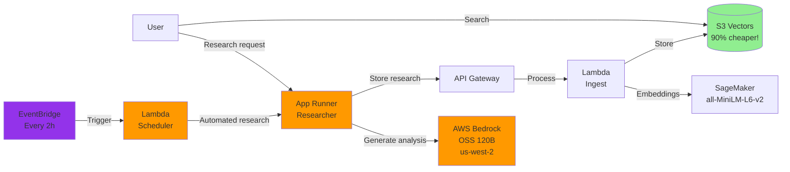

# Guide 4: Deploy the Researcher Agent

In this guide, you will deploy the Alex Researcher service: an AI agent that generates investment research and automatically stores it in your knowledge base.

## Prerequisites

Before you begin, make sure you have:
1. Completed Guides 1-3 (SageMaker, S3 Vectors, and Ingestion Pipeline deployed)
2. Docker Desktop installed and running
3. AWS CLI configured with your credentials
4. Access to AWS Bedrock OpenAI OSS models (see Step 0 below)

## REMINDER - IMPORTANT TIP!

There is a `gameplan.md` file in the project root that describes the full Alex project for an AI Agent, so you can ask questions and get help. There are also identical files named `CLAUDE.md` and `AGENTS.md`. If you need help, just start your favorite AI agent and give it this instruction:

> I am a student in the AI in Production course. We are in the course repository. Read the `gameplan.md` file for a project overview. Read this file fully and review all linked guides carefully. Do not start any work other than reading and checking the folder structure. When you finish reading, tell me if you have any questions before we begin.

After it answers questions, state exactly which guide you are on and any issue. Be careful validating every suggestion; always ask for the root cause and evidence for problems. LLMs tend to jump to conclusions, but often self-correct when asked for evidence.

## What you will deploy

The Researcher service is an AWS App Runner application that:
- Uses the OpenAI Agents SDK for agent orchestration and tracing
- Uses AWS Bedrock with OpenAI OSS 120B for AI capabilities
- Uses a Playwright MCP (Model Context Protocol) server for web browsing and data gathering
- Automatically calls your ingestion pipeline to store research in S3 Vectors
- Provides a REST API to generate on-demand financial analysis

Here is how it fits into the Alex architecture:



## Step 0: Request access to Bedrock models

Researcher uses AWS Bedrock with the OpenAI OSS 120B open-source model. First, you need to request access to this model.

### Request model access - These instructions are for OSS models, but you can also use Nova in us-east-1 or in your region (cheaper and simpler)

1. Sign in to the AWS Console
2. Go to **Amazon Bedrock**
3. Switch to region **US West (Oregon) us-west-2** (top-right)
4. In the left sidebar, click **Model access**
5. Click **Manage model access** or **Modify model access**
6. Find the **OpenAI** section
7. Check the boxes for:
   - **gpt-oss-120b** (OpenAI GPT OSS 120B)
   - **gpt-oss-20b** (OpenAI GPT OSS 20B) - optional, smaller model
8. Click **Request model access** at the bottom
9. Wait for approval (usually instant for these models)
10. Alternatively, request access to Amazon Nova models in your region or in us-east-1

**Important notes:**
- ⚠️ OSS models are ONLY available in region **us-west-2**
- ✅ Your App Runner service can be in any region (for example, us-east-1) and connect cross-region to us-west-2
- OSS models are OpenAI open-weight models, not commercial GPT models
- No API key is required for Bedrock - authentication is handled by AWS IAM
- The researcher agent requires an OpenAI API key for OpenAI Agents SDK tracing functionality (to monitor and debug agent execution)

## Extra part of Step 0: IMPORTANT - ADDED FROM THE VIDEOS!

### Update `server.py` with your model

Many thanks to student Marcin B. for this critical step.

In future labs, we will make this more configurable. But in this step, the Researcher Agent has some code variables you must change manually.

Please review the file `backend/researcher/server.py`

You should see this section:

```python
    # Please overwrite these variables with the region you are using
    # Other options: us-west-2 (for OpenAI OSS models) and eu-central-1
    REGION = "us-east-1"
    os.environ["AWS_REGION_NAME"] = REGION  # LiteLLM preferred variable
    os.environ["AWS_REGION"] = REGION  # Boto3 standard
    os.environ["AWS_DEFAULT_REGION"] = REGION  # Fallback

    # Please overwrite this variable with the model you are using
    # Common options: bedrock/eu.amazon.nova-pro-v1:0 for EU and bedrock/us.amazon.nova-pro-v1:0 for US
    # or bedrock/amazon.nova-pro-v1:0 if you are not using inference profiles
    # bedrock/openai.gpt-oss-120b-1:0 for OpenAI OSS models
    # bedrock/converse/us.anthropic.claude-sonnet-4-20250514-v1:0 for Claude Sonnet 4
    # NOTE: nova-pro is required to support tools and MCP servers; nova-lite is not enough - thanks Yuelin L.!
    MODEL = "bedrock/us.amazon.nova-pro-v1:0"
    model = LitellmModel(model=MODEL)
```

Update the `REGION` and `MODEL` values so they match the model you have access to. See the examples above for possible values.  
Keep in mind that nova-lite is not an acceptable choice because it does not support tool calling/MCP. Thanks Yuelin L.!

## Step 1: Deploy infrastructure

First, make sure you have your OpenAI API key and Part 3 values in your `.env` file.

Open the `.env` file in the project root using Cursor's file explorer and verify you have these values:
- `OPENAI_API_KEY` - Your OpenAI API key (required for agent tracing)
- `ALEX_API_ENDPOINT` - From Part 3
- `ALEX_API_KEY` - From Part 3

If you have not added your OpenAI API key yet, add this line to `.env`:
```
OPENAI_API_KEY=sk-...  # Your real OpenAI API key (required for agent tracing)
```

Now configure the initial infrastructure:

```bash
# Go to the terraform/4_researcher directory
# Copy the example variables file
cp terraform.tfvars.example terraform.tfvars
```

Edit `terraform.tfvars` and update it with values from `.env`:
```hcl
aws_region = "us-east-1"  # Your AWS region
openai_api_key = "sk-..."  # Your OpenAI API key
alex_api_endpoint = "https://xxxxxxxxxx.execute-api.us-east-1.amazonaws.com/prod/ingest"  # From Part 3
alex_api_key = "your-api-key-here"  # From Part 3
scheduler_enabled = false  # Keep this false for now
```

Deploy the ECR repository and IAM roles first:

```bash
# Initialize Terraform (creates local state file)
terraform init

# Deploy only the ECR repository and IAM roles (not App Runner yet)
terraform apply -target=aws_ecr_repository.researcher -target=aws_iam_role.app_runner_role
```

Type `yes` when prompted. This creates:
- ECR repository for your Docker images
- IAM roles with correct permissions for App Runner

Save the ECR repository URL shown in the output: you will need it in Step 2.

## Step 2: Build and deploy Researcher

Now build the Docker container and deploy it to App Runner.

```bash
# Go to the backend/researcher directory
uv run deploy.py
```

This script:
1. Builds a Docker image (with `--platform linux/amd64` for compatibility)
2. Pushes it to your ECR repository
3. Starts an App Runner deployment
4. Waits for deployment to finish (3-5 minutes)
5. Shows your service URL when ready

**Important note for Mac users with Apple Silicon:**
The deploy script automatically builds for `linux/amd64` architecture to ensure AWS App Runner compatibility. That is why you will see "Building Docker image for linux/amd64..." in output.

When Docker image upload finishes, you will see:
```
✅ Docker image uploaded successfully!
```

## Step 3: Create the App Runner service

Now that your Docker image is in ECR, create the App Runner service:

```bash
# Go back to terraform/4_researcher directory
# Deploy all infrastructure, including App Runner
terraform apply
```

Type `yes` when prompted. This will:
- Create the App Runner service using your Docker image
- Configure service environment variables
- Configure optional EventBridge scheduler (if enabled)

App Runner service creation takes 3-5 minutes. When done, you will see the service URL in the output.

## Step 4: Test the full system

Let's test the full pipeline: Research -> Ingestion -> Search.

### 4.1: First, clean the database

Delete any existing test data:

```bash
# Go to backend/ingest directory
uv run cleanup_s3vectors.py
```

You should see: "✅ All documents deleted successfully"

### 4.2: Generate research

Now generate investment research:

```bash
# Go to backend/researcher directory
uv run test_research.py
```

This script:
1. Automatically finds your App Runner service URL
2. Verifies service health
3. Generates research on a current topic (default)
4. Displays results
5. Automatically stores it in your knowledge base

You can also research specific topics:
```bash
uv run test_research.py "Tesla competitive advantages"
uv run test_research.py "Microsoft cloud revenue growth"
```

Research takes 20-30 seconds because the agent browses financial websites and generates investment conclusions.

### 4.3: Verify data storage

Check that research was stored:

```bash
# Go to backend/ingest directory
uv run test_search_s3vectors.py
```

You should see your research in the database with:
- Research content
- Embeddings generated by SageMaker
- Metadata including timestamp and topic

### 4.4: Test semantic search

Now verify semantic search works:

```bash
uv run test_search_s3vectors.py "electric vehicle market"
```

Even if you search for something different from the stored content, semantic search will find related content.

## Step 5: Test Researcher

Now that the service is deployed and tested, we will explore its capabilities.

### Health check test

Verify service health:

**Mac/Linux:**
```bash
curl https://YOUR_SERVICE_URL/health
```

**Windows PowerShell:**
```powershell
Invoke-WebRequest -Uri "https://YOUR_SERVICE_URL/health" | ConvertFrom-Json
```

You should see:
```json
{
  "service": "Alex Researcher",
  "status": "healthy",
  "alex_api_configured": true,
  "timestamp": "2025-..."
}
```

### Test with different topics

1. **Generate multiple analyses:**
   ```bash
   uv run test_research.py "NVIDIA AI chip market share"
   uv run test_research.py "Apple services revenue growth"
   uv run test_research.py "Gold vs Bitcoin as an inflation hedge"
   ```

2. **Search across topics:**
   ```bash
    # Go to backend/ingest directory
   uv run test_search_s3vectors.py "artificial intelligence"
   uv run test_search_s3vectors.py "inflation protection"
   ```

3. **Build your knowledge base:**
   Try different investment topics and build a complete knowledge base for portfolio management.

## Step 6: Enable automated research (optional)

Now we will enable automated research every 2 hours to collect the latest financial insights and expand your knowledge base.

### Enable the scheduler

The scheduler is disabled by default. To enable it:

```bash
# Go to terraform/4_researcher if you are not there yet
# Edit your terraform.tfvars file
```

Change the `scheduler_enabled` value in `terraform.tfvars`:
```hcl
scheduler_enabled = true  # Changed from false
```

Then apply the change:
```bash
terraform apply
```

**Windows PowerShell:**
```powershell
# Go to terraform/4_researcher directory
# Edit terraform.tfvars and set scheduler_enabled = true
# Apply change
terraform apply
```

Type `yes` when prompted. You will see:
- New resources will be created (Lambda function and EventBridge schedule)
- Output showing `scheduler_status = "ENABLED - Running every 2 hours"`

**Note:** The scheduler uses a small Lambda function to call your App Runner endpoint. This is required because App Runner endpoints can take 30-60 seconds to complete research, but EventBridge API Destinations has a 5-second timeout limit.

### Verify scheduler status

Check current scheduler status:

```bash
terraform output scheduler_status
```

### Monitor automated research

The scheduler will call your `/research/auto` endpoint every 2 hours. You can:

1. View Lambda logs to see when it runs:
```bash
aws logs tail /aws/lambda/alex-research-scheduler --follow --region us-east-1
```

2. View App Runner logs to see completed research:
```bash
aws logs tail /aws/apprunner/alex-researcher/*/application --follow --region us-east-1
```

3. Search your S3 Vectors store to see accumulated research:
```bash
# Go to backend/ingest directory
uv run test_search_s3vectors.py
```

### Disable scheduler (when needed)

When you want to stop automated research (to save API costs):

**Mac/Linux:**
```bash
# Go to terraform/4_researcher directory
terraform apply -var="scheduler_enabled=false"
```

**Windows PowerShell:**
```powershell
# Go to terraform/4_researcher directory
terraform apply -var="scheduler_enabled=false"
```

This removes the scheduler while keeping other services active.

## Troubleshooting

### "Service creation failed"
- Check that your ECR repository exists: `aws ecr describe-repositories`
- Make sure Docker is running
- Verify your AWS credentials are configured

### "Deployment stuck in OPERATION_IN_PROGRESS"
- This is normal on first deployment (can take 5-10 minutes)
- Check CloudWatch logs in AWS Console > App Runner > Your service > Logs

### "Exit code 255" or service does not start
- Usually the Docker image was not built for the correct architecture
- Make sure the deploy script uses `--platform linux/amd64`
- Rebuild and redeploy

### "Connection refused" when calling the service
- Verify service status is "RUNNING"
- Make sure you use HTTPS (not HTTP)
- Verify the service URL is correct

### "504 Gateway Timeout" errors
- The agent may be taking a long time (>30 seconds)
- This is normal if the agent browses multiple websites
- Research should still complete and be stored

### "Invalid model identifier" or Bedrock errors
- Make sure you requested access to OSS models in us-west-2 (see Step 0)
- Verify your IAM role has Bedrock permissions (should be added by Terraform)
- Models are available only in us-west-2 but can be accessed from any region
- Verify model access: Bedrock console -> Model access -> Check status

## Cleanup (optional)

If you want to stop ALL services to avoid costs:

```bash
# Go to terraform/4_researcher directory
terraform destroy
```

This removes all AWS resources created in this guide.

## Summary

You have successfully deployed an agentic AI system that can research, analyze, and manage investment knowledge. The system uses modern cloud-native architecture, autoscaling, vector search, and collaborating AI agents to provide intelligent financial analysis.

## Save your configuration

Before moving to the next guide, make sure your `.env` file is updated:

```bash
# Go to project root and edit .env
# Use your preferred text editor (nano, vim, or open it in Cursor)
```

Verify you have all these values from Parts 1-4:
```
# Part 1
AWS_ACCOUNT_ID=123456789012
DEFAULT_AWS_REGION=us-east-1

# Part 2
SAGEMAKER_ENDPOINT=alex-embedding-endpoint

# Part 3
VECTOR_BUCKET=alex-vectors-123456789012
ALEX_API_ENDPOINT=https://xxxxxxxxxx.execute-api.us-east-1.amazonaws.com/prod/ingest
ALEX_API_KEY=your-api-key-here

# Part 4
OPENAI_API_KEY=sk-...
```

## What's next?

Congratulations! You now have a complete AI research pipeline:
1. **Researcher Agent** (App Runner) - Generates investment analysis using Bedrock OSS models in us-west-2
2. **Ingestion Pipeline** (Lambda) - Processes and stores documents
3. **Vector database** (S3 Vectors) - Cost-effective semantic search
4. **Embeddings model** (SageMaker) - Creates semantic representations
5. **Automated scheduler** (EventBridge + Lambda) - Optional, generates research every 2 hours

Your system can now:
- Generate professional investment research on demand
- Automatically store and index all research
- Perform semantic search across your entire knowledge base
- Scale automatically based on demand
- Continuously build knowledge with scheduled research

Continue with: [5_database.md](5_database.md), where we will configure Aurora Serverless v2 PostgreSQL to manage user portfolios and financial data.
