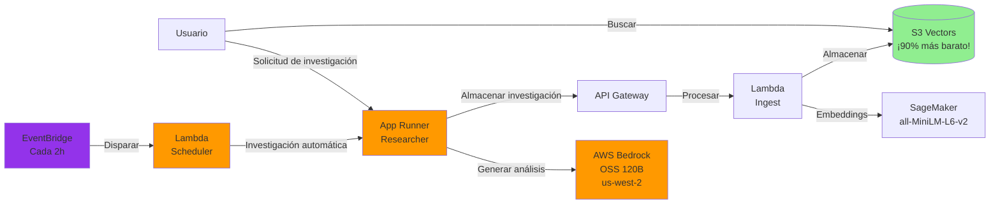

# Guía 4: Despliega el Agente Investigador

En esta guía, desplegarás el servicio Alex Researcher: un agente de IA que genera investigaciones de inversión y las almacena automáticamente en tu base de conocimientos.

## Prerrequisitos

Antes de comenzar, asegúrate de tener:
1. Completado las Guías 1-3 (SageMaker, S3 Vectors y Pipeline de Ingesta desplegados)
2. Docker Desktop instalado y en ejecución
3. AWS CLI configurado con tus credenciales
4. Acceso a los modelos OpenAI OSS de AWS Bedrock (ver Paso 0 abajo)

## ¡RECORDATORIO - CONSEJO IMPORTANTE!

Hay un archivo `gameplan.md` en la raíz del proyecto que describe todo el proyecto Alex a un Agente de IA, para que puedas hacer preguntas y recibir ayuda. También existen los archivos idénticos `CLAUDE.md` y `AGENTS.md`. Si necesitas ayuda, simplemente inicia tu agente de IA favorito y dale la siguiente instrucción:

> Soy estudiante en el curso AI in Production. Estamos en el repositorio del curso. Lee el archivo `gameplan.md` para un resumen del proyecto. Lee este archivo completamente y revisa todas las guías vinculadas cuidadosamente. No comiences ningún trabajo aparte de leer y comprobar la estructura de carpetas. Cuando hayas terminado de leer, dime si tienes preguntas antes de que empecemos.

Después de responder preguntas, di exactamente en qué guía estás y cualquier problema. Ten cuidado de validar cada sugerencia; siempre pregunta por la causa raíz y evidencia de los problemas. Los LLM tienden a sacar conclusiones apresuradas, pero a menudo se corrigen cuando se les pide evidencia.

## Qué vas a desplegar

El servicio Researcher es una aplicación AWS App Runner que:
- Usa el SDK OpenAI Agents para orquestación y trazabilidad del agente
- Usa AWS Bedrock con el modelo OSS 120B de OpenAI para capacidades de IA
- Emplea un servidor MCP (Model Context Protocol) de Playwright para navegación web y obtención de datos
- Llama automáticamente a tu pipeline de ingesta para almacenar investigaciones en S3 Vectors
- Proporciona una API REST para generar análisis financieros bajo demanda

Así encaja en la arquitectura de Alex:



## Paso 0: Solicita acceso a los modelos Bedrock

Researcher utiliza AWS Bedrock con el modelo open-source OSS 120B de OpenAI. Primero necesitas solicitar acceso a este modelo.

### Solicitar acceso al modelo - Estas instrucciones son para modelos OSS, pero también puedes usar Nova en us-east-1 o en tu región (más económico y sencillo)

1. Inicia sesión en la consola de AWS
2. Navega al servicio **Amazon Bedrock**
3. Cambia a la región **US West (Oregon) us-west-2** (parte superior derecha)
4. En el menú lateral izquierdo, haz clic en **Model access**
5. Haz clic en **Manage model access** o **Modify model access**
6. Busca la sección **OpenAI**
7. Marca las casillas para:
   - **gpt-oss-120b** (OpenAI GPT OSS 120B)
   - **gpt-oss-20b** (OpenAI GPT OSS 20B) - opcional, modelo más pequeño
8. Haz clic en **Request model access** en la parte inferior
9. Espera la aprobación (normalmente instantánea para estos modelos)
10. Como alternativa, solicita acceso a los modelos Amazon Nova en tu región o en us-east-1

**Notas importantes:**
- ⚠️ Los modelos OSS SOLO están disponibles en la región **us-west-2**
- ✅ Tu servicio App Runner puede estar en cualquier región (por ejemplo, us-east-1) y conectarse entre regiones a us-west-2
- Los modelos OSS son modelos open-weight de OpenAI, no son los modelos GPT comerciales
- No se requiere API Key para Bedrock – la autenticación la gestiona AWS IAM
- El agente researcher requiere una API Key de OpenAI para la funcionalidad de trazado del SDK OpenAI Agents (para monitorear y depurar la ejecución del agente)

## Parte extra del Paso 0: ¡IMPORTANTE - AGREGADO DESDE LOS VIDEOS!

### Actualiza server.py con tu modelo

Muchas gracias al estudiante Marcin B. por este paso crucial.

En laboratorios futuros, haremos esto más configurable. Pero en este paso, el Agente Researcher tiene algunas variables en el código que necesitas cambiar manualmente.

Por favor, revisa el archivo `backend/researcher/server.py`

Deberías ver esta sección:

```python
    # Por favor, sobrescribe estas variables con la región que estás usando
    # Otras opciones: us-west-2 (para modelos OpenAI OSS) y eu-central-1
    REGION = "us-east-1"
    os.environ["AWS_REGION_NAME"] = REGION  # Variable preferida de LiteLLM
    os.environ["AWS_REGION"] = REGION  # Estándar en Boto3
    os.environ["AWS_DEFAULT_REGION"] = REGION  # Fallback

    # Por favor, sobrescribe esta variable con el modelo que estés utilizando
    # Opciones comunes: bedrock/eu.amazon.nova-pro-v1:0 para EU y bedrock/us.amazon.nova-pro-v1:0 para US
    # o bedrock/amazon.nova-pro-v1:0 si no usas perfiles de inferencia
    # bedrock/openai.gpt-oss-120b-1:0 para modelos OpenAI OSS
    # bedrock/converse/us.anthropic.claude-sonnet-4-20250514-v1:0 para Claude Sonnet 4
    # NOTA: nova-pro es necesario para soportar herramientas y servidores MCP; nova-lite no es suficiente – gracias Yuelin L.!
    MODEL = "bedrock/us.amazon.nova-pro-v1:0"
    model = LitellmModel(model=MODEL)
```

Actualiza los valores de REGION y MODEL para reflejar el modelo al que tienes acceso. Ve los ejemplos dados para valores posibles.  
Ten en cuenta que nova-lite no es una elección aceptable ya que no soporta tool calling/MCP. ¡Gracias Yuelin L!

## Paso 1: Despliega la infraestructura

Primero, asegúrate de tener tu clave API de OpenAI y los valores de la Parte 3 en tu archivo `.env`.

Abre el archivo `.env` en la raíz del proyecto usando el explorador de archivos de Cursor y verifica que tienes estos valores:
- `OPENAI_API_KEY` - Tu clave API de OpenAI (requerida para trazado del agente)
- `ALEX_API_ENDPOINT` - De la Parte 3
- `ALEX_API_KEY` - De la Parte 3

Si aún no has agregado tu clave API de OpenAI, añade esta línea al archivo `.env`:
```
OPENAI_API_KEY=sk-...  # Tu clave API real de OpenAI (requerida para el trazado del agente)
```

Ahora configura la infraestructura inicial:

```bash
# Navega al directorio terraform/4_researcher
# Copia el archivo de variables de ejemplo
cp terraform.tfvars.example terraform.tfvars
```

Edita `terraform.tfvars` y actualízalo con tus valores del archivo `.env`:
```hcl
aws_region = "us-east-1"  # Tu región de AWS
openai_api_key = "sk-..."  # Tu clave API de OpenAI
alex_api_endpoint = "https://xxxxxxxxxx.execute-api.us-east-1.amazonaws.com/prod/ingest"  # De la Parte 3
alex_api_key = "your-api-key-here"  # De la Parte 3
scheduler_enabled = false  # Mantenlo en false por ahora
```

Despliega primero el repositorio ECR y los roles IAM:

```bash
# Inicializa Terraform (crea el archivo de estado local)
terraform init

# Despliega solo el repositorio ECR y los roles IAM (no App Runner todavía)
terraform apply -target=aws_ecr_repository.researcher -target=aws_iam_role.app_runner_role
```

Escribe `yes` cuando se te solicite. Esto crea:
- Repositorio ECR para tus imágenes Docker
- Roles IAM con permisos adecuados para App Runner

Guarda la URL del repositorio ECR que aparece en la salida: la necesitarás en el Paso 2.

## Paso 2: Construye y despliega el Researcher

Ahora vamos a construir el contenedor Docker y a desplegarlo en App Runner.

```bash
# Navega al directorio backend/researcher
uv run deploy.py
```

Este script:
1. Construirá una imagen Docker (con `--platform linux/amd64` para compatibilidad)
2. La subirá a tu repositorio ECR
3. Lanzará un despliegue en App Runner
4. Esperará a que finalice el despliegue (3-5 minutos)
5. Mostrará la URL de tu servicio cuando esté listo

**Nota importante para usuarios de Mac con Apple Silicon:**
El script de despliegue construye automáticamente para la arquitectura `linux/amd64` para asegurar compatibilidad con AWS App Runner. Por eso verás "Building Docker image for linux/amd64..." en la salida.

Cuando finalice la subida de la imagen Docker, verás:
```
✅ ¡Imagen Docker subida exitosamente!
```

## Paso 3: Crea el servicio App Runner

Ahora que tu imagen Docker está en ECR, crea el servicio App Runner:

```bash
# Vuelve al directorio terraform/4_researcher
# Despliega toda la infraestructura, incluyendo App Runner
terraform apply
```

Escribe `yes` cuando se te solicite. Esto:
- Creará el servicio App Runner usando tu imagen Docker
- Configurará variables de entorno para el servicio
- Configurará el EventBridge scheduler opcional (si está habilitado)

La creación del servicio App Runner tarda 3-5 minutos. Cuando finalice, verás la URL del servicio en la salida.

## Paso 4: Prueba el sistema completo

Probemos la pipeline completa: Investigación → Ingesta → Búsqueda.

### 4.1: Primero, limpia la base de datos

Borra cualquier dato de prueba existente:

```bash
# Navega al directorio backend/ingest
uv run cleanup_s3vectors.py
```

Deberías ver: "✅ Todos los documentos eliminados exitosamente"

### 4.2: Genera investigación

Ahora genera investigación de inversión:

```bash
# Navega al directorio backend/researcher
uv run test_research.py
```

Este script:
1. Encuentra automáticamente la URL de tu servicio App Runner
2. Verifica que el servicio esté saludable
3. Genera investigación sobre un tema de actualidad (por defecto)
4. Muestra los resultados
5. La almacena automáticamente en tu base de conocimientos

También puedes investigar temas específicos:
```bash
uv run test_research.py "Ventajas competitivas de Tesla"
uv run test_research.py "Crecimiento de ingresos de la nube de Microsoft"
```

La investigación tarda 20-30 segundos ya que el agente navega por sitios financieros y genera conclusiones de inversión.

### 4.3: Verifica almacenamiento de datos

Comprueba que la investigación fue almacenada:

```bash
# Navega al directorio backend/ingest
uv run test_search_s3vectors.py
```

Deberías ver tu investigación en la base de datos con:
- El contenido de investigación
- Embeddings generados por SageMaker
- Metadata incluyendo timestamp y tema

### 4.4: Prueba búsqueda semántica

Ahora comprueba que la búsqueda semántica funciona:

```bash
uv run test_search_s3vectors.py "mercado de vehículos eléctricos"
```

Aunque busques algo distinto a lo almacenado, la búsqueda semántica encontrará contenido relacionado.

## Paso 5: Prueba el Researcher

Ahora que el servicio está desplegado y probado, exploraremos sus capacidades.

### Prueba de Health Check

Verifica que el servicio esté saludable:

**Mac/Linux:**
```bash
curl https://YOUR_SERVICE_URL/health
```

**Windows PowerShell:**
```powershell
Invoke-WebRequest -Uri "https://YOUR_SERVICE_URL/health" | ConvertFrom-Json
```

Deberías ver:
```json
{
  "service": "Alex Researcher",
  "status": "healthy",
  "alex_api_configured": true,
  "timestamp": "2025-..."
}
```

### Prueba con diferentes temas

1. **Genera múltiples análisis:**
   ```bash
   uv run test_research.py "Cuota de mercado de chips de IA de NVIDIA"
   uv run test_research.py "Crecimiento de ingresos por servicios de Apple"
   uv run test_research.py "Oro vs Bitcoin como cobertura ante la inflación"
   ```

2. **Busca entre temas:**
   ```bash
   # Navega al directorio backend/ingest
   uv run test_search_s3vectors.py "inteligencia artificial"
   uv run test_search_s3vectors.py "protección contra la inflación"
   ```

3. **Construye tu base de conocimientos:**
   Prueba diferentes temas de inversión y construye una base de conocimientos completa para gestión de portafolios.

## Paso 6: Habilita investigación automatizada (opcional)

Ahora habilitaremos investigación automatizada cada 2 horas para recolectar los últimos insights financieros y ampliar tu base de conocimientos.

### Habilita el Scheduler

El scheduler está deshabilitado por defecto. Para habilitarlo:

```bash
# Navega al directorio terraform/4_researcher si no estás allí ya
# Edita tu archivo terraform.tfvars
```

Cambia el valor de `scheduler_enabled` en `terraform.tfvars`:
```hcl
scheduler_enabled = true  # Cambiado de false
```

Luego aplica el cambio:
```bash
terraform apply
```

**Windows PowerShell:**
```powershell
# Navega al directorio terraform/4_researcher
# Edita terraform.tfvars y pon scheduler_enabled = true
# Aplica el cambio
terraform apply
```

Escribe `yes` cuando se te solicite. Verás:
- Se crearán nuevos recursos (función Lambda y EventBridge schedule)
- Salida mostrando `scheduler_status = "ENABLED - Running every 2 hours"`

**Nota:** El scheduler usa una pequeña función Lambda para llamar a tu endpoint App Runner. Esto es necesario porque los endpoints App Runner pueden tardar 30-60 segundos en completar la investigación, pero EventBridge API Destinations tiene un límite de timeout de 5 segundos.

### Verifica el estado del scheduler

Consulta el estado actual del scheduler:

```bash
terraform output scheduler_status
```

### Monitorea la investigación automatizada

El scheduler llamará a tu endpoint `/research/auto` cada 2 horas. Puedes:

1. Ver los logs de Lambda para ver cuándo se ejecuta:
```bash
aws logs tail /aws/lambda/alex-research-scheduler --follow --region us-east-1
```

2. Ver los logs de App Runner para ver la investigación realizada:
```bash
aws logs tail /aws/apprunner/alex-researcher/*/application --follow --region us-east-1
```

3. Buscar en tu base S3 Vectors para ver la investigación acumulada:
```bash
# Navega al directorio backend/ingest
uv run test_search_s3vectors.py
```

### Desactiva el scheduler (cuando lo necesites)

Cuando quieras detener la investigación automatizada (para ahorrar costos de API):

**Mac/Linux:**
```bash
# Navega al directorio terraform/4_researcher
terraform apply -var="scheduler_enabled=false"
```

**Windows PowerShell:**
```powershell
# Navega al directorio terraform/4_researcher
terraform apply -var="scheduler_enabled=false"
```

Esto eliminará el scheduler pero mantendrá activos los demás servicios.

## Resolución de problemas

### "Service creation failed"
- Revisa que tu repositorio ECR exista: `aws ecr describe-repositories`
- Asegúrate de que Docker esté en funcionamiento
- Verifica que tus credenciales AWS estén configuradas

### "Deployment stuck in OPERATION_IN_PROGRESS"
- Es normal en el primer despliegue (puede tardar 5-10 minutos)
- Revisa los logs de CloudWatch en AWS Console > App Runner > Tu servicio > Logs

### "Exit code 255" o el servicio no inicia
- Generalmente la imagen Docker no está construida para la arquitectura correcta
- Asegúrate que el script de despliegue use `--platform linux/amd64`
- Reconstruye y vuelve a desplegar

### "Connection refused" al llamar al servicio
- Verifica que el estado del servicio sea "RUNNING"
- Asegúrate de usar HTTPS (no HTTP)
- Verifica que la URL del servicio sea correcta

### Errores "504 Gateway Timeout"
- El agente puede estar tardando mucho (>30 segundos)
- Es normal si el agente navega varios sitios web
- La investigación debería completarse y almacenarse igualmente

### "Invalid model identifier" o errores de Bedrock
- Asegúrate de haber solicitado acceso a los modelos OSS en us-west-2 (ver Paso 0)
- Comprueba que tu rol IAM tenga permisos para Bedrock (debería ser añadido por Terraform)
- Los modelos solo están disponibles en us-west-2 pero puedes acceder desde cualquier región
- Verifica acceso a modelos: Ve a la consola de Bedrock → Model access → Check status

## Limpieza (opcional)

Si deseas detener TODOS los servicios para evitar costos:

```bash
# Navega al directorio terraform/4_researcher
terraform destroy
```

Esto eliminará todos los recursos AWS creados en esta guía.

## Resumen

¡Has desplegado exitosamente un sistema de IA agente que puede investigar, analizar y gestionar conocimiento de inversión! El sistema utiliza arquitectura moderna cloud-native, escalado automático, búsqueda vectorial e IA agentes trabajando juntos para brindarte análisis financieros inteligentes.

## Guarda tu configuración

Antes de pasar a la siguiente guía, asegúrate de que tu archivo `.env` esté actualizado:

```bash
# Navega a la raíz del proyecto y edita .env
# Usa tu editor de texto favorito (nano, vim, o ábrelo en Cursor)
```

Verifica que tienes todos estos valores de las Partes 1-4:
```
# Parte 1
AWS_ACCOUNT_ID=123456789012
DEFAULT_AWS_REGION=us-east-1

# Parte 2
SAGEMAKER_ENDPOINT=alex-embedding-endpoint

# Parte 3
VECTOR_BUCKET=alex-vectors-123456789012
ALEX_API_ENDPOINT=https://xxxxxxxxxx.execute-api.us-east-1.amazonaws.com/prod/ingest
ALEX_API_KEY=your-api-key-here

# Parte 4
OPENAI_API_KEY=sk-...
```

## ¿Qué sigue?

¡Felicidades! Ahora tienes una pipeline de investigación con IA completa:
1. **Agente Researcher** (App Runner) – Genera análisis de inversión usando modelos Bedrock OSS en us-west-2
2. **Pipeline de Ingesta** (Lambda) – Procesa y almacena documentos
3. **Base de datos vectorial** (S3 Vectors) – Búsqueda semántica rentable
4. **Modelo de embeddings** (SageMaker) – Crea representaciones semánticas
5. **Scheduler automatizado** (EventBridge + Lambda) – Opcional, genera investigación cada 2 horas

Tu sistema ahora puede:
- Generar investigación de inversión profesional bajo demanda
- Almacenar e indexar automáticamente toda la investigación
- Realizar búsqueda semántica en toda tu base de conocimientos
- Escalar automáticamente según la demanda
- Construir conocimiento continuamente con investigación programada

Continúa con: [5_database.md](5_database.md) donde configuraremos Aurora Serverless v2 PostgreSQL para gestionar portafolios de usuario y datos financieros.