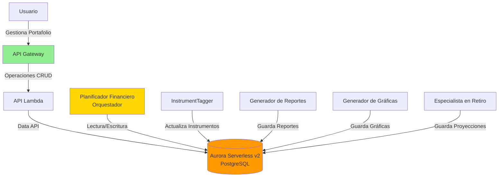
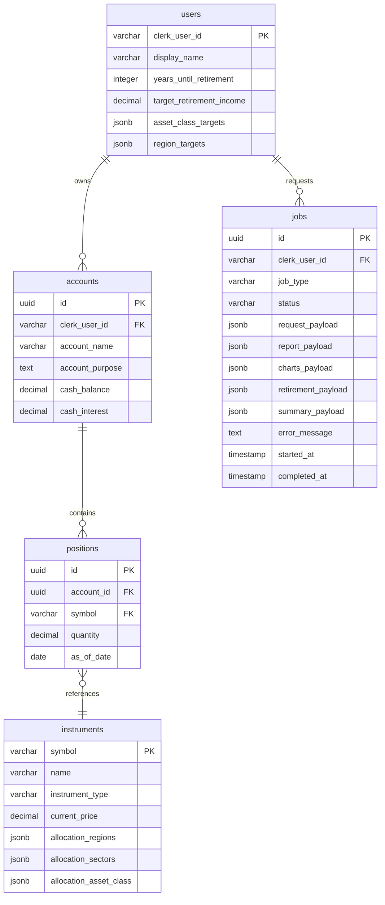

# Construyendo Alex: Parte 5 - Base de Datos e Infraestructura Compartida

¡Bienvenido a la Parte 5! Ahora entramos en la segunda fase de construir Alex: transformarlo de una herramienta de investigación a una plataforma SaaS completa de planificación financiera. En esta guía, configuraremos Aurora Serverless v2 PostgreSQL con la Data API y crearemos una librería reutilizable de base de datos que usarán todos nuestros agentes de IA.

## RECORDATORIO - ¡CONSEJO IMPORTANTE!

Hay un archivo llamado `gameplan.md` en la raíz del proyecto que describe todo el proyecto Alex a un Agente de IA, para que puedas hacer preguntas y obtener ayuda. También hay un archivo idéntico `CLAUDE.md` y `AGENTS.md`. Si necesitas ayuda, simplemente inicia tu Agente de IA favorito y dale esta instrucción:

> Soy un estudiante en el curso AI in Production. Estamos en el repositorio del curso. Lee el archivo `gameplan.md` para informarte sobre el proyecto. Lee este archivo completamente y revisa detenidamente todas las guías enlazadas. No empieces ningún trabajo salvo leer y comprobar la estructura del directorio. Cuando hayas completado toda la lectura, avísame si tienes preguntas antes de que empecemos.

Después de responder preguntas, indica exactamente en qué guía estás y cualquier problema. Sé cuidadoso validando cada sugerencia; siempre pregunta la causa raíz y evidencia de los problemas. Los LLM suelen saltar a conclusiones, pero a menudo se corrigen cuando tienen que proporcionar pruebas.

## ¿Por qué Aurora Serverless v2 con Data API?

AWS ofrece varias opciones de bases de datos, cada una con diferentes ventajas:

### Servicios Comunes de Bases de Datos en AWS

| Servicio           | Tipo            | Mejor Para                                | Por qué no lo elegimos                                            |
| -----------------  | --------------- | ----------------------------------------- | ---------------------------------------------------------------  |
| **DynamoDB**       | NoSQL           | Búsquedas clave-valor simples, apps de gran escala | No soporta joins en SQL, complejo para datos relacionales como portafolios |
| **RDS (Regular)**  | SQL Tradicional | Cargas predecibles, apps siempre activas  | Requiere configuración de VPC/red, siempre encendido = coste alto |
| **DocumentDB**     | NoSQL Documento | Apps compatibles con MongoDB              | Demasiado para datos financieros estructurados                   |
| **Neptune**        | Grafos           | Redes sociales, motores de recomendación  | No es adecuado - no necesitamos relaciones de grafo              |
| **Timestream**     | Series temporales| IoT, métricas, logs                       | Demasiado específico para datos generales de portafolios         |

### ¿Por qué Aurora Serverless v2 PostgreSQL?

Elegimos **Aurora Serverless v2 con Data API** porque ofrece:

1. **Sin complejidad de VPC** - La Data API ofrece acceso HTTP, eliminando configuración de red
2. **Escala a cero** - Puede pausarse tras inactividad, reduciendo costes hasta unos ~$1.44/día mínimo
3. **PostgreSQL** - Soporte SQL completo con JSONB para datos flexibles (porcentaje de asignaciones)
4. **Serverless** - Escala automáticamente según demanda, perfecto para proyectos de aprendizaje
5. **Data API** - Acceso HTTP directo desde Lambda sin pools de conexión ni VPC
6. **Pago por uso** - Solo pagas por lo que usas, ideal para desarrollo

Para estudiantes aprendiendo AWS, esto elimina la complejidad de VPCs, grupos de seguridad y gestión de conexiones, mientras proporciona una base de datos de nivel producción que funciona perfectamente con funciones Lambda.

## ¿Qué vamos a construir?

En esta guía desplegarás:

- Clúster Aurora Serverless v2 PostgreSQL con Data API activada (¡sin necesidad de VPC!)
- Esquema de base de datos completo para portafolios, usuarios e informes
- Paquete compartido de base de datos con validación Pydantic
- Datos de prueba con 22 ETFs populares
- Scripts para reiniciar la base de datos fácilmente durante el desarrollo

Así es como encaja la base de datos en nuestra arquitectura:



## Prerrequisitos

Antes de empezar, asegúrate de tener:

- Completado las Guías 1-4 (toda la infraestructura de las Partes 1-4)
- AWS CLI configurado
- Python con el gestor de paquetes `uv` instalado
- Terraform instalado
- Docker Desktop instalado y corriendo (para pruebas locales)

## Paso 0: Permisos IAM adicionales

Desde la Guía 4, necesitamos permisos adicionales en AWS para Aurora y servicios asociados.

### Crea una Política RDS Personalizada

1. Inicia sesión en la Consola de AWS como usuario root (solo para la configuración de IAM)
2. Ve a **IAM** → **Políticas**
3. Haz clic en **Crear política**
4. Haz clic en la pestaña **JSON**
5. Sustituye el contenido por:

```json
{
  "Version": "2012-10-17",
  "Statement": [
    {
      "Sid": "RDSPermissions",
      "Effect": "Allow",
      "Action": [
        "rds:CreateDBCluster",
        "rds:CreateDBInstance",
        "rds:CreateDBSubnetGroup",
        "rds:DeleteDBCluster",
        "rds:DeleteDBInstance",
        "rds:DeleteDBSubnetGroup",
        "rds:DescribeDBClusters",
        "rds:DescribeDBInstances",
        "rds:DescribeDBSubnetGroups",
        "rds:DescribeGlobalClusters",
        "rds:ModifyDBCluster",
        "rds:ModifyDBInstance",
        "rds:ModifyDBSubnetGroup",
        "rds:AddTagsToResource",
        "rds:ListTagsForResource",
        "rds:RemoveTagsFromResource",
        "rds-data:ExecuteStatement",
        "rds-data:BatchExecuteStatement",
        "rds-data:BeginTransaction",
        "rds-data:CommitTransaction",
        "rds-data:RollbackTransaction"
      ],
      "Resource": "*"
    },
    {
      "Sid": "EC2Permissions",
      "Effect": "Allow",
      "Action": [
        "ec2:DescribeVpcs",
        "ec2:DescribeVpcAttribute",
        "ec2:DescribeSubnets",
        "ec2:DescribeAvailabilityZones",
        "ec2:DescribeSecurityGroups",
        "ec2:CreateSecurityGroup",
        "ec2:DeleteSecurityGroup",
        "ec2:AuthorizeSecurityGroupIngress",
        "ec2:AuthorizeSecurityGroupEgress",
        "ec2:RevokeSecurityGroupIngress",
        "ec2:RevokeSecurityGroupEgress",
        "ec2:CreateTags",
        "ec2:DescribeTags"
      ],
      "Resource": "*"
    },
    {
      "Sid": "SecretsManagerPermissions",
      "Effect": "Allow",
      "Action": [
        "secretsmanager:CreateSecret",
        "secretsmanager:DeleteSecret",
        "secretsmanager:DescribeSecret",
        "secretsmanager:GetSecretValue",
        "secretsmanager:PutSecretValue",
        "secretsmanager:UpdateSecret"
      ],
      "Resource": "*"
    },
    {
      "Sid": "KMSPermissions",
      "Effect": "Allow",
      "Action": [
        "kms:CreateGrant",
        "kms:Decrypt",
        "kms:DescribeKey",
        "kms:Encrypt"
      ],
      "Resource": "*"
    }
  ]
}
```

6. Haz clic en **Siguiente: Etiquetas**, luego **Siguiente: Revisar**
7. Para **Nombre de la política**, escribe: `AlexRDSCustomPolicy`
8. Para **Descripción**, escribe: `RDS and Data API permissions for Alex project`
9. Haz clic en **Crear política**

### Agregar Políticas Administradas de AWS requeridas

1. Aún en IAM, haz clic en **Grupos de usuarios** en la barra lateral
2. Haz clic en el grupo `AlexAccess` (creado en la Guía 1)
3. Haz clic en la pestaña **Permisos**, luego en **Agregar permisos** → **Adjuntar políticas**
4. Busca y selecciona estas políticas administradas de AWS:
   - `AmazonRDSDataFullAccess`
   - `AWSLambda_FullAccess`
   - `AmazonSQSFullAccess`
   - `AmazonEventBridgeFullAccess`
   - `SecretsManagerReadWrite`
5. También selecciona la política personalizada que acabas de crear:
   - `AlexRDSCustomPolicy`
6. Haz clic en **Agregar permisos**

### Verificar Permisos

Cierra sesión y vuelve a acceder con tu usuario IAM, luego verifica:

```bash
# Debería devolver lista vacía o los clústeres existentes
aws rds describe-db-clusters

# Debería mostrar que el comando existe y lista los parámetros requeridos
aws rds-data execute-statement --help
# Deberías ver: "the following arguments are required: --resource-arn, --secret-arn, --sql"
# Esto confirma que los comandos Data API están disponibles
```

## Paso 1: Desplegar Aurora Serverless v2

Ahora vamos a desplegar la infraestructura de base de datos con Terraform.

### Configura y Despliega la Base de Datos

```bash
# Desde la raíz del proyecto (directorio alex)
cd terraform/5_database

# Copia el archivo de variables de ejemplo
cp terraform.tfvars.example terraform.tfvars
```

Edita `terraform.tfvars` y pon tus valores:

```hcl
aws_region = "us-east-1"  # Tu región AWS
min_capacity = 0.5        # ACUs mínimos (0.5 = ~$43/mes)
max_capacity = 1.0        # ACUs máximos (bajo para desarrollo)
```

Despliega la base de datos:

```bash
# Inicializa Terraform (crea archivo local de estado)
terraform init

# Despliega la infraestructura de base de datos
terraform apply
```

Escribe `yes` cuando se te pida. Esto creará:

- Clúster Aurora Serverless v2 con Data API activada
- Credenciales de base de datos en Secrets Manager
- Grupo de seguridad y configuración de subredes
- La base de datos `alex`

El despliegue tarda unos 10-15 minutos. Al finalizar, Terraform mostrará valores importantes como el ARN del clúster y el ARN del secreto.

### Guarda tu Configuración

**Importante**: Actualiza tu archivo `.env` con los valores de la base de datos:

1. Revisa los outputs de Terraform:

   ```bash
   terraform output
   ```

2. Edita el archivo `.env` en la raíz de tu proyecto:

   - En el explorador de archivos de Cursor, haz clic en `.env` en el directorio alex
   - Si no lo ves, asegúrate de que los archivos ocultos sean visibles (Cmd+Shift+. en Mac, Ctrl+H en Linux/Windows)

3. Añade estas líneas con los valores del output de Terraform:
   ```
   # Parte 5 - Base de datos
   AURORA_CLUSTER_ARN=arn:aws:rds:us-east-1:123456789012:cluster:alex-aurora-cluster
   AURORA_SECRET_ARN=arn:aws:secretsmanager:us-east-1:123456789012:secret:alex-aurora-credentials-xxxxx
   ```

💡 **Consejo**: Los valores exactos de ARN se muestran en el output de Terraform. ¡Cópialos cuidadosamente!

## Paso 2: Inicializar la Base de Datos

Ahora probemos la conexión y creemos nuestro esquema.

```bash
# Desde la raíz del proyecto (directorio alex)
cd backend/database

# Prueba la conexión Data API
uv run test_data_api.py
```

Deberías ver:

```
✅ ¡Conectado exitosamente a Aurora usando Data API!
Database version: PostgreSQL 15.x
```

## Paso 3: Ejecutar Migraciones de Base de Datos

Crea el esquema de la base de datos:

```bash
# Desde el directorio backend/database
uv run run_migrations.py
```

Deberías ver:

```
Starting migration: 001_schema.sql
✅ Migración completada exitosamente
¡Todas las migraciones completadas!
```

## Paso 4: Cargar Datos de Ejemplo

Ahora vamos a poblar la tabla instruments con 22 ETFs populares:

```bash
# Desde backend/database
uv run seed_data.py
```

Deberías ver:

```
Seeding 22 instruments...
✅ SPY - SPDR S&P 500 ETF
✅ QQQ - Invesco QQQ Trust
✅ BND - Vanguard Total Bond Market ETF
[... más ETFs ...]
✅ Successfully seeded 22 instruments
```

## Paso 5: Crear Datos de Prueba (Opcional)

Para desarrollo, creemos un usuario de prueba con un portafolio de ejemplo:

```bash
# Desde backend/database
uv run reset_db.py --with-test-data
```

Deberías ver:

```
Dropping all tables...
Running migrations...
Loading default instruments...
Creating test user with portfolio...
✅ Database reset complete with test data!

Test user created:
- User ID: test_user_001
- Display Name: Test User
- 3 accounts (401k, Roth IRA, Taxable)
- 5 positions in 401k account
```

## Paso 6: Verificar la Integridad de la Base de Datos

Por último, ejecuta el script de verificación para obtener un reporte completo del estado de la base de datos. Esto es un valioso chequeo para asegurarte de que todo esté correctamente antes de continuar a la Parte 6.

```bash
1 # Desde backend/database
2 uv run verify_database.py
```

El script te dará un reporte detallado resumiendo cantidad de tablas, integridad de los datos y más. Lo clave a verificar es el
banner final de confirmación al final del reporte:

```bash
---
🎉 VERIFICACIÓN DE BASE DE DATOS COMPLETADA
---
✅ Todas las tablas creadas exitosamente
✅ Instrumentos cargados con datos completos de asignación
✅ Todos los porcentajes de asignación suman 100%
✅ Índices y triggers presentes
✅ ¡Base de datos lista para la Parte 6: Orquesta de Agentes!
```

## Entendiendo el Esquema de la Base de Datos

Nuestro esquema incluye cinco tablas con separación clara entre datos específicos de usuario y datos compartidos de referencia:



### Descripción de Tablas

- **users**: Datos básicos del usuario (Clerk maneja la autenticación)
- **instruments**: ETFs, acciones y fondos con precios actuales y datos de asignación (datos de referencia compartidos)
- **accounts**: Cuentas de inversión del usuario (401k, IRA, etc.)
- **positions**: Posesiones en cada cuenta
- **jobs**: Seguimiento asíncrono de análisis, con campos separados para la salida de cada agente:
  - `report_payload`: Análisis en markdown del agente Reporter
  - `charts_payload`: Datos de visualización de Charter
  - `retirement_payload`: Proyecciones del agente Retirement
  - `summary_payload`: Resumen final y metadatos del agente Planner

Todos los datos se validan mediante esquemas Pydantic antes de insertarse en la base de datos, asegurando integridad. Cada agente escribe sus resultados en su propio campo JSONB dedicado en la tabla `jobs`, eliminando la necesidad de lógica compleja de fusiones. El seguimiento de ejecución de agentes se maneja con LangFuse y CloudWatch Logs, no en la base de datos.

## Gestión de Costes

Aurora Serverless v2 cuesta aproximadamente:

- **Capacidad mínima (0.5 ACU)**: ~$43/mes
- **Funcionamiento normal**: $1.44-$2.88/día

### Gestión de Costes

Para minimizar costes cuando no estés desarrollando:

```bash
# Para destruir completamente la base de datos y parar todos los cargos:
cd terraform/5_database
terraform destroy

# Para crear de nuevo la base de datos después:
terraform apply
```

⚠️ **Advertencia**: `terraform destroy` eliminará por completo la base de datos y todos los datos. Hazlo solo cuando hayas acabado el desarrollo o vayas a pausar.

**Recomendación**: Completa las Partes 5-8 en 3-5 días y luego destruye para evitar costes adicionales.

## Solución de Problemas

### Problemas de Conexión con Data API

Si no puedes conectar con la Data API:

1. **Comprueba el estado del clúster**:

```bash
aws rds describe-db-clusters --db-cluster-identifier alex-aurora-cluster
```

El estado debe ser "available"

2. **Comprueba si la Data API está activa**:

```bash
aws rds describe-db-clusters --db-cluster-identifier alex-aurora-cluster --query 'DBClusters[0].EnableHttpEndpoint'
```

Debe devolver `true`

3. **Verifica los secretos** (el nombre del secreto tiene un sufijo aleatorio):

```bash
# Lista todos los secretos para encontrar el nombre correcto
aws secretsmanager list-secrets --query "SecretList[?contains(Name, 'alex-aurora-credentials')].Name"

# Después, obtiene el valor del secreto (reemplaza por el nombre real de arriba)
aws secretsmanager get-secret-value --secret-id alex-aurora-credentials-xxxxx --query SecretString --output text | jq .
```

Debe mostrar usuario y contraseña

### Fallos en Migraciones

Si las migraciones fallan:

1. **Revisa la sintaxis SQL**:

```bash
# Desde backend/database
# Las migraciones están en el subdirectorio migrations
cat migrations/001_schema.sql
```

2. **Reinicia y reintenta**:

```bash
# Desde backend/database
uv run reset_db.py
# Esto eliminará todas las tablas, ejecutará migraciones y recargará datos de ejemplo
```

### Errores de Validación en Pydantic

Si ves errores de validación:

1. **Comprueba la suma de asignaciones**:
   Todos los diccionarios de asignación deben sumar 100.0

2. **Revisa los tipos Literal**:
   Usa solo los valores permitidos para regiones, sectores y clases de activos

3. **Revisa las definiciones de esquema**:

```bash
# Desde backend/database
cat src/schemas.py
```

## Próximos Pasos

¡Excelente! Ahora tienes una base de datos de nivel producción con:

- ✅ Aurora Serverless v2 con Data API (¡sin complejidad de VPC!)
- ✅ Esquema completo para datos financieros
- ✅ Validación con Pydantic para todos los datos
- ✅ 22 ETFs con datos de composición
- ✅ Paquete de base de datos compartido para todos los agentes

Continúa con [6_agents.md](6_agents.md) donde construiremos la orquesta de agentes de IA que usará esta base de datos para brindar análisis financiero completo.

¡Tu base de datos está lista y esperando a los agentes! 🚀
