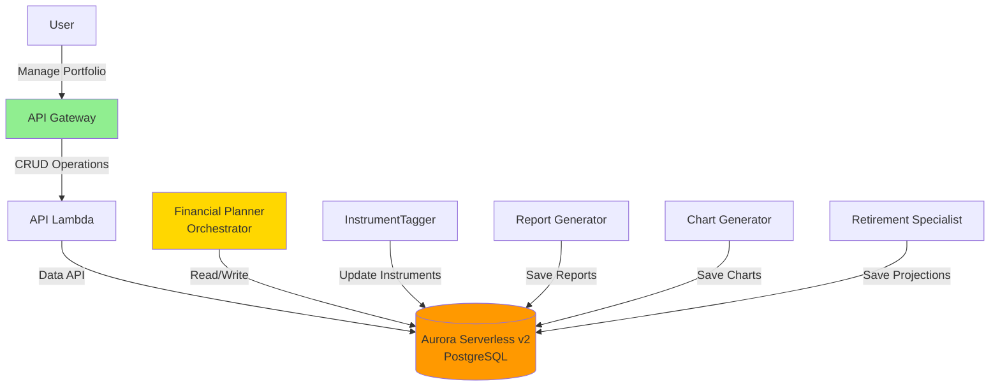
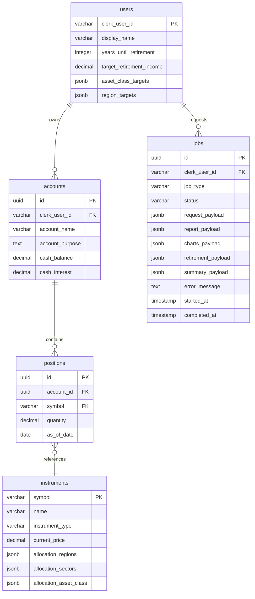

# Building Alex: Part 5 - Database and Shared Infrastructure

Welcome to Part 5! We now enter the second phase of building Alex: transforming it from a research tool into a full financial planning SaaS platform. In this guide, we will configure Aurora Serverless v2 PostgreSQL with the Data API and create a reusable database library that all of our AI agents will use.

## REMINDER - IMPORTANT TIP!

There is a file named `gameplan.md` at the project root that describes the full Alex project for an AI Agent, so you can ask questions and get help. There is also an identical file `CLAUDE.md` and `AGENTS.md`. If you need help, simply start your favorite AI Agent and give it this instruction:

> I am a student in the AI in Production course. We are in the course repository. Read the `gameplan.md` file to understand the project. Read this file completely and carefully review all linked guides. Do not start any work other than reading and checking the directory structure. When you have completed all reading, tell me if you have questions before we begin.

After answering questions, state exactly which guide you are on and any issue. Be careful validating every suggestion; always ask for the root cause and evidence for problems. LLMs often jump to conclusions, but they usually self-correct when required to provide proof.

## Why Aurora Serverless v2 with Data API?

AWS offers several database options, each with different strengths:

### Common Database Services on AWS

| Service           | Type            | Best For                                  | Why We Didn't Choose It                                          |
| ----------------- | --------------- | ----------------------------------------- | ---------------------------------------------------------------  |
| **DynamoDB**      | NoSQL           | Simple key-value lookups, large-scale apps | Does not support SQL joins, complex for relational data like portfolios |
| **RDS (Regular)** | Traditional SQL | Predictable workloads, always-on apps     | Requires VPC/network setup, always on = higher cost             |
| **DocumentDB**    | Document NoSQL  | MongoDB-compatible apps                   | Overkill for structured financial data                           |
| **Neptune**       | Graph           | Social networks, recommendation engines   | Not suitable - we do not need graph relationships                |
| **Timestream**    | Time series     | IoT, metrics, logs                        | Too specific for general portfolio data                          |

### Why Aurora Serverless v2 PostgreSQL?

We choose **Aurora Serverless v2 with Data API** because it provides:

1. **No VPC complexity** - Data API provides HTTP access, removing network setup
2. **Scales down to minimum** - Can pause after inactivity, reducing cost to around ~$1.44/day minimum
3. **PostgreSQL** - Full SQL support with JSONB for flexible data (allocation percentages)
4. **Serverless** - Automatically scales based on demand, perfect for learning projects
5. **Data API** - Direct HTTP access from Lambda without connection pools or VPC
6. **Pay-as-you-go** - You only pay for what you use, ideal for development

For students learning AWS, this removes VPC, security group, and connection-management complexity while still providing a production-grade database that works perfectly with Lambda functions.

## What will we build?

In this guide you will deploy:

- Aurora Serverless v2 PostgreSQL cluster with Data API enabled (no VPC required!)
- Full database schema for portfolios, users, and reports
- Shared database package with Pydantic validation
- Seed data with 22 popular ETFs
- Scripts to reset the database easily during development

This is how the database fits into our architecture:



## Prerequisites

Before starting, make sure you have:

- Completed Guides 1-4 (all infrastructure from Parts 1-4)
- AWS CLI configured
- Python with the `uv` package manager installed
- Terraform installed
- Docker Desktop installed and running (for local tests)

## Step 0: Additional IAM permissions

From Guide 4 onward, we need additional AWS permissions for Aurora and related services.

### Create a custom RDS policy

1. Sign in to the AWS Console as root user (for IAM setup only)
2. Go to **IAM** -> **Policies**
3. Click **Create policy**
4. Click the **JSON** tab
5. Replace the content with:

```json
{
  "Version": "2012-10-17",
  "Statement": [
    {
      "Sid": "RDSPermissions",
      "Effect": "Allow",
      "Action": [
        "rds:CreateDBCluster",
        "rds:CreateDBInstance",
        "rds:CreateDBSubnetGroup",
        "rds:DeleteDBCluster",
        "rds:DeleteDBInstance",
        "rds:DeleteDBSubnetGroup",
        "rds:DescribeDBClusters",
        "rds:DescribeDBInstances",
        "rds:DescribeDBSubnetGroups",
        "rds:DescribeGlobalClusters",
        "rds:ModifyDBCluster",
        "rds:ModifyDBInstance",
        "rds:ModifyDBSubnetGroup",
        "rds:AddTagsToResource",
        "rds:ListTagsForResource",
        "rds:RemoveTagsFromResource",
        "rds-data:ExecuteStatement",
        "rds-data:BatchExecuteStatement",
        "rds-data:BeginTransaction",
        "rds-data:CommitTransaction",
        "rds-data:RollbackTransaction"
      ],
      "Resource": "*"
    },
    {
      "Sid": "EC2Permissions",
      "Effect": "Allow",
      "Action": [
        "ec2:DescribeVpcs",
        "ec2:DescribeVpcAttribute",
        "ec2:DescribeSubnets",
        "ec2:DescribeAvailabilityZones",
        "ec2:DescribeSecurityGroups",
        "ec2:CreateSecurityGroup",
        "ec2:DeleteSecurityGroup",
        "ec2:AuthorizeSecurityGroupIngress",
        "ec2:AuthorizeSecurityGroupEgress",
        "ec2:RevokeSecurityGroupIngress",
        "ec2:RevokeSecurityGroupEgress",
        "ec2:CreateTags",
        "ec2:DescribeTags"
      ],
      "Resource": "*"
    },
    {
      "Sid": "SecretsManagerPermissions",
      "Effect": "Allow",
      "Action": [
        "secretsmanager:CreateSecret",
        "secretsmanager:DeleteSecret",
        "secretsmanager:DescribeSecret",
        "secretsmanager:GetSecretValue",
        "secretsmanager:PutSecretValue",
        "secretsmanager:UpdateSecret"
      ],
      "Resource": "*"
    },
    {
      "Sid": "KMSPermissions",
      "Effect": "Allow",
      "Action": [
        "kms:CreateGrant",
        "kms:Decrypt",
        "kms:DescribeKey",
        "kms:Encrypt"
      ],
      "Resource": "*"
    }
  ]
}
```

6. Click **Next: Tags**, then **Next: Review**
7. For **Policy name**, enter: `AlexRDSCustomPolicy`
8. For **Description**, enter: `RDS and Data API permissions for Alex project`
9. Click **Create policy**

### Add required AWS managed policies

1. Still in IAM, click **User groups** in the sidebar
2. Click the `AlexAccess` group (created in Guide 1)
3. Click the **Permissions** tab, then **Add permissions** -> **Attach policies**
4. Search for and select these AWS managed policies:
   - `AmazonRDSDataFullAccess`
   - `AWSLambda_FullAccess`
   - `AmazonSQSFullAccess`
   - `AmazonEventBridgeFullAccess`
   - `SecretsManagerReadWrite`
5. Also select the custom policy you just created:
   - `AlexRDSCustomPolicy`
6. Click **Add permissions**

### Verify permissions

Sign out and sign back in with your IAM user, then verify:

```bash
# Should return an empty list or existing clusters
aws rds describe-db-clusters

# Should show command help and required parameters
aws rds-data execute-statement --help
# You should see: "the following arguments are required: --resource-arn, --secret-arn, --sql"
# This confirms Data API commands are available
```

## Step 1: Deploy Aurora Serverless v2

Now we will deploy the database infrastructure with Terraform.

### Configure and deploy the database

```bash
# From project root (alex directory)
cd terraform/5_database

# Copy example variables file
cp terraform.tfvars.example terraform.tfvars
```

Edit `terraform.tfvars` and set your values:

```hcl
aws_region = "us-east-1"  # Your AWS region
min_capacity = 0.5        # Minimum ACUs (0.5 = ~$43/month)
max_capacity = 1.0        # Maximum ACUs (low for development)
```

Deploy the database:

```bash
# Initialize Terraform (creates local state file)
terraform init

# Deploy database infrastructure
terraform apply
```

Type `yes` when prompted. This will create:

- Aurora Serverless v2 cluster with Data API enabled
- Database credentials in Secrets Manager
- Security group and subnet configuration
- The `alex` database

Deployment takes around 10-15 minutes. At the end, Terraform will show key values such as the cluster ARN and secret ARN.

### Save your configuration

**Important**: Update your `.env` file with database values:

1. Check Terraform outputs:

   ```bash
   terraform output
   ```

2. Edit `.env` in your project root:

   - In Cursor's file explorer, click `.env` in the alex directory
   - If you do not see it, make hidden files visible (Cmd+Shift+. on Mac, Ctrl+H on Linux/Windows)

3. Add these lines with Terraform output values:
   ```
   # Part 5 - Database
   AURORA_CLUSTER_ARN=arn:aws:rds:us-east-1:123456789012:cluster:alex-aurora-cluster
   AURORA_SECRET_ARN=arn:aws:secretsmanager:us-east-1:123456789012:secret:alex-aurora-credentials-xxxxx
   ```

💡 **Tip**: Exact ARN values appear in Terraform output. Copy them carefully!

## Step 2: Initialize the database

Now test the connection and create our schema.

```bash
# From project root (alex directory)
cd backend/database

# Test Data API connection
uv run test_data_api.py
```

You should see:

```
✅ Connected successfully to Aurora using Data API!
Database version: PostgreSQL 15.x
```

## Step 3: Run database migrations

Create the database schema:

```bash
# From backend/database directory
uv run run_migrations.py
```

You should see:

```
Starting migration: 001_schema.sql
✅ Migration completed successfully
All migrations completed!
```

## Step 4: Load sample data

Now populate the instruments table with 22 popular ETFs:

```bash
# From backend/database
uv run seed_data.py
```

You should see:

```
Seeding 22 instruments...
✅ SPY - SPDR S&P 500 ETF
✅ QQQ - Invesco QQQ Trust
✅ BND - Vanguard Total Bond Market ETF
[... more ETFs ...]
✅ Successfully seeded 22 instruments
```

## Step 5: Create test data (optional)

For development, create a test user with a sample portfolio:

```bash
# From backend/database
uv run reset_db.py --with-test-data
```

You should see:

```
Dropping all tables...
Running migrations...
Loading default instruments...
Creating test user with portfolio...
✅ Database reset complete with test data!

Test user created:
- User ID: test_user_001
- Display Name: Test User
- 3 accounts (401k, Roth IRA, Taxable)
- 5 positions in 401k account
```

## Step 6: Verify database integrity

Finally, run the verification script to get a full database health report. This is an important check to make sure everything is correct before moving to Part 6.

```bash
# From backend/database
uv run verify_database.py
```

The script gives a detailed report summarizing table counts, data integrity, and more. The key thing to check is the final confirmation banner at the end of the report:

```bash
---
🎉 DATABASE VERIFICATION COMPLETED
---
✅ All tables created successfully
✅ Instruments loaded with complete allocation data
✅ All allocation percentages sum to 100%
✅ Indexes and triggers present
✅ Database ready for Part 6: Agent Orchestra!
```

## Understanding the database schema

Our schema includes five tables with a clear separation between user-specific data and shared reference data:



### Table descriptions

- **users**: Basic user data (Clerk handles authentication)
- **instruments**: ETFs, stocks, and funds with current prices and allocation data (shared reference data)
- **accounts**: User investment accounts (401k, IRA, etc.)
- **positions**: Holdings in each account
- **jobs**: Asynchronous analysis tracking, with separate fields for each agent output:
  - `report_payload`: Markdown analysis from Reporter agent
  - `charts_payload`: Visualization data from Charter
  - `retirement_payload`: Projections from Retirement agent
  - `summary_payload`: Final summary and metadata from Planner agent

All data is validated through Pydantic schemas before insertion, ensuring integrity. Each agent writes results to its own dedicated JSONB field in the `jobs` table, which avoids complex merge logic. Agent execution tracing is handled by LangFuse and CloudWatch Logs, not in the database.

## Cost management

Aurora Serverless v2 costs approximately:

- **Minimum capacity (0.5 ACU)**: ~$43/month
- **Typical operation**: $1.44-$2.88/day

### Cost management

To minimize costs when you are not developing:

```bash
# To fully destroy the database and stop all charges:
cd terraform/5_database
terraform destroy

# To recreate the database afterward:
terraform apply
```

⚠️ **Warning**: `terraform destroy` will completely delete the database and all data. Do this only when you are done developing or pausing the project.

**Recommendation**: Complete Parts 5-8 within 3-5 days, then destroy resources to avoid extra costs.

## Troubleshooting

### Data API connection issues

If you cannot connect to Data API:

1. **Check cluster status**:

```bash
aws rds describe-db-clusters --db-cluster-identifier alex-aurora-cluster
```

Status should be "available"

2. **Check if Data API is enabled**:

```bash
aws rds describe-db-clusters --db-cluster-identifier alex-aurora-cluster --query 'DBClusters[0].EnableHttpEndpoint'
```

It should return `true`

3. **Verify secrets** (secret name includes random suffix):

```bash
# List all secrets to find correct name
aws secretsmanager list-secrets --query "SecretList[?contains(Name, 'alex-aurora-credentials')].Name"

# Then get secret value (replace with real name above)
aws secretsmanager get-secret-value --secret-id alex-aurora-credentials-xxxxx --query SecretString --output text | jq .
```

It should show username and password

### Migration failures

If migrations fail:

1. **Check SQL syntax**:

```bash
# From backend/database
# Migrations are in migrations subdirectory
cat migrations/001_schema.sql
```

2. **Reset and retry**:

```bash
# From backend/database
uv run reset_db.py
# This drops all tables, runs migrations, and reloads sample data
```

### Pydantic validation errors

If you see validation errors:

1. **Check allocation totals**:
   All allocation dictionaries must sum to 100.0

2. **Review Literal types**:
   Use only allowed values for regions, sectors, and asset classes

3. **Review schema definitions**:

```bash
# From backend/database
cat src/schemas.py
```

## Next steps

Excellent! You now have a production-grade database with:

- ✅ Aurora Serverless v2 with Data API (no VPC complexity!)
- ✅ Full schema for financial data
- ✅ Pydantic validation for all data
- ✅ 22 ETFs with composition data
- ✅ Shared database package for all agents

Continue with [6_agents.md](6_agents.md), where we will build the AI agent orchestra that uses this database to deliver full financial analysis.

Your database is ready and waiting for the agents! 🚀
