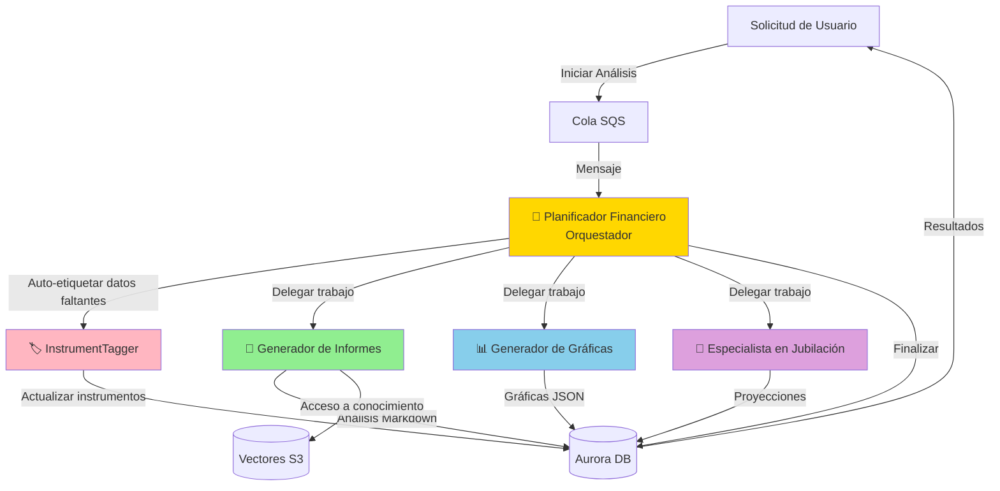

# Construyendo Alex: Parte 6 - Orquesta de Agentes IA

¡Bienvenido a la parte más emocionante de Alex! En esta guía, desplegarás un sofisticado sistema de IA multi-agente en el que agentes especializados colaboran para proporcionar un análisis financiero integral. Aquí es donde Alex realmente cobra vida como un asesor financiero inteligente.

## RECORDATORIO - ¡CONSEJO IMPORTANTE!

Hay un archivo `gameplan.md` en la raíz del proyecto que describe el proyecto Alex completo para un Agente de IA, para que puedas hacer preguntas y obtener ayuda. También existe un archivo idéntico `CLAUDE.md` y `AGENTS.md`. Si necesitas ayuda, simplemente inicia tu Agente de IA favorito y dale esta instrucción:

> Soy estudiante en el curso AI in Production. Estamos en el repositorio del curso. Lee el archivo `gameplan.md` para un resumen del proyecto. Lee este archivo completo y todas las guías enlazadas cuidadosamente. No inicies ningún trabajo aparte de leer y comprobar la estructura de directorios. Cuando hayas terminado toda la lectura, dime si tienes preguntas antes de empezar.

Después de responder preguntas, di exactamente en qué guía estás y cualquier problema detectado. Ten cuidado de validar cada sugerencia; siempre pide la causa raíz y evidencia de los problemas. Los LLMs tienden a sacar conclusiones precipitadas, pero suelen corregirse cuando se les pide evidencia.

## ¿Qué vas a construir?

Implementarás cinco agentes IA especializados que trabajan juntos:

1. **Planner** (Orquestador) - El director de nuestra orquesta de IA
2. **Tagger** - Clasifica y etiqueta instrumentos financieros
3. **Reporter** - Genera informes detallados de análisis de portafolio
4. **Charter** - Crea visualizaciones de datos para tu portafolio
5. **Retirement** - Proyecta escenarios de jubilación con simulaciones Monte Carlo

Así es como colaboran:



## ¿Por qué usar una Arquitectura Multi-Agente?

En vez de tener una gran IA que lo haga todo, usamos agentes especializados porque:

1. **Especialización**: Cada agente sobresale en su tarea específica
2. **Fiabilidad**: Prompts más pequeños y enfocados son más fiables
3. **Procesamiento en paralelo**: Varios agentes pueden trabajar simultáneamente
4. **Mantenibilidad**: Es sencillo actualizar agentes individuales sin afectar los demás
5. **Eficiencia de costos**: Solo ejecutas los agentes que necesitas

## Prerrequisitos

Antes de comenzar, asegúrate de tener:
- Completadas las Guías 1-5 (toda la infraestructura desplegada)
- AWS CLI configurado
- Python con el gestor de paquetes `uv` instalado
- Docker Desktop en ejecución
- Acceso a los modelos AWS Bedrock en us-west-2

## Antes de comenzar - Context Engineering

Lee este artículo fundamental de Philipp Schmid, Senior AI Relation Engineer en Google DeepMind:

https://www.philschmid.de/context-engineering

## Paso 0: Solicitar Acceso Adicional a Amazon Bedrock Model

Nuestros agentes usan el modelo Nova Pro de Amazon para mayor fiabilidad. Asegúrate de tener acceso:

1. Inicia sesión en la consola AWS
2. Ve a **Amazon Bedrock**
3. Cambia a la región **US West (Oregon) us-west-2**
4. Haz clic en **Acceso a modelos** en la barra lateral izquierda
5. Haz clic en **Administrar acceso a modelo**
6. Busca la sección **Amazon**
7. Marca la casilla para **Amazon Nova Pro**
8. Haz clic en **Solicitar acceso a modelo**
9. Espera la aprobación (normalmente es instantánea)

**Nota**: Los agentes usarán este modelo cross-region desde tu región de despliegue.

## Paso 1: Configurar Variables de Entorno

Nuestros agentes requieren varias variables de entorno, incluyendo una API Key de Polygon para datos de mercado en tiempo real.

### 1.1 Obtener clave API de Polygon (gratis)

El agente Planner obtiene precios de acciones en tiempo real usando Polygon.io. Consigue una clave API gratuita:

1. Ve a [polygon.io](https://polygon.io)
2. Haz clic en **Get your Free API Key**
3. Regístrate con tu correo (no se requiere tarjeta)
4. Verifica tu correo electrónico
5. Copia tu clave API desde el dashboard

El plan gratuito incluye:
- 5 llamadas API por minuto
- Datos de precios de cierre de día
- Perfecto para desarrollo y pruebas

**Opcional**: Para producción, considera el plan Basic ($29/mes) para:
- 100 llamadas API por minuto
- Datos en tiempo real
- Websocket streaming

### 1.2 Configurar entorno del agente

Abre tu archivo `.env` en Cursor y añade estas líneas:

```bash
# Parte 6 - Configuración de Agentes
BEDROCK_MODEL_ID=us.amazon.nova-pro-v1:0
BEDROCK_REGION=us-west-2
DEFAULT_AWS_REGION=us-east-1  # O tu región preferida

# API de Polygon.io para precios en tiempo real (regístrate gratis en polygon.io) - cambia a paid si tienes plan de pago
POLYGON_API_KEY=your_polygon_api_key_here
POLYGON_PLAN=free
```

`BEDROCK_MODEL_ID` utiliza el modelo Nova Pro de Amazon, que tiene excelentes capacidades para llamar herramientas y límites altos de uso.

## Paso 2: Explorar el Código de los Agentes

Antes de probar, entendamos qué hace cada agente. Usa el explorador de archivos de Cursor y navega al directorio `backend`.

### 2.1 InstrumentTagger (El más sencillo)

**Directorio**: `backend/tagger`

Abre `backend/tagger/agent.py` en Cursor. Este agente:
- Usa salidas estructuradas (el único que lo hace)
- Clasifica instrumentos financieros (ETFs, acciones)
- Determina la asignación de activos (acciones, bonos, bienes raíces)
- Identifica exposición geográfica
- No necesita herramientas - solo clasificación

Abre `backend/tagger/templates.py` para ver el prompt que guía su análisis.

### 2.2 Agente Report Writer

**Directorio**: `backend/reporter`

Abre `backend/reporter/agent.py`. Este agente:
- Genera análisis completos de portafolios
- Usa herramientas para acceder a S3 Vectors e información de mercado
- Escribe reportes detallados en markdown
- Identifica fortalezas y debilidades

Revisa `backend/reporter/templates.py` para su marco analítico.

### 2.3 Agente Chart Maker

**Directorio**: `backend/charter`

Abre `backend/charter/agent.py`. Este agente:
- Crea 4-6 gráficos diferentes
- Escoge las visualizaciones apropiadas (pie, bar, donut)
- Genera JSON compatible con Recharts
- No usa herramientas - regresa JSON puro

Revisa `backend/charter/templates.py` para ver las guías de visualización.

### 2.4 Agente Retirement Specialist

**Directorio**: `backend/retirement`

Abre `backend/retirement/agent.py`. Este agente:
- Ejecuta simulaciones Monte Carlo
- Proyecta escenarios de jubilación
- Calcula probabilidades de éxito
- Usa herramientas para guardar proyecciones

Consulta `backend/retirement/templates.py` para la lógica de planificación de retiro.

### 2.5 Financial Planner (Orquestador)

**Directorio**: `backend/planner`

Abre `backend/planner/agent.py`. Este orquestador:
- Recibe solicitudes de análisis mediante SQS
- Auto-etiqueta datos de instrumentos faltantes
- Decide qué agentes invocar
- Coordina ejecución en paralelo
- Finaliza los resultados

Mira `backend/planner/templates.py` para la lógica de orquestación.

## Paso 3: Probar los Agentes Localmente

Probemos cada agente localmente, empezando por el más sencillo. Cada prueba usa datos simulados para verificar que el agente funciona correctamente.

### 3.1 Probar InstrumentTagger

**En el directorio**: `backend/tagger`

```bash
uv run test_simple.py
```

**Salida esperada**: Verás que el agente clasifica VTI como un ETF. Verás "Tagged: 1 instruments" y "Updated: ['VTI']". La prueba termina rápido (5-10 segundos).

### 3.2 Probar Report Writer

**En el directorio**: `backend/reporter`

```bash
uv run test_simple.py
```

**Salida esperada**: Muestra "Success: 1" y "Message: Report generated and stored". El informe (más de 2800 caracteres) incluye análisis de portafolio, resumen ejecutivo, observaciones clave y recomendaciones. Tarda 15-20 segundos.

### 3.3 Probar Chart Maker

**En el directorio**: `backend/charter`

```bash
uv run test_simple.py
```

**Salida esperada**: Muestra "Success: True" y "Message: Generated 5 charts". Verás detalles de los gráficos, incluyendo las principales tenencias, asignación de activos, desglose por sectores y exposición geográfica. Cada gráfico tiene título, tipo (pie/bar/donut) y datos con colores. Tarda 10-15 segundos.

### 3.4 Probar Retirement Specialist

**En el directorio**: `backend/retirement`

```bash
uv run test_simple.py
```

**Salida esperada**: Muestra "Success: 1" y "Message: Retirement analysis completed". El análisis (más de 3900 caracteres) incluye resultados de simulaciones Monte Carlo con tasas de éxito, proyecciones de portafolio y recomendaciones específicas para mejorar la preparación para la jubilación. Tarda 10-15 segundos.

### 3.5 Probar Financial Planner

**En el directorio**: `backend/planner`

```bash
uv run test_simple.py
```

**Salida esperada**: Muestra "Success: True" y "Message: Analysis completed for job [job-id]". El planificador coordina el análisis y responde rápido, ya que usa agentes simulados localmente. Tarda 5-10 segundos.

### 3.6 Probar el Sistema Completo Localmente

**En el directorio**: `backend`

```bash
uv run test_simple.py
```

**Salida esperada**: Ejecuta todas las pruebas de agentes de forma secuencial. Verás un resumen "Passed: 5/5" con tildes para cada agente (tagger, reporter, charter, retirement, planner). Mensaje final: "✅ ALL TESTS PASSED!". Tarda de 60-90 segundos en total.

## Paso 4: Empaquetar Funciones Lambda

Ahora vamos a crear paquetes de despliegue para AWS Lambda. Cada agente necesita sus dependencias empaquetadas correctamente para Lambda.

### 4.1 Empaquetar Todos los Agentes

**En el directorio**: `backend`

```bash
uv run package_docker.py
```

Este script:
1. Usa Docker para asegurar compatibilidad con Linux
2. Empaqueta cada agente con sus dependencias
3. Crea archivos zip para desplegar en Lambda
4. Tarda 2-3 minutos en total

**Salida esperada**: 
```
Packaging tagger...
✅ Created tagger_lambda.zip (52 MB)
Packaging reporter...
✅ Created reporter_lambda.zip (68 MB)
Packaging charter...
✅ Created charter_lambda.zip (54 MB)
Packaging retirement...
✅ Created retirement_lambda.zip (55 MB)
Packaging planner...
✅ Created planner_lambda.zip (72 MB)
All agents packaged successfully!
```

## Paso 5: Configurar Terraform

Vamos a configurar la infraestructura.

### 5.1 Definir Variables de Terraform

**En el directorio**: `terraform/6_agents`

```bash
cp terraform.tfvars.example terraform.tfvars
```

Edita `terraform.tfvars` en Cursor y añade tus valores:

```hcl
# Tu región AWS para funciones Lambda (debe coincidir con la de la base de datos)
aws_region = "us-east-1"

# ARN del cluster Aurora de la Parte 5 (déjalo vacío - Terraform lo encuentra automáticamente)
aurora_cluster_arn = ""

# ARN secreto de Aurora de la Parte 5 (déjalo vacío - Terraform lo encuentra automáticamente)
aurora_secret_arn = ""

# Nombre del bucket S3 Vectors de la Parte 3
vector_bucket = "alex-vectors-123456789012"  # Reemplaza por tu Account ID

# Configuración del modelo Bedrock
bedrock_model_id = "us.amazon.nova-pro-v1:0"  # Modelo Nova Pro de Amazon

# Región de Bedrock (puede ser distinta de Lambda)
bedrock_region = "us-west-2"

# Nombre del endpoint SageMaker de la Parte 2
sagemaker_endpoint = "alex-embedding-endpoint"

# Configuración de API Polygon (para precios en tiempo real)
polygon_api_key = "your_polygon_api_key_here"
polygon_plan = "free"
```

**Nota**: Los ARN de Aurora pueden dejarse vacíos - Terraform los encuentra automáticamente usando data sources. Asegúrate de actualizar `vector_bucket` con tu ID de cuenta y agregar tu clave de Polygon.

## Paso 6: Desplegar Infraestructura

Despleguemos las cinco funciones Lambda y la infraestructura asociada.

### 6.1 Inicializar Terraform

**En el directorio**: `terraform/6_agents`

```bash
terraform init
```

### 6.2 Revisar el plan

```bash
terraform plan
```

Revisa lo que se va a crear:
- 5 funciones Lambda con distinta memoria y timeout
- Bucket S3 para paquetes Lambda
- Cola SQS con Dead Letter Queue
- Roles y políticas IAM
- Grupos de logs CloudWatch

### 6.3 Desplegar

```bash
terraform apply
```

Escribe `yes` cuando lo pida. Tarda de 3 a 5 minutos.

**Salida esperada**:
```
Apply complete! Resources: 25 added, 0 changed, 0 destroyed.

Outputs:
lambda_functions = {
  "charter" = "alex-charter"
  "planner" = "alex-planner"
  "reporter" = "alex-reporter"
  "retirement" = "alex-retirement"
  "tagger" = "alex-tagger"
}
sqs_queue_url = "https://sqs.us-east-1.amazonaws.com/123456789012/alex-analysis-jobs"
```

## Paso 7: Subir Código Actualizado a Lambda

La implementación de Terraform creó las funciones Lambda, pero hay que subirles el código empaquetado más reciente:

**En el directorio**: `backend`

```bash
uv run deploy_all_lambdas.py
```

Esto actualiza las cinco funciones Lambda con tu código empaquetado. Tarda cerca de 1 minuto.

**Salida esperada**:
```
Updating alex-tagger... ✅
Updating alex-reporter... ✅
Updating alex-charter... ✅
Updating alex-retirement... ✅
Updating alex-planner... ✅
All Lambda functions updated successfully!
```

## Paso 8: Probar Agentes Desplegados

Probemos cada agente ejecutándose en AWS Lambda.

### 8.1 Probar Agentes Individuales

Comprueba cada agente en AWS (ejecuta 3 veces para fiabilidad):

**En el directorio**: `backend/tagger`
```bash
uv run test_full.py
```

**En el directorio**: `backend/reporter`
```bash
uv run test_full.py
```

**En el directorio**: `backend/charter`
```bash
uv run test_full.py
```

**En el directorio**: `backend/retirement`
```bash
uv run test_full.py
```

**En el directorio**: `backend/planner`
```bash
uv run test_full.py
```

Todas deben terminar exitosamente. La prueba del planner tarda más (60-90 segundos) ya que coordina a todos los agentes.

### 8.2 Probar el Sistema Completo vía SQS

**En el directorio**: `backend`

```bash
uv run test_full.py
```

Esto envía un mensaje a SQS, lanzando el pipeline completo de análisis. Verás:
1. Trabajo creado en la base de datos
2. Mensaje enviado a SQS
3. Planner recoge el mensaje
4. Agentes procesan en paralelo
5. Resultados guardados en la base de datos
6. Trabajo marcado como completado

Tiempo total: 90-120 segundos.

## Paso 9: Probar Escenarios Avanzados

### 9.1 Test de Múltiples Cuentas

Prueba con un usuario que tiene varias cuentas de inversión:

**En el directorio**: `backend`

```bash
uv run test_multiple_accounts.py
```

Esto crea un usuario con 3 cuentas (401k, IRA, Taxable) y corre el análisis completo. El sistema debe manejar todas correctamente.

### 9.2 Prueba de Escalabilidad

Prueba con múltiples usuarios simultáneamente:

**En el directorio**: `backend`

```bash
uv run test_scale.py
```

Esto crea 5 usuarios con portafolios de diferente tamaño y lanza análisis para todos en paralelo. Demuestra que el sistema soporta múltiples solicitudes.

## Paso 10: Explora la Base de Datos

Veamos qué crearon nuestros agentes en la base de datos:

**En el directorio**: `backend`

```bash
uv run check_jobs.py
```

Esto muestra los trabajos de análisis recientes con su estado y resultados:
- IDs de trabajo y timestamps
- Información del usuario
- Estado (pendiente, procesando, completado)
- Tamaño del resultado de cada agente

## Paso 11: Explora la Consola de AWS

Observemos la infraestructura en acción:

### 11.1 Ver funciones Lambda

1. Ve a [Lambda Console](https://console.aws.amazon.com/lambda)
2. Verás 5 funciones: `alex-planner`, `alex-tagger`, `alex-reporter`, `alex-charter`, `alex-retirement`
3. Haz click en `alex-planner`
4. Ve a la pestaña **Monitor**
5. Haz clic en **View CloudWatch logs**
6. Haz clic en el log stream más reciente
7. Verás logs detallados mostrando el razonamiento del agente

### 11.2 Revisar la cola SQS

1. Ve a [SQS Console](https://console.aws.amazon.com/sqs)
2. Haz clic en `alex-analysis-jobs`
3. Revisa la pestaña **Monitoring** para métricas de mensajes
4. **Messages available** debe ser 0 (todas procesadas)
5. Revisa la dead letter queue `alex-analysis-jobs-dlq` (debe estar vacía)

### 11.3 Monitorea Costos

1. Ve a [Cost Management Console](https://console.aws.amazon.com/cost-management)
2. Haz clic en **Cost Explorer**
3. Filtra por servicio para ver:
   - Costos de Lambda (mínimos, pagas por ejecución)
   - Costos de Aurora (~$1-2/día cuando está en pausa)
   - Costos Bedrock (pagas por token)
   - Costos de SQS (fracciones de centavo)

Coste mensual esperado para desarrollo: $30-50.

## Solución de Problemas

### Problemas de Timeout en Agentes

Si los agentes se quedan sin tiempo:
1. Revisa configuración de timeout de la función Lambda (debe ser 60s para agentes, 300s para planner)
2. Verifica acceso a modelos Bedrock en us-west-2
3. Revisa logs CloudWatch para errores específicos

### Error de Conexión con la Base de Datos

Si hay errores con la base de datos:
1. Verifica que el clúster Aurora está corriendo (no en pausa)
2. Verifica que DATABASE_CLUSTER_ARN está en variables de entorno de Lambda
3. Asegura que Data API está habilitado en el clúster

### Mensaje SQS No Procesado

Si los mensajes permanecen en la cola:
1. Comprueba que planner Lambda tiene trigger SQS habilitado
2. Verifica permisos IAM para acceso a SQS
3. Revisa la dead letter queue para ver mensajes fallidos

### Errores de Límite de Tasa

Si ves errores de rate limit:
1. Los agentes reintentan automáticamente con backoff exponencial
2. Considera espaciar las solicitudes
3. El modelo Nova Pro permite mucho, pero puede agotarse eventualmente

### Errores de Modelo Incorrecto

Si ves errores de modelo no encontrado:
1. Verifica acceso a modelos Bedrock en us-west-2
2. Verifica la variable de entorno BEDROCK_MODEL_ID
3. Asegúrate de usar el formato `us.amazon.nova-pro-v1:0`

### Resultados Vacíos

Si los agentes devuelven resultados vacíos:
1. Verifica que los datos de prueba incluyen posiciones válidas
2. Asegúrate que la base de datos contiene datos de instrumentos (ejecuta migrate.py si hace falta)
3. Consulta los logs CloudWatch para ver el razonamiento del agente

## Arquitectura en Profundidad

### Patrón de Comunicación entre Agentes

Los agentes usan un patrón sofisticado de colaboración:

1. **Disparo asíncrono**: SQS desacopla la solicitud del procesamiento
2. **Preprocesamiento**: El orquestador prepara los datos
3. **Ejecución en paralelo**: Los agentes trabajan simultáneamente cuando es posible
4. **Escrituras aisladas**: Cada agente escribe su propio campo en la base de datos
5. **Finalización atómica**: El trabajo se marca como completado solo si todos tienen éxito

### Estrategia de uso de herramientas

Cada agente usa herramientas de manera diferente:
- **Tagger**: Sin herramientas (solo salida estructurada)
- **Reporter**: Herramientas para acceder a S3 Vectors y escribir en la base de datos
- **Charter**: Sin herramientas (regresa JSON directo)
- **Retirement**: Herramientas para escribir en la base de datos
- **Planner**: Herramientas para invocar otros agentes y finalizar

Esto evita el conflicto entre herramientas y salidas estructuradas en OpenAI Agents SDK.

### Manejo de Errores

El sistema maneja errores de manera robusta:
- Reintentos automáticos con backoff exponencial ante rate limits
- Dead letter queue para mensajes fallidos
- Logs detallados para depuración
- La base de datos rastrea el estado de los errores

## Próximos Pasos

¡Felicidades! Has desplegado un sofisticado sistema de IA multi-agente. Tus agentes ya están listos para aportar análisis financiero inteligente.

Continúa con la [Guía 7](7_frontend.md) donde construirás la aplicación frontend con la que los usuarios interactuarán para gestionar sus portafolios y solicitar análisis a tus agentes IA.

## Resumen

En esta guía:
- ✅ Desplegaste 5 agentes IA especializados
- ✅ Configuraste la orquestación de agentes con SQS
- ✅ Probaste ejecuciones locales y remotas
- ✅ Verificaste que soporta varios usuarios
- ✅ Exploraste monitorización y gestión de costes

¡Tu orquesta de IA está lista para actuar! 🎭