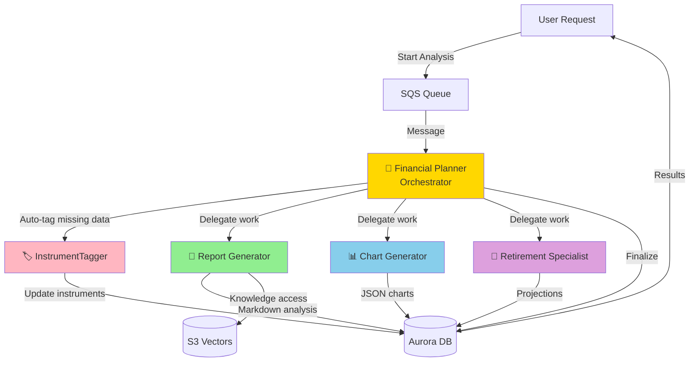

# Building Alex: Part 6 - AI Agent Orchestra

Welcome to the most exciting part of Alex! In this guide, you will deploy a sophisticated multi-agent AI system where specialized agents collaborate to provide comprehensive financial analysis. This is where Alex truly comes to life as an intelligent financial advisor.

## REMINDER - IMPORTANT TIP!

There is a `gameplan.md` file in the project root that describes the complete Alex project for an AI Agent, so you can ask questions and get help. There is also an identical file `CLAUDE.md` and `AGENTS.md`. If you need help, simply start your favorite AI Agent and give it this instruction:

> I am a student in the AI in Production course. We are in the course repository. Read the `gameplan.md` file for a project summary. Read this file fully and all linked guides carefully. Do not start any work other than reading and checking the directory structure. When you finish all reading, tell me if you have questions before we start.

After answering questions, state exactly which guide you are on and any detected issue. Be careful validating each suggestion; always ask for the root cause and evidence for problems. LLMs tend to jump to conclusions, but they often self-correct when asked for evidence.

## What will you build?

You will implement five specialized AI agents working together:

1. **Planner** (Orchestrator) - The conductor of our AI orchestra
2. **Tagger** - Classifies and tags financial instruments
3. **Reporter** - Generates detailed portfolio analysis reports
4. **Charter** - Creates data visualizations for your portfolio
5. **Retirement** - Projects retirement scenarios with Monte Carlo simulations

Here is how they collaborate:



## Why use a multi-agent architecture?

Instead of one large AI that does everything, we use specialized agents because:

1. **Specialization**: Each agent excels at its specific task
2. **Reliability**: Smaller, focused prompts are more reliable
3. **Parallel processing**: Multiple agents can work simultaneously
4. **Maintainability**: Easy to update individual agents without affecting others
5. **Cost efficiency**: You only run the agents you need

## Prerequisites

Before you begin, make sure you have:
- Completed Guides 1-5 (all infrastructure deployed)
- AWS CLI configured
- Python with the `uv` package manager installed
- Docker Desktop running
- Access to AWS Bedrock models in us-west-2

## Before you begin - Context Engineering

Read this foundational article by Philipp Schmid, Senior AI Relation Engineer at Google DeepMind:

https://www.philschmid.de/context-engineering

## Step 0: Request additional access to Amazon Bedrock model

Our agents use Amazon Nova Pro for higher reliability. Make sure you have access:

1. Sign in to AWS Console
2. Go to **Amazon Bedrock**
3. Switch to region **US West (Oregon) us-west-2**
4. Click **Model access** in the left sidebar
5. Click **Manage model access**
6. Find the **Amazon** section
7. Check the box for **Amazon Nova Pro**
8. Click **Request model access**
9. Wait for approval (usually instant)

**Note**: Agents will use this model cross-region from your deployment region.

## Step 1: Configure environment variables

Our agents require several environment variables, including a Polygon API key for real-time market data.

### 1.1 Get Polygon API key (free)

The Planner agent fetches real-time stock prices using Polygon.io. Get a free API key:

1. Go to [polygon.io](https://polygon.io)
2. Click **Get your Free API Key**
3. Sign up with your email (no card required)
4. Verify your email
5. Copy your API key from the dashboard

The free plan includes:
- 5 API calls per minute
- End-of-day closing price data
- Perfect for development and testing

**Optional**: For production, consider the Basic plan ($29/month) for:
- 100 API calls per minute
- Real-time data
- WebSocket streaming

### 1.2 Configure agent environment

Open your `.env` file in Cursor and add these lines:

```bash
# Part 6 - Agent Configuration
BEDROCK_MODEL_ID=us.amazon.nova-pro-v1:0
BEDROCK_REGION=us-west-2
DEFAULT_AWS_REGION=us-east-1  # Or your preferred region

# Polygon.io API for real-time prices (sign up free at polygon.io) - switch to paid if you have a paid plan
POLYGON_API_KEY=your_polygon_api_key_here
POLYGON_PLAN=free
```

`BEDROCK_MODEL_ID` uses Amazon Nova Pro, which has excellent tool-calling capabilities and high usage limits.

## Step 2: Explore agent code

Before testing, let us understand what each agent does. Use Cursor file explorer and navigate to the `backend` directory.

### 2.1 InstrumentTagger (the simplest)

**Directory**: `backend/tagger`

Open `backend/tagger/agent.py` in Cursor. This agent:
- Uses structured outputs (the only one that does)
- Classifies financial instruments (ETFs, stocks)
- Determines asset allocation (stocks, bonds, real estate)
- Identifies geographic exposure
- Does not need tools - classification only

Open `backend/tagger/templates.py` to see the prompt guiding its analysis.

### 2.2 Report Writer agent

**Directory**: `backend/reporter`

Open `backend/reporter/agent.py`. This agent:
- Generates complete portfolio analysis
- Uses tools to access S3 Vectors and market information
- Writes detailed markdown reports
- Identifies strengths and weaknesses

Review `backend/reporter/templates.py` for its analytical framework.

### 2.3 Chart Maker agent

**Directory**: `backend/charter`

Open `backend/charter/agent.py`. This agent:
- Creates 4-6 different charts
- Chooses appropriate visualizations (pie, bar, donut)
- Generates Recharts-compatible JSON
- Uses no tools - returns pure JSON

Review `backend/charter/templates.py` for visualization guidance.

### 2.4 Retirement Specialist agent

**Directory**: `backend/retirement`

Open `backend/retirement/agent.py`. This agent:
- Runs Monte Carlo simulations
- Projects retirement scenarios
- Calculates success probabilities
- Uses tools to save projections

Check `backend/retirement/templates.py` for retirement-planning logic.

### 2.5 Financial Planner (orchestrator)

**Directory**: `backend/planner`

Open `backend/planner/agent.py`. This orchestrator:
- Receives analysis requests through SQS
- Auto-tags missing instrument data
- Decides which agents to invoke
- Coordinates parallel execution
- Finalizes results

Look at `backend/planner/templates.py` for orchestration logic.

## Step 3: Test agents locally

Let us test each agent locally, starting with the simplest. Each test uses mocked data to verify that the agent works correctly.

### 3.1 Test InstrumentTagger

**In directory**: `backend/tagger`

```bash
uv run test_simple.py
```

**Expected output**: You will see the agent classify VTI as an ETF. You will see "Tagged: 1 instruments" and "Updated: ['VTI']". Test completes quickly (5-10 seconds).

### 3.2 Test Report Writer

**In directory**: `backend/reporter`

```bash
uv run test_simple.py
```

**Expected output**: Shows "Success: 1" and "Message: Report generated and stored". The report (more than 2800 characters) includes portfolio analysis, executive summary, key findings, and recommendations. It takes 15-20 seconds.

### 3.3 Test Chart Maker

**In directory**: `backend/charter`

```bash
uv run test_simple.py
```

**Expected output**: Shows "Success: True" and "Message: Generated 5 charts". You will see chart details including top holdings, asset allocation, sector breakdown, and geographic exposure. Each chart has title, type (pie/bar/donut), and colored data. It takes 10-15 seconds.

### 3.4 Test Retirement Specialist

**In directory**: `backend/retirement`

```bash
uv run test_simple.py
```

**Expected output**: Shows "Success: 1" and "Message: Retirement analysis completed". The analysis (more than 3900 characters) includes Monte Carlo simulation results with success rates, portfolio projections, and specific recommendations to improve retirement readiness. It takes 10-15 seconds.

### 3.5 Test Financial Planner

**In directory**: `backend/planner`

```bash
uv run test_simple.py
```

**Expected output**: Shows "Success: True" and "Message: Analysis completed for job [job-id]". The planner coordinates analysis and responds quickly because it uses mocked local agents. It takes 5-10 seconds.

### 3.6 Test full system locally

**In directory**: `backend`

```bash
uv run test_simple.py
```

**Expected output**: Runs all agent tests sequentially. You will see a "Passed: 5/5" summary with checks for each agent (tagger, reporter, charter, retirement, planner). Final message: "✅ ALL TESTS PASSED!". Total runtime is 60-90 seconds.

## Step 4: Package Lambda functions

Now create deployment packages for AWS Lambda. Each agent needs dependencies packaged correctly for Lambda.

### 4.1 Package all agents

**In directory**: `backend`

```bash
uv run package_docker.py
```

This script:
1. Uses Docker to ensure Linux compatibility
2. Packages each agent with dependencies
3. Creates zip files for Lambda deployment
4. Takes 2-3 minutes total

**Expected output**:
```
Packaging tagger...
✅ Created tagger_lambda.zip (52 MB)
Packaging reporter...
✅ Created reporter_lambda.zip (68 MB)
Packaging charter...
✅ Created charter_lambda.zip (54 MB)
Packaging retirement...
✅ Created retirement_lambda.zip (55 MB)
Packaging planner...
✅ Created planner_lambda.zip (72 MB)
All agents packaged successfully!
```

## Step 5: Configure Terraform

Let us configure infrastructure.

### 5.1 Set Terraform variables

**In directory**: `terraform/6_agents`

```bash
cp terraform.tfvars.example terraform.tfvars
```

Edit `terraform.tfvars` in Cursor and add your values:

```hcl
# Your AWS region for Lambda functions (must match database region)
aws_region = "us-east-1"

# Aurora cluster ARN from Part 5 (leave empty - Terraform finds it automatically)
aurora_cluster_arn = ""

# Aurora secret ARN from Part 5 (leave empty - Terraform finds it automatically)
aurora_secret_arn = ""

# S3 Vectors bucket name from Part 3
vector_bucket = "alex-vectors-123456789012"  # Replace with your Account ID

# Bedrock model configuration
bedrock_model_id = "us.amazon.nova-pro-v1:0"  # Amazon Nova Pro model

# Bedrock region (can differ from Lambda)
bedrock_region = "us-west-2"

# SageMaker endpoint name from Part 2
sagemaker_endpoint = "alex-embedding-endpoint"

# Polygon API configuration (for real-time prices)
polygon_api_key = "your_polygon_api_key_here"
polygon_plan = "free"
```

**Note**: Aurora ARNs can be left empty - Terraform finds them automatically with data sources. Make sure to update `vector_bucket` with your account ID and add your Polygon key.

## Step 6: Deploy infrastructure

Let us deploy the five Lambda functions and related infrastructure.

### 6.1 Initialize Terraform

**In directory**: `terraform/6_agents`

```bash
terraform init
```

### 6.2 Review plan

```bash
terraform plan
```

Review what will be created:
- 5 Lambda functions with different memory and timeout
- S3 bucket for Lambda packages
- SQS queue with Dead Letter Queue
- IAM roles and policies
- CloudWatch log groups

### 6.3 Deploy

```bash
terraform apply
```

Type `yes` when prompted. It takes 3-5 minutes.

**Expected output**:
```
Apply complete! Resources: 25 added, 0 changed, 0 destroyed.

Outputs:
lambda_functions = {
  "charter" = "alex-charter"
  "planner" = "alex-planner"
  "reporter" = "alex-reporter"
  "retirement" = "alex-retirement"
  "tagger" = "alex-tagger"
}
sqs_queue_url = "https://sqs.us-east-1.amazonaws.com/123456789012/alex-analysis-jobs"
```

## Step 7: Upload updated code to Lambda

Terraform created the Lambda functions, but you still need to upload the latest packaged code:

**In directory**: `backend`

```bash
uv run deploy_all_lambdas.py
```

This updates all five Lambda functions with your packaged code. It takes around 1 minute.

**Expected output**:
```
Updating alex-tagger... ✅
Updating alex-reporter... ✅
Updating alex-charter... ✅
Updating alex-retirement... ✅
Updating alex-planner... ✅
All Lambda functions updated successfully!
```

## Step 8: Test deployed agents

Let us test each agent running on AWS Lambda.

### 8.1 Test individual agents

Check each agent on AWS (run 3 times for reliability):

**In directory**: `backend/tagger`
```bash
uv run test_full.py
```

**In directory**: `backend/reporter`
```bash
uv run test_full.py
```

**In directory**: `backend/charter`
```bash
uv run test_full.py
```

**In directory**: `backend/retirement`
```bash
uv run test_full.py
```

**In directory**: `backend/planner`
```bash
uv run test_full.py
```

All should complete successfully. Planner test takes longer (60-90 seconds) because it coordinates all agents.

### 8.2 Test full system via SQS

**In directory**: `backend`

```bash
uv run test_full.py
```

This sends a message to SQS, launching the full analysis pipeline. You will see:
1. Job created in database
2. Message sent to SQS
3. Planner picks up message
4. Agents process in parallel
5. Results saved to database
6. Job marked completed

Total time: 90-120 seconds.

## Step 9: Test advanced scenarios

### 9.1 Multiple accounts test

Test with a user who has several investment accounts:

**In directory**: `backend`

```bash
uv run test_multiple_accounts.py
```

This creates a user with 3 accounts (401k, IRA, Taxable) and runs full analysis. The system should handle all of them correctly.

### 9.2 Scalability test

Test with multiple users simultaneously:

**In directory**: `backend`

```bash
uv run test_scale.py
```

This creates 5 users with portfolios of different sizes and launches analysis for all in parallel. It demonstrates that the system supports multiple concurrent requests.

## Step 10: Explore the database

Let us see what our agents created in the database:

**In directory**: `backend`

```bash
uv run check_jobs.py
```

This shows recent analysis jobs with status and results:
- Job IDs and timestamps
- User information
- Status (pending, processing, completed)
- Result size from each agent

## Step 11: Explore AWS Console

Let us observe infrastructure in action:

### 11.1 View Lambda functions

1. Go to [Lambda Console](https://console.aws.amazon.com/lambda)
2. You will see 5 functions: `alex-planner`, `alex-tagger`, `alex-reporter`, `alex-charter`, `alex-retirement`
3. Click `alex-planner`
4. Go to **Monitor** tab
5. Click **View CloudWatch logs**
6. Click the most recent log stream
7. You will see detailed logs showing agent reasoning

### 11.2 Check SQS queue

1. Go to [SQS Console](https://console.aws.amazon.com/sqs)
2. Click `alex-analysis-jobs`
3. Check **Monitoring** tab for message metrics
4. **Messages available** should be 0 (all processed)
5. Check dead letter queue `alex-analysis-jobs-dlq` (should be empty)

### 11.3 Monitor costs

1. Go to [Cost Management Console](https://console.aws.amazon.com/cost-management)
2. Click **Cost Explorer**
3. Filter by service to see:
   - Lambda costs (minimal, pay-per-execution)
   - Aurora costs (~$1-2/day when paused)
   - Bedrock costs (pay-per-token)
   - SQS costs (fractions of a cent)

Expected monthly cost for development: $30-50.

## Troubleshooting

### Agent timeout issues

If agents time out:
1. Check Lambda timeout settings (should be 60s for agents, 300s for planner)
2. Verify Bedrock model access in us-west-2
3. Review CloudWatch logs for specific errors

### Database connection error

If there are database errors:
1. Verify Aurora cluster is running (not paused)
2. Verify `DATABASE_CLUSTER_ARN` exists in Lambda environment variables
3. Ensure Data API is enabled on the cluster

### SQS message not processed

If messages remain in queue:
1. Check that planner Lambda has SQS trigger enabled
2. Verify IAM permissions for SQS access
3. Review dead letter queue for failed messages

### Rate-limit errors

If you see rate-limit errors:
1. Agents automatically retry with exponential backoff
2. Consider spacing out requests
3. Nova Pro allows a lot, but limits can still be hit

### Incorrect model errors

If you see model-not-found errors:
1. Verify Bedrock model access in us-west-2
2. Verify `BEDROCK_MODEL_ID` environment variable
3. Make sure you use format `us.amazon.nova-pro-v1:0`

### Empty results

If agents return empty results:
1. Verify test data includes valid positions
2. Ensure database contains instrument data (run migration script if needed)
3. Check CloudWatch logs for agent reasoning

## Architecture deep dive

### Agent communication pattern

Agents use a robust collaboration pattern:

1. **Asynchronous trigger**: SQS decouples request from processing
2. **Preprocessing**: Orchestrator prepares data
3. **Parallel execution**: Agents run simultaneously when possible
4. **Isolated writes**: Each agent writes to its own field in database
5. **Atomic completion**: Job is marked complete only if all succeed

### Tool usage strategy

Each agent uses tools differently:
- **Tagger**: No tools (structured output only)
- **Reporter**: Tools to access S3 Vectors and write database
- **Charter**: No tools (returns direct JSON)
- **Retirement**: Tools to write database
- **Planner**: Tools to invoke other agents and finalize

This avoids conflicts between tool calling and structured outputs in OpenAI Agents SDK.

### Error handling

The system handles errors robustly:
- Automatic retries with exponential backoff for rate limits
- Dead letter queue for failed messages
- Detailed logs for debugging
- Database tracks error status

## Next steps

Congratulations! You have deployed a sophisticated multi-agent AI system. Your agents are now ready to provide intelligent financial analysis.

Continue with [Guide 7](7_frontend.md), where you will build the frontend application users interact with to manage portfolios and request analysis from your AI agents.

## Summary

In this guide:
- ✅ You deployed 5 specialized AI agents
- ✅ You configured SQS-based agent orchestration
- ✅ You tested local and remote executions
- ✅ You verified support for multiple users
- ✅ You explored monitoring and cost management

Your AI orchestra is ready to perform! 🎭
