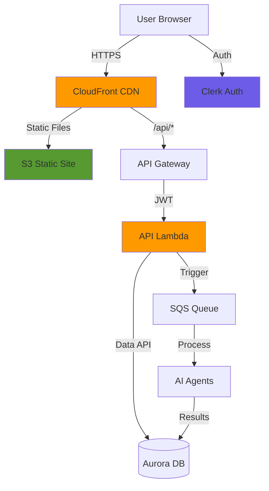

# Building Alex: Part 7 - Frontend and API

Welcome to the final development phase! In this guide, you will deploy the user interface that brings Alex to life: a modern React application with real-time agent visualization, portfolio management, and complete financial analysis screens.

## REMINDER - IMPORTANT TIP!

There is a file called `gameplan.md` at the project root that describes the entire Alex project for an AI Agent, so you can ask questions and get help. There is also an identical file named `CLAUDE.md` and `AGENTS.md`. If you need help, simply start your favorite AI Agent and give it this instruction:

> I am a student in the AI in Production course. We are in the course repository. Read the `gameplan.md` file for a project summary. Read this file completely and review all linked guides carefully. Do not start any work other than reading and checking the directory structure. When you finish reading, tell me if you have any questions before we begin.

After it answers questions, state exactly which guide you are on and any issues you are facing. Be careful when validating each suggestion; always ask for the root cause and evidence of problems. LLMs tend to jump to quick conclusions, but they usually self-correct when asked for evidence.

## What You Will Build

You will deploy a complete SaaS frontend with:
- **Authentication**: Sign up/sign in with Clerk and automatic user creation
- **Portfolio Management**: Add accounts, track positions, edit holdings
- **AI Analysis**: Launch and monitor multi-agent analysis with real-time progress
- **Interactive Reports**: Markdown reports, dynamic charts, retirement projections
- **Production Infrastructure**: CloudFront CDN, API Gateway, Lambda backend

Here is the complete architecture:



## Prerequisites

Before you begin, make sure you have:
- Completed guides 1-6 (all backend infrastructure deployed)
- AWS CLI configured
- Node.js 20+ and npm installed
- Python with the `uv` package manager
- Terraform installed
- A Clerk account (free tier is enough)

## Step 1: Configure Authentication with Clerk

We will use Clerk for authentication, the same service we saw earlier in the course. If you already have Clerk credentials from a previous project, you can reuse them.

### 1.1 Get Your Clerk Credentials

If you already have Clerk credentials:
1. Go to the [Clerk Dashboard](https://dashboard.clerk.com)
2. Select your existing application
3. Go to **API Keys** in the left sidebar
4. You will need:
   - Publishable Key (starts with `pk_`)
   - Secret Key (starts with `sk_`)
   - JWKS Endpoint URL (shown under **Show JWT Public Key** -> **JWKS Endpoint**)

If you need to create a new Clerk application:
1. Sign up at [clerk.com](https://clerk.com)
2. Create a new application
3. Choose **Email** and optionally **Google** as sign-in methods
4. Get your keys in the API Keys section

### 1.2 Configure the Frontend Environment

Create a `.env.local` file in the frontend directory in Cursor and add your Clerk credentials:

```bash
# Clerk Authentication (use your existing keys if available)
NEXT_PUBLIC_CLERK_PUBLISHABLE_KEY=pk_test_your-key-here
CLERK_SECRET_KEY=sk_test_your-secret-here

# Sign-in/sign-up redirects (already correct)
NEXT_PUBLIC_CLERK_AFTER_SIGN_IN_URL=/dashboard
NEXT_PUBLIC_CLERK_AFTER_SIGN_UP_URL=/dashboard

# API URL - use localhost for local development, AWS URL for production
NEXT_PUBLIC_API_URL=http://localhost:8000
```

### 1.3 Configure the Backend Environment

Now add Clerk configuration to the root `.env` file:

```bash
# In the root alex directory, add to your .env file:

# Part 7 - Clerk Authentication
CLERK_JWKS_URL=https://your-app.clerk.accounts.dev/.well-known/jwks.json
```

To find your JWKS URL:
1. Go to Clerk Dashboard -> **API Keys**
2. Click **Show JWT Public Key**
3. Copy the **JWKS Endpoint** URL

## Step 2: Test the Frontend Locally

Let's verify the frontend works before deployment.

### 2.1 Install Dependencies

Navigate to the frontend directory and install packages:

```bash
# In alex/frontend
npm install
```

This installs React, NextJS, Tailwind CSS, and other required packages.

### 2.2 Start Development Servers

We will run the backend API and frontend together:

```bash
# Navigate to the scripts directory
# Go to alex/scripts in your terminal

# Start frontend and backend
uv run run_local.py
```

You should see:
```
🚀 Starting FastAPI backend...
  ✅ Backend running at http://localhost:8000
     API docs: http://localhost:8000/docs

🚀 Starting NextJS frontend...
  ✅ Frontend running at http://localhost:3000
```

### 2.3 Explore the Application

Open your browser and visit [http://localhost:3000](http://localhost:3000)

1. **Home Page**: You will see the Alex AI Financial Advisor landing page
2. **Sign In**: Click "Sign In", create an account, or use your Clerk credentials
3. **Dashboard**: After signing in, you will be redirected to the dashboard
4. **User Creation**: The system automatically creates your user profile in the database

### 2.4 Explore API Documentation

Open [http://localhost:8000/docs](http://localhost:8000/docs) to view interactive docs (Swagger).

This documentation shows:
- All API endpoints
- Request/response schemas
- Authentication requirements
- Try-it-out feature (requires JWT token)

Key endpoints:
- `GET /api/user` - Get or create user profile
- `GET /api/accounts` - List investment accounts
- `POST /api/positions` - Add positions to accounts
- `POST /api/analyze` - Launch AI analysis
- `GET /api/jobs/{job_id}` - Check analysis status

## Step 3: Add Test Portfolio Data

Let's create a sample portfolio to work with.

### 3.1 Navigate to the Accounts Page

1. Click **Accounts** in the navigation bar
2. You will see "No accounts found"
3. Click the **Populate Test Data** button

The system creates:
- 3 accounts (401k, Roth IRA, Taxable)
- Multiple ETF and stock positions
- Cash balances

### 3.2 Explore Account Management

Click any account to:
- View positions and current values
- Edit quantities
- Add new positions
- Remove positions
- Update cash balance

Try editing a position:
1. Click the edit icon next to a position
2. Change the quantity
3. Click save
4. Notice how value updates automatically

**Note**: AI analysis features require deployed AWS infrastructure. You can explore portfolio management locally, but analysis will only work after deployment.

## Step 4: Deploy Infrastructure

Now let's deploy everything to AWS for production use.

### 4.1 Configure Terraform

Navigate to the Part 7 Terraform directory:

```bash
# Go to alex/terraform/7_frontend

# Copy example variables
cp terraform.tfvars.example terraform.tfvars
```

Edit `terraform.tfvars` in Cursor:

```hcl
# AWS region for deployment
aws_region = "us-east-1"

# Clerk configuration for JWT validation
# Get this from your Clerk dashboard
# JWKS URL: https://[your-instance].clerk.accounts.dev/.well-known/jwks.json
# issuer: https://[your-instance].clerk.accounts.dev
clerk_jwks_url = "https://engaging-feline-80.clerk.accounts.dev/.well-known/jwks.json"
clerk_issuer   = "https://engaging-feline-80.clerk.accounts.dev"
```

To find your AWS account ID:
```bash
aws sts get-caller-identity --query Account --output text
```

### 4.2 Package the API Lambda

Navigate to the `backend/api` directory and package Lambda:

```bash
# In alex/backend/api
uv run package_docker.py
```

This creates `api_lambda.zip` with all dependencies. It takes around 1-2 minutes.

### 4.3 Deploy the Infrastructure

Return to the Terraform directory and deploy:

```bash
# In alex/terraform/7_frontend

# Initialize Terraform
terraform init

# Review what will be created
terraform plan

# Deploy infrastructure
terraform apply
```

Type `yes` when prompted. This creates:
- S3 bucket for the frontend
- CloudFront CDN
- API Gateway with Lambda integration
- Lambda function for the API
- IAM roles and policies

Deployment takes 10-15 minutes (CloudFront takes time).

### 4.4 Save Important Outputs

After deployment, save outputs:

```bash
terraform output
```

You will see:
- `cloudfront_url` - Your frontend URL
- `api_gateway_url` - API endpoint
- `s3_bucket` - Frontend bucket name

Also update your root `.env` file with the SQS queue URL from Part 6:

```bash
# Check Part 6 outputs if you don't already have this
# In alex/terraform/6_agents
terraform output sqs_queue_url

# Add to your .env file:
SQS_QUEUE_URL=https://sqs.us-east-1.amazonaws.com/123456789012/alex-analysis-jobs
```

## Step 5: Deploy Frontend Code

Now let's build and deploy the frontend.

### 5.1 Build the Frontend

Navigate to the frontend directory:

```bash
# In alex/frontend

# Build production version
npm run build
```

This creates an optimized build in the `out` directory.

### 5.2 Deploy to S3

Go to the scripts directory and run deployment:

```bash
# In alex/scripts

# Upload frontend to S3 and invalidate CloudFront cache
uv run deploy.py
```

This script:
1. Uploads built files to S3
2. Sets correct content types
3. Invalidates CloudFront cache
4. Takes about 2 minutes

## Step 6: Test Production Deployment

### 6.1 Access Your Application

Open your CloudFront URL from Terraform output in a browser:
```
https://d1234567890.cloudfront.net
```

1. **Sign In**: Use your Clerk credentials
2. **Dashboard**: Confirm it loads correctly
3. **API Calls**: Verify data loads properly

### 6.2 Test Portfolio Management

1. Navigate to **Accounts**
2. Click **Populate Test Data** if needed
3. Edit a position to verify updates
4. Add a new position

## Step 7: Run AI Analysis in Production

Now that everything is deployed, let's launch AI analysis!

### 7.1 Navigate to Advisor Team

Click **Advisor Team** in navigation. You will see four specialist agents:
- 🎯 **Financial Planner** - Orchestrates analysis
- 📊 **Portfolio Analyst** - Analyzes holdings and performance
- 📈 **Chart Specialist** - Creates visualizations
- 🎯 **Retirement Planner** - Projects retirement scenarios

Note: The fifth agent (InstrumentTagger) works invisibly when needed.

### 7.2 Launch Analysis

1. Click the **Start New Analysis** button (purple, highlighted)
2. Watch progress visualization:
   - Financial Planner activates first
   - Then the other three work in parallel
   - Each agent shows a glow effect when active
3. Wait 60-90 seconds until completion
4. You are automatically redirected to the Analysis page

### 7.3 Review Analysis Results

The Analysis page has four tabs:

**Overview Tab**:
- Executive summary
- Key findings
- Risk assessment
- Recommendations

**Charts Tab**:
- Asset allocation chart
- Geographic exposure
- Sector distribution
- Top holdings

**Retirement Tab**:
- Monte Carlo simulation results
- Probability of success
- Portfolio projections
- Retirement readiness score

**Recommendations Tab**:
- Concrete actions
- Rebalancing suggestions
- Risk adjustments

## Step 8: Monitor from the AWS Console

Let's explore what happens under the hood.

### 8.1 CloudWatch Logs

1. Go to [CloudWatch Console](https://console.aws.amazon.com/cloudwatch)
2. Click **Log groups**
3. Search for `/aws/lambda/alex-api`
4. Click the latest log stream
5. You will see API requests and responses

### 8.2 API Gateway Metrics

1. Go to [API Gateway Console](https://console.aws.amazon.com/apigateway)
2. Click `alex-api`
3. Click **Dashboard**
4. View request count, latency, and errors

### 8.3 Lambda Performance

1. Go to [Lambda Console](https://console.aws.amazon.com/lambda)
2. Click `alex-api`
3. Click the **Monitor** tab
4. View invocations, duration, and errors
5. Check concurrent executions

### 8.4 SQS Queue Activity

When you launch an analysis:

1. Go to [SQS Console](https://console.aws.amazon.com/sqs)
2. Click `alex-analysis-jobs`
3. Watch **Messages Available** change
4. Review the **Monitoring** tab for metrics

### 8.5 CloudFront Distribution

1. Go to [CloudFront Console](https://console.aws.amazon.com/cloudfront)
2. Click your distribution
3. Review the **Monitoring** tab for:
   - Requests per second
   - Cache hit ratio
   - Data transfer
   - Origin requests

## Step 9: Cost Monitoring

As a responsible AWS user, always monitor costs:

### 9.1 Check Current Costs

1. Sign in as AWS root user
2. Go to [Billing Dashboard](https://console.aws.amazon.com/billing)
3. Review current month **Bills**
4. Review service-level breakdown

### 9.2 Expected Costs

For this complete application:
- **Lambda**: < $1/month (pay per invocation)
- **API Gateway**: < $4/month (1M requests in free tier)
- **Aurora**: $43-60/month (largest cost)
- **S3 & CloudFront**: < $1/month for development
- **SQS**: < $1/month
- **CloudWatch**: < $5/month
- **Bedrock**: $0.01-0.10 per analysis

**Total**: ~$50-70/month during development

### 9.3 Cost Optimization

To reduce costs when not developing:

```bash
# Stop Aurora to save ~$43/month
# In alex/terraform/5_database
terraform destroy

# Or destroy everything
# Run in each terraform directory in reverse order (7, 6, 5, 4, 3, 2)
terraform destroy
```

## Troubleshooting

### Frontend Does Not Build

If `npm run build` fails:
1. Check Node.js version (you need 20+)
2. Delete `node_modules` and `.next`
3. Run `npm install` again
4. Check for TypeScript errors

### API Returns 401 Unauthorized

If API calls fail with 401:
1. Verify Clerk keys in `.env.local`
2. Check JWKS URL in Lambda environment variables
3. Sign out and sign in again
4. Verify token expiration (Clerk tokens expire after one hour)

### Analysis Does Not Start

If analysis stays pending:
1. Check SQS queue for messages
2. Confirm planner Lambda has SQS trigger
3. Check CloudWatch logs for errors
4. Ensure Aurora cluster is running

### CloudFront Returns 403

If you get access denied:
1. Check S3 bucket policy
2. Verify CloudFront OAI has access
3. Wait 15 minutes for propagation
4. Try in an incognito window

### Charts Are Not Displayed

If charts are blank:
1. Check browser console for errors
2. Verify chart data in analysis results
3. Confirm Recharts library loaded correctly
4. Check charter agent output

## Architecture Best Practices

### Key Security Aspects

The application follows security best practices:

1. **Authentication**: Clerk handles all authentication
2. **JWT Validation**: All API requests validate token
3. **HTTPS Only**: CloudFront enforces SSL
4. **Input Validation**: Pydantic validates all data
5. **CORS Protection**: Restricted origins
6. **Secret Management**: Uses AWS Secrets Manager

### Performance Optimizations

1. **CDN Caching**: Static files cached globally
2. **Code Splitting**: NextJS handles this automatically
3. **API Response Caching**: CloudFront caches GET requests
4. **DB Connection Pooling**: Data API handles this
5. **Parallel Agent Execution**: Agents run simultaneously

### Scalability Design

The architecture scales automatically:
- **CloudFront**: Handles millions of requests
- **API Gateway**: Auto-scales on demand
- **Lambda**: Up to 1000 concurrent executions
- **Aurora Serverless**: Scales ACUs as needed
- **SQS**: Handles queue management automatically

## Next Steps

Congratulations! You have deployed a complete AI-powered financial planning application!

### Explore Advanced Features

Try these additional features:
1. Create multiple accounts with different strategies
2. Test with international ETFs
3. Adjust retirement parameters
4. Export reports (print to PDF)

### Customize the Application

Ideas to improve:
- Add more chart types
- Implement portfolio rebalancing
- Add email notifications
- Create a mobile app
- Integrate with brokerages

### Keep Learning

Continue with [Guide 8](8_observability.md), where you will add:
- Full monitoring with CloudWatch
- Distributed tracing with X-Ray
- Security scanning
- Performance optimization

## Summary

In this guide you achieved:
- ✅ Configure Clerk authentication
- ✅ Deploy a React/NextJS frontend
- ✅ Create a FastAPI backend on Lambda
- ✅ Configure CloudFront CDN
- ✅ Test portfolio management
- ✅ Run multi-agent AI analysis
- ✅ Monitor costs and performance

Your Alex Financial Advisor is now online and ready for users! 🎉

## Quick Reference

### Key URLs
- **Frontend**: Your CloudFront URL
- **API Docs**: Your API Gateway URL + `/docs`
- **Clerk Dashboard**: https://dashboard.clerk.com

### Common commands
```bash
# Local development
uv run run_local.py

# Deploy frontend
npm run build
uv run deploy.py

# Check costs
aws ce get-cost-and-usage --time-period Start=2024-01-01,End=2024-01-31 --granularity MONTHLY --metrics "UnblendedCost" --group-by Type=DIMENSION,Key=SERVICE

# View logs
aws logs tail /aws/lambda/alex-api --follow
```

### Cost Management
- Configure billing alerts
- Check costs weekly
- Destroy resources when not in use
- Use AWS Free Tier when possible

Excellent work completing Alex Financial Advisor! 🚀
