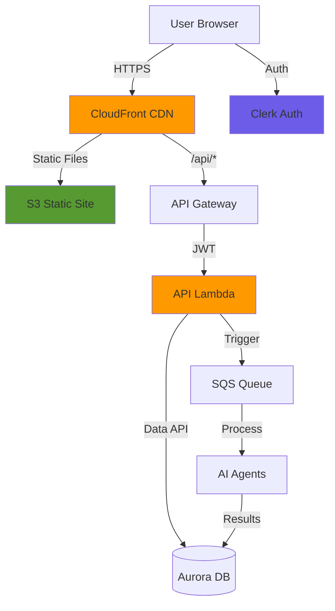

# Construyendo Alex: Parte 7 - Frontend y API

¡Bienvenido a la fase final de desarrollo! En esta guía, desplegarás la interfaz de usuario que da vida a Alex: una aplicación moderna en React con visualización en tiempo real de agentes, gestión de portafolios y pantallas de análisis financiero completas.

## ¡RECORDATORIO - CONSEJO IMPORTANTE!

Hay un archivo llamado `gameplan.md` en la raíz del proyecto que describe todo el proyecto Alex a un Agente de IA, para que puedas hacer preguntas y obtener ayuda. También hay un archivo idéntico `CLAUDE.md` y `AGENTS.md`. Si necesitas ayuda, simplemente inicia tu Agente de IA favorito y dale esta instrucción:

> Soy estudiante en el curso AI in Production. Estamos en el repositorio del curso. Lee el archivo `gameplan.md` para un resumen del proyecto. Lee este archivo completamente y revisa todas las guías enlazadas cuidadosamente. No comiences ningún trabajo aparte de leer y comprobar la estructura de directorios. Cuando termines de leer, dime si tienes preguntas antes de que empecemos.

Después de responder preguntas, indica exactamente en qué guía estás y cualquier problema. Sé cuidadoso validando cada sugerencia; siempre pide la causa raíz y evidencia de los problemas. Los LLM tienen tendencia a sacar conclusiones rápidas, pero suelen corregirse cuando se les pide evidencia.

## Qué Vas a Construir

Desplegarás un frontend SaaS completo con:
- **Autenticación**: Registro/inicio de sesión con Clerk y creación automática de usuario
- **Gestión de Portafolios**: Añade cuentas, rastrea posiciones, edita tenencias
- **Análisis IA**: Lanza y monitoriza análisis multi-agente con progreso en tiempo real
- **Informes Interactivos**: Informes Markdown, gráficos dinámicos, proyecciones de jubilación
- **Infraestructura de Producción**: CloudFront CDN, API Gateway, backend Lambda

Aquí tienes la arquitectura completa:



## Requisitos Previos

Antes de comenzar, asegúrate de tener:
- Completadas las guías 1-6 (toda la infraestructura backend desplegada)
- AWS CLI configurado
- Node.js 20+ y npm instalados
- Python con gestor de paquetes `uv`
- Terraform instalado
- Una cuenta en Clerk (la versión gratuita basta)

## Paso 1: Configura la Autenticación con Clerk

Usaremos Clerk para la autenticación, el mismo servicio que vimos antes en el curso. Si ya tienes credenciales de Clerk de un proyecto anterior, puedes reutilizarlas.

### 1.1 Consigue tus Credenciales de Clerk

Si ya tienes credenciales de Clerk:
1. Ingresa al [Clerk Dashboard](https://dashboard.clerk.com)
2. Selecciona tu aplicación existente
3. Ve a **API Keys** en la barra lateral izquierda
4. Necesitarás:
   - Publishable Key (empieza con `pk_`)
   - Secret Key (empieza con `sk_`)
   - JWKS Endpoint URL (aparece bajo **Show JWT Public Key** → **JWKS Endpoint**)

Si necesitas crear una nueva aplicación Clerk:
1. Regístrate en [clerk.com](https://clerk.com)
2. Crea una nueva aplicación
3. Elige **Email** y opcionalmente **Google** como métodos de inicio de sesión
4. Obtén tus llaves en la sección API Keys

### 1.2 Configura el Entorno del Frontend

Crea un archivo `.env.local` en el directorio frontend en Cursor y añade tus credenciales de Clerk:

```bash
# Clerk Authentication (usa tus claves existentes si las tienes)
NEXT_PUBLIC_CLERK_PUBLISHABLE_KEY=pk_test_your-key-here
CLERK_SECRET_KEY=sk_test_your-secret-here

# Redirecciones para inicio/registro de sesión (ya están correctas)
NEXT_PUBLIC_CLERK_AFTER_SIGN_IN_URL=/dashboard
NEXT_PUBLIC_CLERK_AFTER_SIGN_UP_URL=/dashboard

# API URL - usa localhost para desarrollo local, URL de AWS para producción
NEXT_PUBLIC_API_URL=http://localhost:8000
```

### 1.3 Configura el Entorno Backend

Ahora añade la configuración de Clerk al archivo `.env` en la raíz:

```bash
# En la raíz del directorio alex, añade a tu archivo .env:

# Parte 7 - Autenticación Clerk
CLERK_JWKS_URL=https://your-app.clerk.accounts.dev/.well-known/jwks.json
```

Para encontrar tu JWKS URL:
1. Ve al Clerk Dashboard → **API Keys**
2. Haz clic en **Show JWT Public Key**
3. Copia la URL de **JWKS Endpoint**

## Paso 2: Prueba el Frontend Localmente

Vamos a verificar que el frontend funciona antes de desplegar.

### 2.1 Instala las Dependencias

Navega al directorio frontend e instala los paquetes:

```bash
# En alex/frontend
npm install
```

Esto instala React, NextJS, Tailwind CSS y otros paquetes necesarios.

### 2.2 Inicia los Servidores de Desarrollo

Vamos a ejecutar el backend API y el frontend juntos:

```bash
# Navega al directorio scripts
# Ve a alex/scripts en tu terminal

# Arranca frontend y backend
uv run run_local.py
```

Deberías ver:
```
🚀 Starting FastAPI backend...
  ✅ Backend running at http://localhost:8000
     API docs: http://localhost:8000/docs

🚀 Starting NextJS frontend...
  ✅ Frontend running at http://localhost:3000
```

### 2.3 Explora la Aplicación

Abre tu navegador y visita [http://localhost:3000](http://localhost:3000)

1. **Página de Inicio**: Verás la portada de Alex, el Asesor Financiero IA
2. **Iniciar Sesión**: Haz clic en "Sign In", crea una cuenta o usa tus credenciales de Clerk
3. **Dashboard**: Tras iniciar sesión, serás redirigido al dashboard
4. **Creación de Usuario**: El sistema crea automáticamente tu perfil de usuario en la base de datos

### 2.4 Explora la Documentación del API

Abre [http://localhost:8000/docs](http://localhost:8000/docs) para ver la documentación interactiva (Swagger).

Esta documentación muestra:
- Todos los endpoints de la API
- Esquemas de solicitud/respuesta
- Requisitos de autenticación
- Función Try-it-out (requiere token JWT)

Endpoints clave:
- `GET /api/user` - Obtener o crear perfil de usuario
- `GET /api/accounts` - Listar cuentas de inversión
- `POST /api/positions` - Añadir posiciones a cuentas
- `POST /api/analyze` - Lanzar análisis IA
- `GET /api/jobs/{job_id}` - Consultar estado del análisis

## Paso 3: Agrega Datos de Portafolio de Prueba

Vamos a crear un portafolio ejemplo para trabajar.

### 3.1 Navega a la Página de Cuentas

1. Haz clic en **Accounts** en la barra de navegación
2. Verás "No accounts found"
3. Haz clic en el botón **Populate Test Data**

El sistema crea:
- 3 cuentas (401k, Roth IRA, Taxable)
- Diversas posiciones en ETFs y acciones
- Saldos en efectivo

### 3.2 Explora la Gestión de Cuentas

Haz clic en cualquier cuenta para:
- Ver posiciones y valores actuales
- Editar cantidades
- Agregar posiciones nuevas
- Eliminar posiciones
- Actualizar saldo en efectivo

Prueba a editar una posición:
1. Haz clic en el icono de editar junto a una posición
2. Cambia la cantidad
3. Haz clic en guardar
4. Observa cómo se actualiza el valor automáticamente

**Nota**: Las funciones de análisis IA requieren que la infraestructura AWS esté desplegada. Puedes explorar la gestión del portafolio localmente, pero el análisis solo funcionará tras el despliegue.

## Paso 4: Despliega la Infraestructura

Ahora vamos a desplegar todo en AWS para uso en producción.

### 4.1 Configura Terraform

Navega al directorio terraform de la Parte 7:

```bash
# Ve a alex/terraform/7_frontend

# Copia variables de ejemplo
cp terraform.tfvars.example terraform.tfvars
```

Edita `terraform.tfvars` en Cursor:

```hcl
# Región AWS para el despliegue
aws_region = "us-east-1"

# Configuración de Clerk para validación JWT
# Consigue esto de tu tablero Clerk
# JWKS URL: https://[tu-instancia].clerk.accounts.dev/.well-known/jwks.json
# issuer: https://[tu-instancia].clerk.accounts.dev
clerk_jwks_url = "https://engaging-feline-80.clerk.accounts.dev/.well-known/jwks.json"
clerk_issuer   = "https://engaging-feline-80.clerk.accounts.dev"
```

Para encontrar tu ID de cuenta AWS:
```bash
aws sts get-caller-identity --query Account --output text
```

### 4.2 Empaqueta el API Lambda

Navega al directorio backend/api y empaqueta la Lambda:

```bash
# En alex/backend/api
uv run package_docker.py
```

Esto crea `api_lambda.zip` con todas las dependencias. Tarda unos 1-2 minutos.

### 4.3 Despliega la Infraestructura

Regresa al directorio terraform y despliega:

```bash
# En alex/terraform/7_frontend

# Inicializa Terraform
terraform init

# Revisa lo que se va a crear
terraform plan

# Despliega la infraestructura
terraform apply
```

Escribe `yes` cuando te lo pida. Esto crea:
- Bucket S3 para el frontend
- CloudFront CDN
- API Gateway con integración Lambda
- Función Lambda para la API
- Roles y políticas IAM

El despliegue tarda 10-15 minutos (CloudFront toma tiempo).

### 4.4 Guarda los Resultados Importantes

Tras desplegar, guarda los outputs:

```bash
terraform output
```

Verás:
- `cloudfront_url` - URL de tu frontend
- `api_gateway_url` - Endpoint API
- `s3_bucket` - Nombre del bucket frontend

Actualiza también tu archivo `.env` raíz con la URL de la cola SQS de la Parte 6:

```bash
# Consulta los outputs de la parte 6 si no tienes esto
# En alex/terraform/6_agents
terraform output sqs_queue_url

# Añade a tu archivo .env:
SQS_QUEUE_URL=https://sqs.us-east-1.amazonaws.com/123456789012/alex-analysis-jobs
```

## Paso 5: Despliega el Código del Frontend

Ahora vamos a construir y desplegar el frontend.

### 5.1 Construye el Frontend

Navega al directorio frontend:

```bash
# En alex/frontend

# Construye la versión de producción
npm run build
```

Esto crea una build optimizada en el directorio `out`.

### 5.2 Despliega a S3

Ve al directorio scripts y ejecuta el despliegue:

```bash
# En alex/scripts

# Sube el frontend a S3 e invalida el caché de CloudFront
uv run deploy.py
```

Este script:
1. Sube los archivos construidos a S3
2. Establece los content-types correctos
3. Invalida el caché de CloudFront
4. Tarda unos 2 minutos

## Paso 6: Prueba el Despliegue en Producción

### 6.1 Accede a tu Aplicación

Abre en tu navegador la URL de CloudFront desde el output de Terraform:
```
https://d1234567890.cloudfront.net
```

1. **Inicia Sesión**: Usa tus credenciales de Clerk
2. **Dashboard**: Comprueba que carga bien
3. **Llamadas API**: Verifica que la información se carga

### 6.2 Prueba la Gestión de Portafolios

1. Navega a **Accounts**
2. Haz clic en **Populate Test Data** si lo necesitas
3. Edita una posición para verificar las actualizaciones
4. Añade una nueva posición

## Paso 7: Ejecuta el Análisis IA en Producción

¡Ahora que todo está desplegado, vamos a lanzar el análisis IA!

### 7.1 Navega al Equipo de Asesores

Haz clic en **Advisor Team** en la navegación. Verás cuatro agentes especialistas:
- 🎯 **Financial Planner** - Orquesta el análisis
- 📊 **Portfolio Analyst** - Analiza tenencias y desempeño
- 📈 **Chart Specialist** - Crea visualizaciones
- 🎯 **Retirement Planner** - Proyecta escenarios de jubilación

Nota: El quinto agente (InstrumentTagger) funciona invisible cuando es necesario.

### 7.2 Lanza el Análisis

1. Haz clic en el botón **Start New Analysis** (púrpura, destacado)
2. Observa la visualización del progreso:
   - Financial Planner se activa primero
   - Luego los otros tres trabajan en paralelo
   - Cada agente muestra un efecto de resplandor cuando está activo
3. Espera 60-90 segundos hasta completarse
4. Redirige automáticamente a la página de Análisis

### 7.3 Revisa los Resultados del Análisis

La página de Análisis tiene cuatro pestañas:

**Pestaña Overview**:
- Resumen ejecutivo
- Observaciones clave
- Evaluación de riesgo
- Recomendaciones

**Pestaña Charts**:
- Gráfico de asignación de activos
- Exposición geográfica
- Distribución sectorial
- Principales tenencias

**Pestaña Retirement**:
- Resultados de simulación Monte Carlo
- Probabilidad de éxito
- Proyecciones del portafolio
- Puntuación de preparación para la jubilación

**Pestaña Recommendations**:
- Acciones concretas
- Sugerencias de rebalanceo
- Ajustes de riesgo

## Paso 8: Monitorea desde la Consola de AWS

Vamos a explorar qué sucede bajo el capó.

### 8.1 Logs de CloudWatch

1. Ve a [CloudWatch Console](https://console.aws.amazon.com/cloudwatch)
2. Haz clic en **Log groups**
3. Busca `/aws/lambda/alex-api`
4. Haz clic en el último stream de logs
5. Verás las peticiones y respuestas de la API

### 8.2 Métricas de API Gateway

1. Ve a [API Gateway Console](https://console.aws.amazon.com/apigateway)
2. Haz clic en `alex-api`
3. Haz clic en **Dashboard**
4. Visualiza recuento de peticiones, latencia y errores

### 8.3 Performance de Lambda

1. Ve a [Lambda Console](https://console.aws.amazon.com/lambda)
2. Haz clic en `alex-api`
3. Haz clic en la pestaña **Monitor**
4. Visualiza invocaciones, duración y errores
5. Comprueba ejecuciones concurrentes

### 8.4 Actividad de la Cola SQS

Cuando lances un análisis:

1. Ve a [SQS Console](https://console.aws.amazon.com/sqs)
2. Haz clic en `alex-analysis-jobs`
3. Observa los **Messages Available** cambiar
4. Revisa la pestaña **Monitoring** para métricas

### 8.5 Distribución de CloudFront

1. Ve a [CloudFront Console](https://console.aws.amazon.com/cloudfront)
2. Haz clic en tu distribución
3. Revisa la pestaña **Monitoring** para:
   - Solicitudes por segundo
   - Porcentaje de aciertos de caché
   - Transferencia de datos
   - Solicitudes al origen

## Paso 9: Monitoreo de Costos

Como usuario responsable de AWS, monitoriza siempre los costos:

### 9.1 Consulta Costos Actuales

1. Ingresa como usuario root de AWS
2. Ve al [Billing Dashboard](https://console.aws.amazon.com/billing)
3. Revisa **Bills** del mes actual
4. Revisa el desglose por servicio

### 9.2 Costos Esperados

Para esta aplicación completa:
- **Lambda**: < $1/mes (pago por invocación)
- **API Gateway**: < $4/mes (1M solicitudes en free tier)
- **Aurora**: $43-60/mes (mayor coste)
- **S3 & CloudFront**: < $1/mes para desarrollo
- **SQS**: < $1/mes
- **CloudWatch**: < $5/mes
- **Bedrock**: $0.01-0.10 por análisis

**Total**: ~$50-70/mes durante desarrollo

### 9.3 Optimización de Costos

Para reducir costes cuando no desarrolles:

```bash
# Detén Aurora para ahorrar ~$43/mes
# En alex/terraform/5_database
terraform destroy

# O destruye todo
# Ejecuta en cada directorio terraform en orden inverso (7, 6, 5, 4, 3, 2)
terraform destroy
```

## Resolución de Problemas

### El Frontend no Construye

Si `npm run build` falla:
1. Comprueba la versión de Node.js (necesitas 20+)
2. Borra `node_modules` y `.next`
3. Ejecuta `npm install` de nuevo
4. Revisa si hay errores de TypeScript

### API Devuelve 401 Unauthorized

Si las llamadas al API fallan con 401:
1. Verifica las claves de Clerk en `.env.local`
2. Comprueba la JWKS URL en variables de entorno de Lambda
3. Cierra sesión y vuelve a ingresar
4. Verifica expiración de token (los tokens de Clerk expiran a la hora)

### El Análisis no Arranca

Si el análisis queda pendiente:
1. Revisa la cola SQS buscando mensajes
2. Comprueba que la Lambda planner tenga el trigger SQS
3. Consulta los logs de CloudWatch en busca de errores
4. Asegura que el clúster Aurora está corriendo

### CloudFront Devuelve 403

Si obtienes acceso denegado:
1. Revisa la política del bucket S3
2. Verifica que CloudFront OAI tiene acceso
3. Espera 15 minutos por propagación
4. Prueba en ventana de incógnito

### Los Gráficos no se Muestran

Si los gráficos están en blanco:
1. Revisa la consola del navegador por errores
2. Verifica los datos de gráfico en los resultados del análisis
3. Comprueba que la librería Recharts cargó bien
4. Revisa el output del agente charter

## Buenas Prácticas de Arquitectura

### Aspectos Clave de Seguridad

La aplicación sigue buenas prácticas de seguridad:

1. **Autenticación**: Clerk gestiona toda la autenticación
2. **Validación JWT**: Todas las peticiones API validan el token
3. **Solo HTTPS**: CloudFront obliga a SSL
4. **Validación de Entradas**: Pydantic valida todos los datos
5. **Protección CORS**: Orígenes restringidos
6. **Gestión de Secretos**: Usa AWS Secrets Manager

### Optimizaciones de Rendimiento

1. **Caché CDN**: Archivos estáticos en caché global
2. **División de Código**: NextJS lo hace automáticamente
3. **Caché de Respuestas API**: CloudFront cachea los GET
4. **Pool de Conexiones a DB**: Data API lo gestiona
5. **Ejecución Paralela de Agentes**: Agentes trabajan simultáneamente

### Diseño para Escalabilidad

La arquitectura escala automáticamente:
- **CloudFront**: Maneja millones de peticiones
- **API Gateway**: Auto-escalado según demanda
- **Lambda**: Hasta 1000 ejecuciones concurrentes
- **Aurora Serverless**: Escala ACUs según necesidad
- **SQS**: Gestiona la cola automáticamente

## Próximos Pasos

¡Felicidades! ¡Has desplegado una aplicación completa de planificación financiera potenciada por IA!

### Explora Funcionalidades Avanzadas

Prueba estas funciones adicionales:
1. Crea varias cuentas con distintas estrategias
2. Prueba con ETFs internacionales
3. Ajusta parámetros de jubilación
4. Exporta informes (imprime a PDF)

### Personaliza la Aplicación

Ideas para mejorar:
- Añade más tipos de gráficos
- Implementa rebalanceo de portafolio
- Añade notificaciones por email
- Crea una app móvil
- Integra con brokerages

### Sigue Aprendiendo

Continúa con la [Guía 8](8_observability.md) donde añadirás:
- Monitorización completa con CloudWatch
- Trazado distribuido con X-Ray
- Escaneo de seguridad
- Optimización de rendimiento

## Resumen

En esta guía lograste:
- ✅ Configurar la autenticación Clerk
- ✅ Desplegar un frontend React/NextJS
- ✅ Crear un backend FastAPI sobre Lambda
- ✅ Configurar CloudFront CDN
- ✅ Probar la gestión de portafolios
- ✅ Ejecutar análisis IA multi-agente
- ✅ Monitorear costes y rendimiento

¡Tu Asesor Financiero Alex ya está en línea y listo para usuarios! 🎉

## Referencia Rápida

### URLs clave
- **Frontend**: Tu CloudFront URL
- **API Docs**: Tu API Gateway URL + `/docs`
- **Clerk Dashboard**: https://dashboard.clerk.com

### Comandos comunes
```bash
# Desarrollo local
uv run run_local.py

# Desplegar frontend
npm run build
uv run deploy.py

# Consultar costes
aws ce get-cost-and-usage --time-period Start=2024-01-01,End=2024-01-31 --granularity MONTHLY --metrics "UnblendedCost" --group-by Type=DIMENSION,Key=SERVICE

# Ver logs
aws logs tail /aws/lambda/alex-api --follow
```

### Gestión de Costos
- Configura alertas de facturación
- Consulta costes semanalmente
- Destruye recursos cuando no los uses
- Usa Free Tier de AWS cuando sea posible

¡Excelente trabajo completando el Asesor Financiero Alex! 🚀