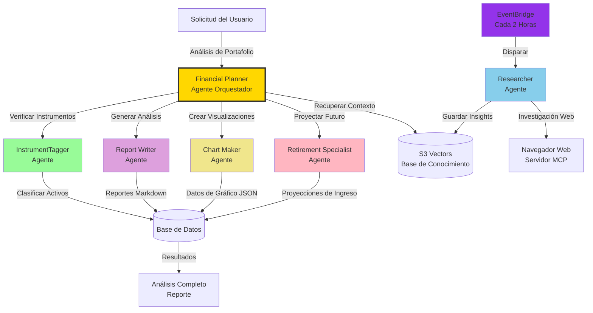
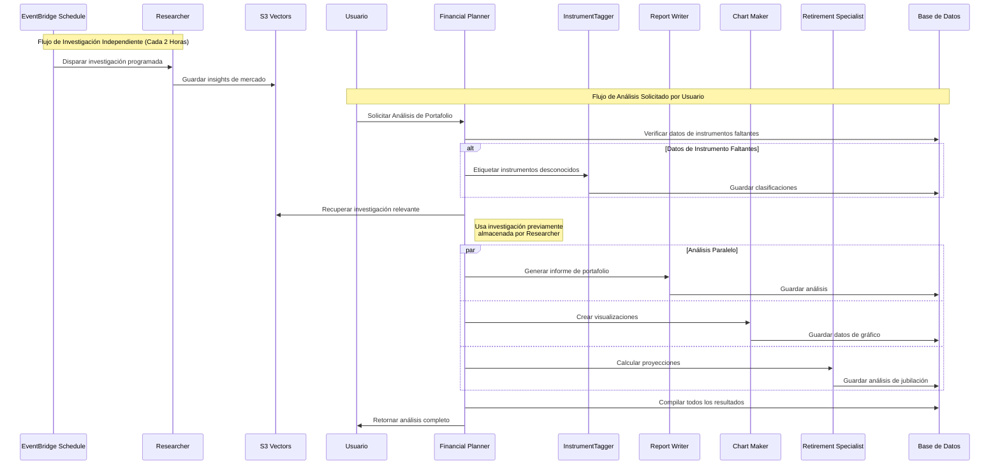
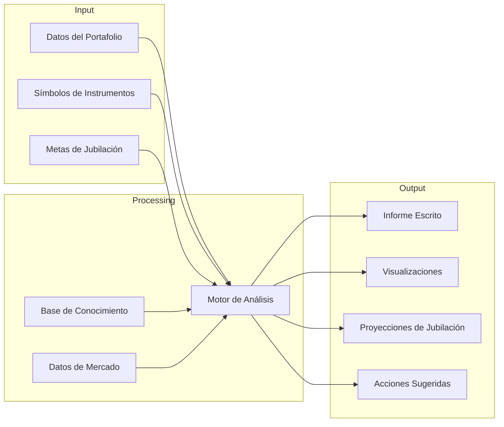

# Arquitectura de Agentes Alex

Este documento ilustra cómo los agentes de IA en la plataforma Alex colaboran para proporcionar planificación financiera integral y análisis de portafolios.

## Resumen de la Colaboración entre Agentes



## Responsabilidades de los Agentes

### Financial Planner (Orquestador)
**Rol**: Coordinador principal que gestiona todo el flujo de trabajo del análisis
- Recibe solicitudes de los usuarios para el análisis de portafolios
- Identifica datos faltantes de instrumentos y delega a InstrumentTagger
- Coordina todos los agentes especializados
- Recupera contexto relevante desde la base de conocimiento S3 Vectors
- Compila el análisis final a partir de la salida de todos los agentes
- Actualiza el estado de los trabajos durante el proceso

### InstrumentTagger
**Rol**: Población automática de datos de referencia para instrumentos financieros
- Clasifica instrumentos por clase de activo (acciones, renta fija, etc.)
- Determina asignación regional (Norteamérica, Europa, Asia, etc.)
- Identifica la exposición sectorial (tecnología, salud, finanzas, etc.)
- Usa salidas estructuradas para un formato de datos consistente
- Futuro: Se integrará con la API de Polygon para datos de mercado en tiempo real

### Researcher (Agente Independiente)
**Rol**: Recopilación autónoma de inteligencia de mercado y conocimientos de inversión
- Opera independientemente en el horario de EventBridge (cada 2 horas)
- No es orquestado por el Financial Planner - funciona de manera autónoma
- Navega sitios de finanzas en busca de tendencias de mercado actualizadas
- Analiza noticias empresariales e informes de resultados
- Investiga indicadores económicos y condiciones de mercado
- Genera insights y recomendaciones de inversión
- Población continua de la base S3 Vectors
- El Financial Planner recupera este conocimiento luego para contexto

### Report Writer
**Rol**: Generar narrativas de análisis de portafolios completas
- Analiza composición y diversificación de portafolios
- Evalúa la exposición al riesgo y la asignación de activos
- Genera resúmenes ejecutivos en formato markdown
- Crea secciones de análisis detallado
- Proporciona recomendaciones accionables
- Escribe en lenguaje financiero profesional y claro

### Chart Maker
**Rol**: Transformar los datos del portafolio en visualizaciones
- Calcula porcentajes de asignación en diferentes dimensiones
- Crea gráficos de sectores para distribución por clase de activo
- Genera gráficos de barras para exposición regional
- Produce visualizaciones de asignación sectorial
- Da formato a los datos para componentes Recharts
- Asegura que todos los porcentajes sumen 100%

### Retirement Specialist
**Rol**: Proyectar resultados financieros a largo plazo
- Calcula los ingresos de jubilación proyectados
- Ejecuta simulaciones Monte Carlo para análisis de probabilidades
- Considera años hasta la jubilación e ingresos objetivo
- Crea gráficos de proyección de ingresos en el tiempo
- Analiza sostenibilidad del portafolio
- Proporciona recomendaciones para preparación de la jubilación

## Flujo de Comunicación entre Agentes



## Flujo de Datos



## Matriz de Capacidades de los Agentes

| Agente | Modelo AI | Función Principal | Formato de Salida | Tiempo de Ejecución |
|--------|-----------|-------------------|-------------------|---------------------|
| Financial Planner | Claude 4 Sonnet | Orquestación y Coordinación | Estado del Trabajo | 2-3 minutos |
| InstrumentTagger | Claude 4 Sonnet | Clasificación de Activos | JSON Estructurado | 5-10 segundos |
| Researcher | Claude 4 Sonnet | Inteligencia de Mercado | Artículos Markdown | 30-60 segundos |
| Report Writer | Claude 4 Sonnet | Narrativa de Portafolio | Informe Markdown | 20-30 segundos |
| Chart Maker | Claude 4 Sonnet | Visualización de Datos | Recharts JSON | 10-15 segundos |
| Retirement Specialist | Claude 4 Sonnet | Proyecciones Futuras | Análisis + Gráficos | 20-30 segundos |

## Integración de Conocimiento

Los agentes aprovechan dos fuentes principales de conocimiento:

### S3 Vectors Knowledge Base
- Investigación histórica e insights de mercado
- Análisis de empresas e informes de resultados
- Indicadores económicos y tendencias
- Estrategias de inversión y recomendaciones
- Se actualiza continuamente por el agente Researcher

### Base de Datos de Referencia
- Clasificaciones y asignaciones de instrumentos
- Portafolios y preferencias de usuarios
- Informes e históricos de análisis
- Cálculos y proyecciones en caché

## Patrones de Colaboración de los Agentes

### 1. Patrón de Enriquecimiento de Datos
```
Instrumento Desconocido → InstrumentTagger → Datos Enriquecidos → Otros Agentes
```

### 2. Patrón de Investigación Independiente
```
EventBridge (Cada 2 horas) → Researcher → S3 Vectors → Crecimiento de la Base de Conocimiento
```

### 3. Patrón de Integración de Conocimiento
```
Financial Planner → Recuperar de S3 Vectors → Análisis Contextualizado
```

### 4. Patrón de Procesamiento Paralelo
```
Financial Planner → [Report Writer, Chart Maker, Retirement] → Resultados Compilados
```

### 5. Patrón de Aprendizaje Continuo
```
Researcher (Autónomo) → Acumulación de Conocimiento → Mejor Análisis con el Tiempo
```

## Principios Clave de Diseño

1. **Especialización**: Cada agente tiene una responsabilidad enfocada
2. **Orquestación**: El Financial Planner coordina pero no microgestiona
3. **Ejecución Paralela**: Agentes independientes corren en simultáneo para mayor velocidad
4. **Compartir Conocimiento**: S3 Vectors permite inteligencia colectiva
5. **Degradación Elegante**: El sistema funciona aunque algunos agentes fallen
6. **Mejora Incremental**: Se pueden añadir nuevos agentes sin interrumpir los existentes

## Mejoras Futuras de los Agentes

### Agentes Planeados
- **Tax Optimizer**: Analizar implicaciones y estrategias fiscales
- **Rebalancer**: Sugerir acciones de rebalanceo de portafolio
- **Risk Analyzer**: Análisis detallado de métricas de riesgo de portafolio

### Capacidades Planeadas
- Integración de datos de mercado en tiempo real (API de Polygon)
- Análisis de estrategias con opciones
- Cobertura de mercados internacionales
- Evaluación ESG (Environmental, Social, Governance)