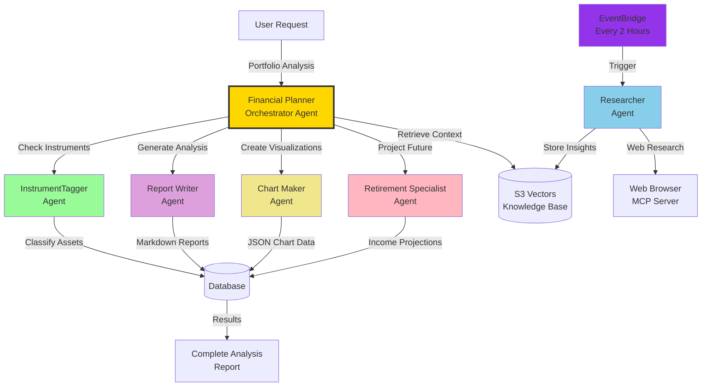
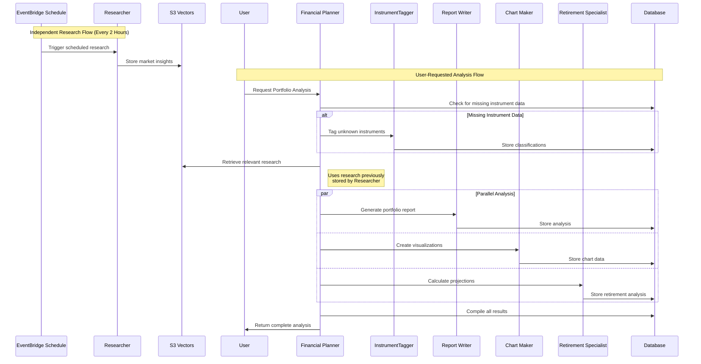
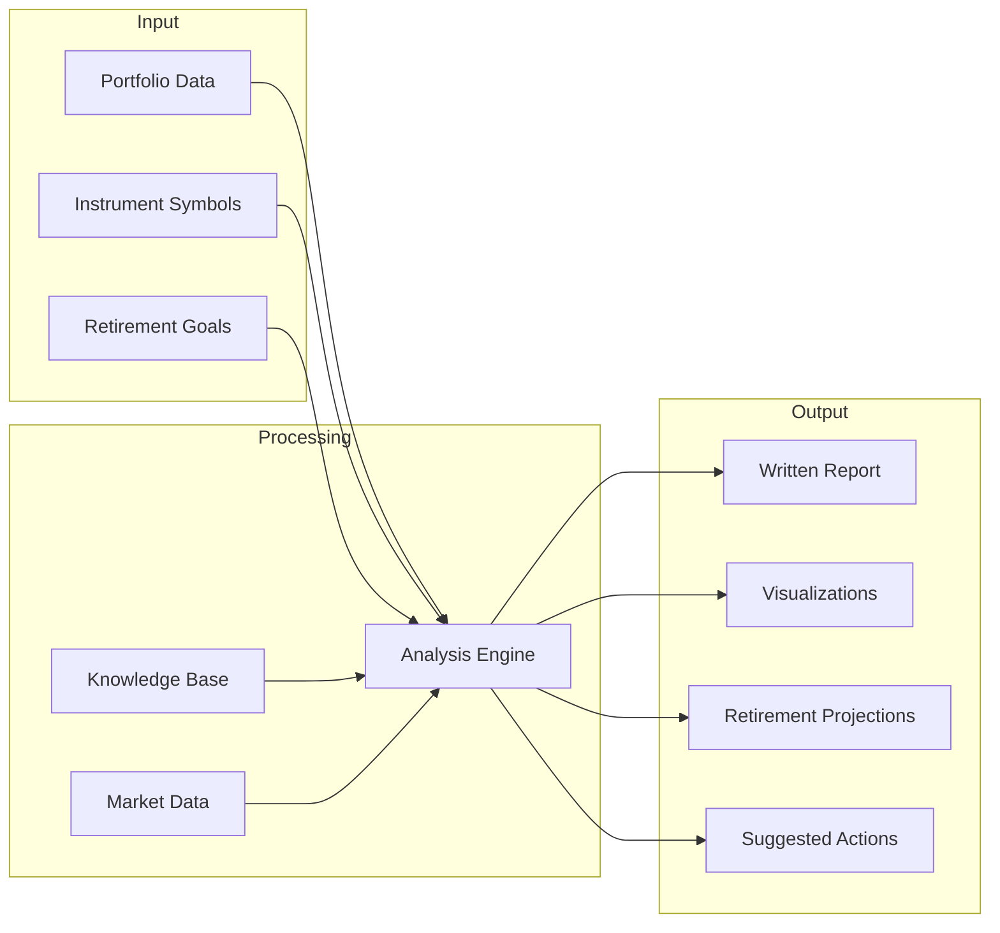

# Alex Agent Architecture

This document illustrates how AI agents on the Alex platform collaborate to provide comprehensive financial planning and portfolio analysis.

## Agent Collaboration Overview



## Agent Responsibilities

### Financial Planner (Orchestrator)
**Role**: Main coordinator that manages the full analysis workflow
- Receives user requests for portfolio analysis
- Identifies missing instrument data and delegates to InstrumentTagger
- Coordinates all specialized agents
- Retrieves relevant context from the S3 Vectors knowledge base
- Compiles final analysis from all agent outputs
- Updates job status during processing

### InstrumentTagger
**Role**: Automated reference data population for financial instruments
- Classifies instruments by asset class (equities, fixed income, etc.)
- Determines regional allocation (North America, Europe, Asia, etc.)
- Identifies sector exposure (technology, healthcare, finance, etc.)
- Uses structured outputs for consistent data formatting
- Future: Integration with Polygon API for real-time market data

### Researcher (Independent Agent)
**Role**: Autonomous collection of market intelligence and investment insights
- Operates independently on EventBridge schedule (every 2 hours)
- Not orchestrated by Financial Planner - runs autonomously
- Browses financial websites for updated market trends
- Analyzes company news and earnings reports
- Researches economic indicators and market conditions
- Generates investment insights and recommendations
- Continuous population of S3 Vectors base
- Financial Planner later retrieves this knowledge for context

### Report Writer
**Role**: Generate comprehensive portfolio analysis narratives
- Analyzes portfolio composition and diversification
- Evaluates risk exposure and asset allocation
- Generates executive summaries in markdown format
- Creates detailed analysis sections
- Provides actionable recommendations
- Writes in clear, professional financial language

### Chart Maker
**Role**: Transform portfolio data into visualizations
- Calculates allocation percentages across dimensions
- Creates pie charts for asset class distribution
- Generates bar charts for regional exposure
- Produces sector allocation visualizations
- Formats data for Recharts components
- Ensures all percentages sum to 100%

### Retirement Specialist
**Role**: Project long-term financial outcomes
- Calculates projected retirement income
- Runs Monte Carlo simulations for probability analysis
- Considers years to retirement and target income
- Creates income projection charts over time
- Analyzes portfolio sustainability
- Provides retirement readiness recommendations

## Agent Communication Flow



## Data Flow



## Agent Capability Matrix

| Agent | AI Model | Main Function | Output Format | Execution Time |
|--------|-----------|-------------------|-------------------|---------------------|
| Financial Planner | Claude 4 Sonnet | Orchestration and Coordination | Job Status | 2-3 minutes |
| InstrumentTagger | Claude 4 Sonnet | Asset Classification | Structured JSON | 5-10 seconds |
| Researcher | Claude 4 Sonnet | Market Intelligence | Markdown Articles | 30-60 seconds |
| Report Writer | Claude 4 Sonnet | Portfolio Narrative | Markdown Report | 20-30 seconds |
| Chart Maker | Claude 4 Sonnet | Data Visualization | Recharts JSON | 10-15 seconds |
| Retirement Specialist | Claude 4 Sonnet | Future Projections | Analysis + Charts | 20-30 seconds |

## Knowledge Integration

Agents leverage two main knowledge sources:

### S3 Vectors Knowledge Base
- Historical research and market insights
- Company analysis and earnings reports
- Economic indicators and trends
- Investment strategies and recommendations
- Continuously updated by the Researcher agent

### Reference Database
- Instrument classifications and allocations
- User portfolios and preferences
- Analysis reports and history
- Cached calculations and projections

## Agent Collaboration Patterns

### 1. Data Enrichment Pattern
```
Unknown Instrument -> InstrumentTagger -> Enriched Data -> Other Agents
```

### 2. Independent Research Pattern
```
EventBridge (Every 2 hours) -> Researcher -> S3 Vectors -> Knowledge Base Growth
```

### 3. Knowledge Integration Pattern
```
Financial Planner -> Retrieve from S3 Vectors -> Contextualized Analysis
```

### 4. Parallel Processing Pattern
```
Financial Planner -> [Report Writer, Chart Maker, Retirement] -> Compiled Results
```

### 5. Continuous Learning Pattern
```
Researcher (Autonomous) -> Knowledge Accumulation -> Better Analysis Over Time
```

## Key Design Principles

1. **Specialization**: Each agent has a focused responsibility
2. **Orchestration**: Financial Planner coordinates but does not micromanage
3. **Parallel Execution**: Independent agents run simultaneously for speed
4. **Knowledge Sharing**: S3 Vectors enables collective intelligence
5. **Graceful Degradation**: System continues working even if some agents fail
6. **Incremental Improvement**: New agents can be added without disrupting existing ones

## Future Agent Enhancements

### Planned Agents
- **Tax Optimizer**: Analyze tax implications and strategies
- **Rebalancer**: Suggest portfolio rebalancing actions
- **Risk Analyzer**: Detailed analysis of portfolio risk metrics

### Planned Capabilities
- Real-time market data integration (Polygon API)
- Options strategy analysis
- International market coverage
- ESG evaluation (Environmental, Social, Governance)
