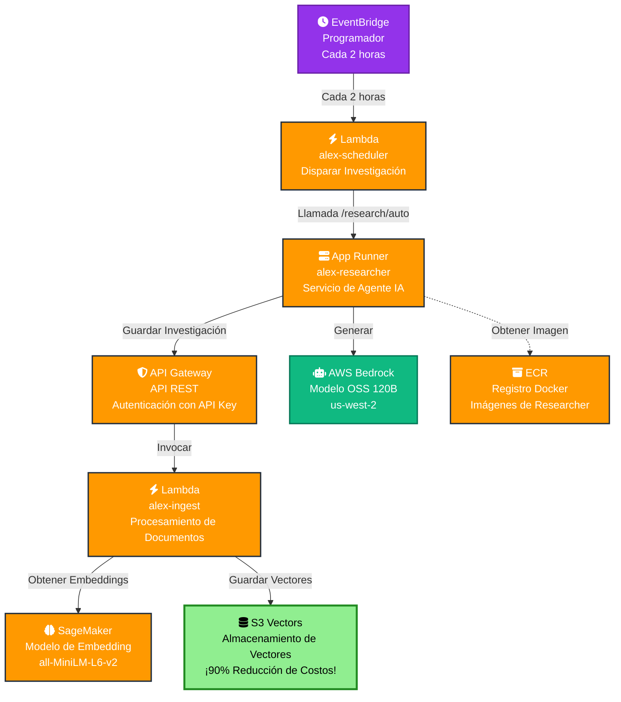
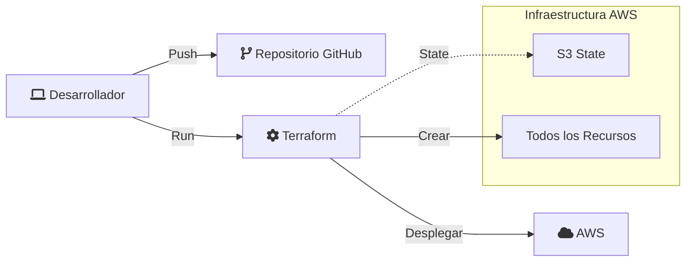

# Resumen de la Arquitectura de Alex (Versión S3 Vectors)

## Arquitectura del Sistema

La plataforma Alex usa una arquitectura moderna serverless en AWS, combinando servicios de IA con infraestructura rentable:



## Detalles de Componentes

### 1. **S3 Vectors** (¡NUEVO! - 90% Reducción de Costos)
- **Propósito**: Almacenamiento nativo de vectores en S3
- **Características**: 
  - Búsqueda de similitud en sub-segundo
  - Optimización automática
  - Sin cargos mínimos
  - Escrituras fuertemente consistentes
- **Costo**: ~$30/mes (vs ~$300/mes para OpenSearch)
- **Escala**: Millones de vectores por índice

### 2. **API Gateway**
- **Tipo**: API REST
- **Auth**: Autenticación con API Key
- **Endpoints**: `/ingest` (POST)
- **Propósito**: Acceso seguro a funciones Lambda

### 3. **Funciones Lambda**
- **alex-ingest**: Procesa documentos y almacena embeddings
  - Runtime: Python 3.13
  - Memoria: 512MB
  - Timeout: 30 segundos
- **alex-scheduler**: Dispara investigación automática
  - Runtime: Python 3.11
  - Memoria: 128MB
  - Timeout: 150 segundos

### 4. **App Runner**
- **Servicio**: alex-researcher
- **Propósito**: Hospeda el agente de investigación IA
- **Recursos**: 1 vCPU, 2GB RAM
- **Características**: Auto-escalado, endpoint HTTPS

### 5. **SageMaker Serverless**
- **Modelo**: sentence-transformers/all-MiniLM-L6-v2
- **Propósito**: Generar embeddings de 384 dimensiones
- **Memoria**: 3GB
- **Concurrencia**: 10 max

### 6. **EventBridge Scheduler**
- **Regla**: alex-research-schedule
- **Horario**: Cada 2 horas
- **Destino**: Lambda alex-scheduler
- **Propósito**: Generación automática de investigación

### 7. **AWS Bedrock**
- **Proveedor**: AWS Bedrock
- **Modelo**: OpenAI OSS 120B (modelo open-weight)
- **Región**: us-west-2 (modelo disponible sólo aquí)
- **Propósito**: Generación y análisis de investigación
- **Características**: Ventana de contexto de 128K, acceso entre regiones

## Flujo de Datos

1. **Flujo Manual de Investigación**:
   ```
   Usuario → App Runner → Bedrock (generar) → API Gateway → Lambda → S3 Vectors
   ```

2. **Flujo Automático de Investigación**:
   ```
   EventBridge (cada 2 hrs) → Lambda Scheduler → App Runner → Bedrock → API Gateway → Lambda → S3 Vectors
   ```

3. **Flujo de Ingesta Directa**:
   ```
   Usuario → API Gateway → Lambda → SageMaker (embedding) → S3 Vectors
   ```

4. **Flujo de Búsqueda** (futuro):
   ```
   Usuario → API Gateway → Lambda → S3 Vectors (búsqueda por similitud)
   ```

## Optimización de Costos

| Componente | Costo Mensual | Notas |
|------------|---------------|-------|
| S3 Vectors | ~$30 | ¡90% más barato que OpenSearch! |
| SageMaker Serverless | ~$5-10 | Pago por petición |
| Lambda | ~$1 | Invocaciones mínimas |
| App Runner | ~$5 | 1 vCPU, 2GB RAM |
| API Gateway | ~$1 | API REST |
| **Total** | **~$42-47** | Antes ~$250+ |

## Funcionalidades de Seguridad

- **API Gateway**: Autenticación con API key
- **IAM Roles**: Acceso con el menor privilegio necesario
- **S3 Vectors**: Siempre privado (sin acceso público)
- **App Runner**: HTTPS por defecto
- **Secrets**: Variables de entorno para API keys

## Arquitectura de Despliegue



## Stack Tecnológico

- **Infraestructura**: Terraform
- **Compute**: Lambda, App Runner
- **IA/ML**: SageMaker, AWS Bedrock
- **Almacenamiento**: S3 Vectors
- **API**: API Gateway
- **Lenguajes**: Python 3.13
- **Contenedor**: Docker

## Ventajas Clave de S3 Vectors

1. **Costo**: Reducción del 90% vs bases de datos de vectores tradicionales
2. **Simplicidad**: Solo S3 - sin infraestructura compleja
3. **Escalabilidad**: Maneja millones de vectores
4. **Rendimiento**: Consultas en sub-segundo
5. **Integración**: Servicio nativo de AWS

## Mejoras Futuras

- Aplicación frontend (Next.js)
- Autenticación de usuario
- Funciones avanzadas de búsqueda
- Actualizaciones en tiempo real
- Panel de análisis